# Comprehensive Audit & Recommendations: Auth, Session Security, Tenant Isolation & Marketing Landing Page

**Generated:** October 3, 2026  
**Repository:** `voice agent` (`voxly-ai` & `web` Next.js portal)

---

## Executive Summary & Quick Reference

| Area | Current Status | Critical Finding / Root Cause | Recommended Action |
| :--- | :--- | :--- | :--- |
| **1. Forgot Password Email** | ❌ **Broken (Fails with 403)** | `hustlelabs.in` is not verified in Resend (`resend.com/domains`). Emails fail silently while API returns 200 OK. | Verify DNS (DKIM/SPF) in Resend or use verified sender; log & return delivery errors. |
| **2. Post-Reset Auth** | ⚠️ **Manual Only** | API returns `{"ok": true}` without JWT/session; frontend drops user to signin form. Modal asks for email redundantly. | Automatically authenticate user on successful reset or provide clean 1-click login. |
| **3. Change Password UI** | ❌ **Missing from Frontend** | Backend `POST /api/auth/change-password` exists, but there is no UI in Settings or Account pages. | Add a "Security & Password" card to `SettingsModule.jsx` and `web/app/app/settings`. |
| **4. Session Inactivity Timeout** | ❌ **Non-Existent (30-day persistence)** | Refresh token lasts 30 days (`JWT_REFRESH_TTL_DAYS=30`). Silent auto-refresh runs without activity checks. | Implement 30-min idle timer, inactivity warning modal, and server-side sliding window. |
| **5. Tenant Information Leaks** | ⚠️ **Severe Internal Leaks** | `/app/calls/[id]` displays raw Telnyx wholesale costs, margins, Gemini API list rates, and queue jobs. | Replace internal carrier/vendor details with productized metrics and hide wholesale pricing. |
| **6. Landing Page Demo** | ⚠️ **Robotic Browser Speech** | "Talk to AI" and "Watch Demo" use local `speechSynthesis` and mock arrays, not the real voice engine. | Replace with real ephemeral voice stream or studio audio samples; lazy-load 3D assets. |

---

## 1. Deep Dive: Email Sign-In, Forgot Password, Reset & Change Password

### 1.1 Why Forgot Password Emails Are Not Being Delivered
- **Investigation:** We inspected `server/services/saas/email_service.py` and probed the Resend API with the configured `RESEND_API_KEY`.
- **Finding:**
  - The API key is valid (`HTTP 200`).
  - However, querying `https://api.resend.com/domains` returned:
    ```json
    {"object": "list", "has_more": false, "data": []}
    ```
  - The environment is configured with `RESEND_FROM_EMAIL=support@hustlelabs.in`.
  - Testing an email send with `from: support@hustlelabs.in` returned:
    ```json
    HTTP 403: {"message": "The hustlelabs.in domain is not verified. Please, add and verify your domain on https://resend.com/domains", "name": "validation_error", "statusCode": 403}
    ```
- **Silent Failure in API:**
  In `server/routes/app_auth.py` (`auth_forgot_password`):
  ```python
  if token:
      reset_url = f"{settings.voxly_frontend_url.rstrip('/')}/#reset-password?token={token}"
      from server.services.saas.email_service import send_password_reset_email
      await send_password_reset_email(body.email.strip().lower(), reset_url)
  return {
      "ok": True,
      "message": "If an account exists for this email, password reset instructions were sent.",
  }
  ```
  The endpoint never checks the return value of `send_password_reset_email`. Even though Resend returns 403 and the email is dropped, the API responds with `200 OK`. The user in `AuthModal.jsx` sees `"If an account exists, reset instructions were sent to your email"`, but **no email ever reaches their inbox**.

### 1.2 User Authentication After Password Reset
- **Flow Analysis:**
  - When the reset link (`/#reset-password?token=...`) is opened, `voxly-ai/src/components/AuthModal.jsx` displays the reset form.
  - Submitting sends `POST /api/auth/reset-password` with `{ token, newPassword }`.
  - The backend (`server/routes/app_auth.py:236`) validates the token and updates the password hash, but returns only `{"ok": True}`.
  - `AuthModal.jsx` catches the response, sets message `"Password updated. Sign in with your new password."`, and switches `mode` to `'signin'`.
- **Issues Identified:**
  1. **User is NOT authenticated automatically:** In modern UX, entering a cryptographically valid reset token from email should issue a fresh session and log the user straight into their dashboard.
  2. **Redundant Email Input in Reset Form:** The reset form in `AuthModal.jsx` still renders the `Work Email` input field as `required`. The reset API does not even accept email (only `token` and `newPassword`). Forcing the user to re-enter email is unnecessary friction.
  3. **Missing "Confirm Password" validation:** There is no second password confirmation field, increasing the chance of typos locking users out.

### 1.3 Missing "Change Password" Flow
- **Backend:** `POST /api/auth/change-password` exists in `server/routes/app_auth.py:207` and is fully implemented in `server/services/saas/auth_service.py` (`change_password(user_id, currentPassword, newPassword)`).
- **Frontend:** **Neither `voxly-ai` nor `web` has any UI for changing password.**
  - `voxly-ai/src/services/api.js` has no `changePassword()` method.
  - `voxly-ai/src/console/modules/SettingsModule.jsx` only shows KYC, user email/role, and wallet credits.
  - `web/app/app/settings` has no password modification form.
  - Logged-in users currently have **no way to change their password** without logging out and attempting the forgot password flow.

---

## 2. Session Management & Inactivity Timeout

### 2.1 Why Users Never Get Logged Out
- **Token Configuration (`server/config/env.py`):**
  - `JWT_ACCESS_TTL_MINUTES = 15` (Access Token: 15 minutes)
  - `JWT_REFRESH_TTL_DAYS = 30` (Refresh Token: 30 days)
  - Portal session cookies (`server/auth/session.py`): hardcoded 7 days (`_TTL_SEC = 86400 * 7`).
- **Silent Background Refresh:**
  In `voxly-ai/src/services/api.js`, the request interceptor catches 401s and automatically calls `/api/auth/refresh` using the HTTP-only refresh cookie.
- **Zero Activity Detection:**
  There are no listeners for user activity (`mousemove`, `keydown`, `click`, `touchstart`). If an operator opens the dashboard, leaves their computer unattended for 12 hours, and returns, any network call or page click silently refreshes the token. The session can remain active for up to 30 continuous days without requiring re-authentication.

### 2.2 Industry Standards (OWASP, SOC2, HIPAA, ISO 27001)

| Policy Dimension | Current Implementation | Industry Standard (B2B SaaS & Telephony) |
| :--- | :--- | :--- |
| **Idle / Inactivity Timeout** | None (infinite up to 30 days) | **15 – 30 minutes** of user inactivity |
| **Idle Warning Dialog** | None | **2-minute countdown modal** before logout |
| **Absolute Session Maximum** | 30 days | **12 – 24 hours** (requiring full re-login) |
| **Multi-Tab Sync** | Partial (syncs token updates) | Full idle synchronization across tabs via `BroadcastChannel` |
| **Server-Side Enforcement** | Fixed 30-day token lifetime | Sliding window: reject refresh if `last_active_at > 30m` |

---

## 3. Information Leakage & What Should Be Hidden from Tenants

A multi-tenant SaaS must prevent customers from seeing internal vendors, wholesale costs, margins, and queue internals. The following elements currently leak:

### 3.1 Critical Leak: `web/components/calls/detail/CallMetadataPanel.tsx` (Visible at `/app/calls/[id]`)
- **Wholesale Carrier Costs & Provider Name:**
  - Rows display `"Telnyx minutes: ₹X.XX ($Y.YY)"` and `"Telnyx $/min: $0.009"`.
  - Customers can see that the carrier is Telnyx, see the exact wholesale cost, and compute your gross margin against what they paid!
- **Upstream AI Model Pricing & Vendor Names:**
  - Displays `"STT/TTS on stack: Not used — Live speech model handles audio (Sarvam/Cartesia slots ignored)"`.
  - Displays `"Gemini audio list $/min ($0.005 in + $0.018 out)"`.
- **Internal System & Queue Architecture:**
  - Displays `"Ledger"`, `"Audio archive"`, `"Outcome job"`, `"Combination ID"`, `"Brain version"`, `"Dial request ID"`.
  - Exposes internal PSTN forensics (`"Answer → first audio sent: 1240 ms"` and internal packet buffers).

### 3.2 Agent Studio Voice Settings (`voxly-ai/src/console/modules/AgentStudioModule.jsx`)
- Under the Voice selection dropdown (lines 822 & 828), voice options are grouped with raw labels:
  - `<optgroup label="OpenAI (phone default)">`
  - `<optgroup label="Gemini Live">`
- **Tenant Experience:** Exposing foundation model vendors encourages tenants to compare raw API costs or question model selections.
- **Recommended Generalization:** Group voices by character / use-case:
  - `"Ultra-Realistic Conversational (Tier 1)"`
  - `"Expressive Customer Care"`
  - `"Professional & Formal"`

### 3.3 Integrations & Admin Labels
- `voxly-ai/src/console/modules/IntegrationsModule.jsx` line 18 mentions `"voice-agent API"`. This should say `"Voxly Platform"` or `"Voxly Cloud"`.
- `voxly-ai/src/console/modules/agent-workspace/AgentDialBulkPanel.jsx` contains references to Telnyx channel ceilings.

---

## 4. Landing Page (Marketing Site) Optimization & Rebranding

### 4.1 Product Naming & Brand Identity Options
The codebase currently has split branding:
- `voxly-ai` is branded as **Voxly** ("Autonomous AI Voice Employees").
- `web` is branded as **Vāṇi** ("Voice control plane for Telugu-speaking businesses").

Depending on your target market, here are 3 cohesive naming strategies:

#### Option A: Modern Global Enterprise Voice SaaS (Recommended for Global/US Market)
- **Names:** **Voxly**, **Vocalis AI**, **AuraVoice**, **EchoScale**
- **Tagline:** *"The Autonomous AI Voice Workforce for Modern Enterprises"*
- **Tone:** Sleek, high-converting B2B SaaS (similar to Bland.ai, Retell, Decagon).

#### Option B: Regional / Vernacular Market Leader (India / Telugu / Multi-lingual Focus)
- **Names:** **Vāṇi AI**, **Dhwani**, **Samvad AI**, **BolTel**
- **Tagline:** *"Human-Level Voice AI for Telugu & Indian Enterprise Workflows"*
- **Tone:** Culturally grounded, localized trust, emphasizes dialect accuracy and sub-500ms regional speech.

#### Option C: Role-Focused AI Employee Brand
- **Names:** **AgentForce Voice**, **RepAI**, **FrontDesk AI**
- **Tagline:** *"Deploy Digital SDRs & Support Agents on Real Phone Lines"*

### 4.2 Critical Fixes for Landing Page Conversion

1. **Fix the "Talk to AI" Demo (Highest Priority):**
   - **Problem:** `voxly-ai/src/services/voiceAgent.js` currently uses local browser `window.speechSynthesis` with static responses. In Chrome/Safari, this sounds robotic, flat, and nothing like the real neural voice pipeline.
   - **Fix:** Connect the demo to a real rate-limited voice pipeline (or stream pre-rendered high-fidelity neural audio clips with lip-synced wave animations).
2. **Replace Synthetic "Watch Demo" with a Real Video:**
   - `WatchDemoModal.jsx` steps through mock text dialogues with synthetic audio. Replace it with an embedded 60-second video demo showing a real incoming call, live screen dashboard, and instant CRM appointment booking.
3. **Optimize Bundle Size & 3D Avatar Loading:**
   - Production build analysis reveals `three-core` (678 kB) and `three-fiber` (341 kB) total **over 1.5 MB uncompressed** in the initial bundle.
   - Dynamic-import the 3D robot scene (`React.lazy(() => import('../three/VoxlyScene'))`) with a clean WebP/SVG fallback so mobile visitors get an instant page load.
4. **Add High-Converting Trust & Proof Elements:**
   - **Interactive Audio Comparison:** Add a 1-click soundboard comparing *"Typical Robotic IVR"* vs *"Your Voice AI"*.
   - **Live Dial Demo Widget:** Allow visitors to enter their phone number and receive an instant demonstration call from the AI agent within 30 seconds.
   - **Clear Pricing Comparison:** Emphasize the all-in minute rate vs hiring a human call center rep ($0.12/min vs $25/hr).

---

## 5. Implementation Roadmap & Action Plan

```mermaid
graph TD
    A[Phase 1: Urgent Auth & Fixes] --> A1[Verify hustlelabs.in in Resend DNS]
    A[Phase 1: Urgent Auth & Fixes] --> A2[Add Change Password UI to Settings]
    A[Phase 1: Urgent Auth & Fixes] --> A3[Auto-login after valid Password Reset]

    B[Phase 2: Security & Session] --> B1[Add 30-min Inactivity Idle Listener]
    B[Phase 2: Security & Session] --> B2[Show 2-min Countdown Warning Modal]
    B[Phase 2: Security & Session] --> B3[Enforce Server-Side Sliding Session Window]

    C[Phase 3: Tenant Isolation] --> C1[Sanitize CallMetadataPanel in /app/calls]
    C[Phase 3: Tenant Isolation] --> C2[Replace Telnyx/Gemini rates with unified customer metrics]
    C[Phase 3: Tenant Isolation] --> C3[Generalize Voice Provider optgroups in Studio]

    D[Phase 4: Marketing Optimization] --> D1[Unify Brand Name & Assets]
    D[Phase 4: Marketing Optimization] --> D2[Replace browser TTS demo with Neural Stream/Audio]
    D[Phase 4: Marketing Optimization] --> D3[Lazy-load 3D Three.js scene for fast mobile LCP]
```



### Immediate Code Changes Required:
1. **Resend Domain Verification:**
   - Log into [resend.com/domains](https://resend.com/domains).
   - Add `hustlelabs.in` and add the 3 DKIM TXT records and SPF TXT record to your DNS provider.
   - Once verified, emails sent from `support@hustlelabs.in` will deliver immediately.
2. **Add `changePassword` in `voxly-ai/src/services/api.js`:**
   ```javascript
   async changePassword(currentPassword, newPassword) {
     return await api.request('POST', '/api/auth/change-password', { currentPassword, newPassword });
   }
   ```
3. **Add Security Card in `SettingsModule.jsx`:**
   Provide fields for Current Password, New Password, Confirm New Password, and trigger `api.auth.changePassword()`.
4. **Implement Inactivity Timer in `AuthContext.jsx`:**
   Track `Date.now()` on `mousemove`, `keydown`, `click`. If `idle > 28 min`, display a modal. If `idle > 30 min`, call `logout()`.
5. **Sanitize `CallMetadataPanel.tsx`:**
   Remove wholesale `telnyx_usd`, `gemini_list_audio_inr_per_min`, queue status, and vendor names from tenant view; render them only when user role is `dev_admin` or `platform_admin`.
