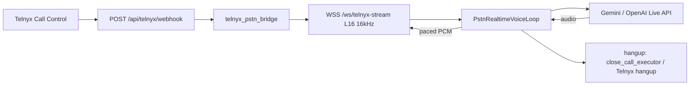
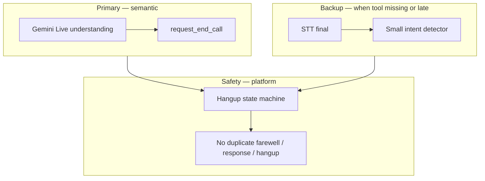
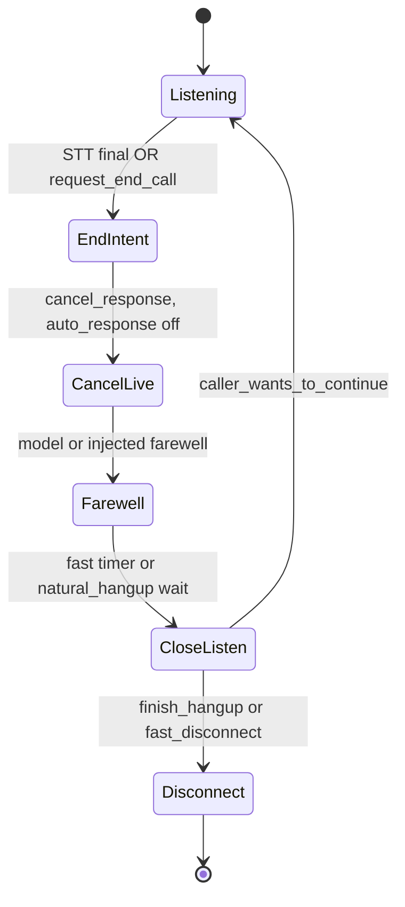

# Telnyx PSTN full-flow audit

| Field | Value |
|--------|--------|
| **Pass 2 (transport / classic turn pipeline)** | 2026-09-08 — remediation verified in `pstn-critical-for-chatgpt/TELNYX_PSTN_FULL_FLOW_AUDIT.md` |
| **Pass 3 (Realtime Voice hangup + i18n)** | 2026-09-27 — this document (root canonical copy) |
| **Scope** | Telnyx Call Control → WebSocket media → `telnyx_pstn_bridge.py` → `PstnRealtimeVoiceLoop` (`pstn_realtime_voice_core.py`) when `uses_realtime_voice` (Gemini/OpenAI Live) |
| **Companion** | [architecture/integrations/telnyx-validation-pipeline.md](architecture/integrations/telnyx-validation-pipeline.md) (TEST 0–10 ladder) |

---

## Executive summary

**Pass 2** closed webhook races, audio pacing, STT/AEC, barge-in, TTS timeouts, admission limits, and **classic** hangup drain (`natural_hangup.py` before provider hangup). That checklist is still accurate for the **media and bridge** layers.

**Pass 3** adds what Pass 2 did **not** cover: **language-independent hangup** on the **Gemini/OpenAI Live** path, tool-vs-STT races, and stuck-session `response_timeout`. A production incident on **2026-09-27** (`call_id` `0e84ae17-1832-4ace-b423-f65fef0a00f3`) ended with `end_reason: response_timeout` after Telugu “no call needed” phrasing that **did not** match `_REFUSAL` and **no** `request_end_call` tool.

**Verdict on the proposed remediation (below):** Use a **three-layer** design (tool → small backup detector → safety state machine). It can fix the **0e84ae17** class and cut idle Telnyx minutes, but it does **not** “solve hangup totally” without Gemini calling `request_end_call` on most closes. **Do not** grow a huge multilingual regex catalog (especially not hundreds of goodbye phrasings per language)—that is unmaintainable and the wrong primary mechanism.

**Code status (2026-09-27):** Pass 3 hangup layers landed in `pstn_realtime_voice_core.py` / `end_call_validate.py` (`caller_backup_end_intent`, tool-trust `goodbye`, 150ms tool/STT defer, hangup-aware stuck-response, hello fast-ack). Gate: `server/tests/test_pass3_hangup_golden.py` TEST 1–5.

---

## Status legend

| Mark | Meaning |
|------|---------|
| ✅ FIXED | Implemented and covered by tests or verified in code |
| 🟡 PARTIAL | Some wiring exists; incident class can still reproduce |
| 🔴 OPEN | Not implemented; known failure mode |
| ⬜ BY DESIGN | Intentional tradeoff (documented) |
| ✅ VERIFIED OK | Original concern incorrect or acceptable |

---

## Architecture (Realtime Voice PSTN)

**Hangup ownership (three layers — maintainable i18n):**

| Layer | Role | What **not** to do |
|--------|------|---------------------|
| **Primary** | Gemini decides end intent → `request_end_call` (`customer_declined`, `caller_goodbye`, `goal_complete`) | Do not rely on STT regex for every language and phrasing |
| **Backup** | On STT final only: **small, carefully tested** intent detector (golden utterances + minimal structural rules, e.g. negation near call/need/service)—**not** an exhaustive phrase list | Do **not** enumerate hundreds of Telugu/Hindi/Tamil goodbyes or sales refusals |
| **Safety** | `PstnRealtimeVoiceLoop` state machine: one farewell path, cancel superseded Live responses, fast-ack vs full reopen, hangup-aware watchdog | Do not stack callback-close inject + sales pitch while `_hangup_flow_active()` |

Platform arms disconnect, plays farewell (or injects one), then `execute_agent_close` / fast disconnect.

---

## Pass 2 summary (sections 1–9, 11–13) — still valid

Detailed row-level evidence lives in `pstn-critical-for-chatgpt/TELNYX_PSTN_FULL_FLOW_AUDIT.md`. Condensed:

| Area | Result |
|------|--------|
| Webhooks, Redis registry, stream start retry | ✅ FIXED |
| WS pacing, resample, idle timeout, cleanup | ✅ FIXED |
| STT supervisor, AEC/barge (no listening silence gate) | ✅ FIXED |
| Turn coalesce epoch, pending merge, LLM turn timeout | ✅ FIXED |
| TTS finish/connect timeouts, error fallback | ✅ FIXED |
| Prewarm brain version, Indic clamp 180 chars | ✅ FIXED |
| Concurrent call admission lock | ✅ FIXED |

**Do not regress Pass 2** when changing hangup (especially: drain before Telnyx hangup, `PHASE_ENDED` stopping readers, shielded cleanup).

---

## Pass 3 — Section 10: Call end / hangup (Realtime Voice)

### 10.A Already in code (Pass 2 + recent hangup work)

| # | Item | Status | Evidence |
|---|------|--------|----------|
| 10.A.1 | Drain outbound before provider hangup | ✅ FIXED | `natural_hangup.py`, `_finish_hangup` playback wait |
| 10.A.2 | `request_end_call` + legacy `end_call` on Live | ✅ FIXED | `server/realtime/hangup_tools.py`, `gemini_voice.py` / `openai_voice.py` |
| 10.A.3 | Fast hangup timers (refusal / goal script) | ✅ FIXED | `FAST_REFUSAL_POST_FAREWELL_SEC`, `FAST_GOAL_COMPLETE_POST_FAREWELL_SEC` in `pstn_realtime_voice_core.py` |
| 10.A.4 | Tool-sourced `firm_refusal` trusts model (i18n) | ✅ FIXED | `_trust_live_tool_evidence` + `test_live_hangup_tools_multilang.py` |
| 10.A.5 | Transcript-arm path for explicit end | ✅ FIXED | `_arm_hangup_from_caller_words`, `user_transcript` `closing` flag |
| 10.A.6 | Missed-tool repair when user already ended | ✅ FIXED | `_maybe_hangup_missed_end_call` |
| 10.A.7 | Hangup force watchdog (stuck pending) | ✅ FIXED | `_schedule_hangup_force_finish` (~26s) |

### 10.B Open or partial (verified against code + incident)

| # | Issue | Sev | Status | What happens today |
|---|--------|-----|--------|-------------------|
| 10.B.1 | **Backup detector misses golden refusal** (tool not called) | 🔴 | ✅ FIXED | `caller_backup_end_intent` + TEST 1 (`కాల్ అవసరం లేదు` / incident line) |
| 10.B.2 | **Tool not called** on clear decline | 🟡 | 🟡 PARTIAL | Backup + prompt now cover the miss; Primary still depends on the model |
| 10.B.3 | **`response_timeout` (30s)** on stuck `_response_open` | 🔴 | ✅ FIXED | `_recover_stuck_response_for_hangup` → cancel + `_finish_hangup` when end intent known |
| 10.B.4 | **Tool `goodbye` still needs regex cues** on user text when `tool_sourced` | 🟡 | ✅ FIXED | `_trust_live_tool_evidence` trusts `goodbye`; blocks `caller_wants_to_continue` only |
| 10.B.5 | **Tool vs STT race** (empty/stale `_user_partial`) | 🟡 | ✅ FIXED | `_last_user_final_text` + `TOOL_STT_DEFER_SEC` (150ms) before validate |
| 10.B.6 | **No preempt cancel** on STT final before model monologue | 🟡 | ✅ FIXED | Backup/refusal STT final → `_arm_hangup_from_caller_words` cancels Live |
| 10.B.7 | **Barge aborts hangup** (`_abort_in_progress_hangup`) | 🟡 | ✅ FIXED | VAD/barge no longer aborts; bare `hello` → `hangup.fast_ack`; “I’m here” / tell me more still re-engage |
| 10.B.8 | **Follow-up inject during hangup flow** | 🟡 | ✅ FIXED | `response_done` drops `_pending_followup_instruction` when `_hangup_flow_active()` |
| 10.B.9 | **`function_call` ignored if `_farewell_response_active`** | 🟡 | ✅ FIXED | Duplicate `request_end_call` ACKs the already-armed hangup |
| 10.B.10 | **Callback withdrawal vs firm refusal** | 🟡 | ✅ FIXED | Backup/refusal cancels callback and arms `firm_refusal` (no callback-close inject) |
| 10.B.11 | **Brain text contradicts platform** (“keep talking after goodbye”) | 🟡 | ⬜ BY DESIGN | Test Studio compiled brains — ops/content fix, not bridge code |
| 10.B.12 | **`looks_like_question` on Indic** (e.g. `సరేనా?`) | 🟡 | 🟡 PARTIAL | Can still block `validate_end_call` on edge phrasing |

### 10.C Incident appendix: `0e84ae17-1832-4ace-b423-f65fef0a00f3`

| Field | Value |
|--------|--------|
| Duration | 101 s |
| End reason | `response_timeout` |
| User last line | `నాకైతే ప్రస్తుతానికి ఏం కాల్ అవసరం లేదు.` |
| Model | Gemini 3.8 Live, te-IN |
| Usage | ~$0.042 total (~66% Telnyx estimate for full leg, ~34% Gemini session-cumulative tokens) |

**Lesson:** **Primary** tool absent; **backup** detector missed the utterance; **safety** watchdog ended with `response_timeout` instead of clean hangup → **paid Telnyx for ~38s post-refusal silence**.

---

## Remediation plan (Pass 3) — design, risks, and “does it solve totally?”

### Anti-pattern (explicit)

- **Do not** build an enormous multilingual regex system or depend on it for every possible sentence.
- **Do not** try to enumerate hundreds of Telugu/Hindi/Tamil (or other) ways of saying goodbye—goodbye and nuanced close are **Primary** (`request_end_call` + Gemini semantics).
- **Do** keep backup detection **small**: a **golden utterance set** (one per language cluster for refusal / explicit end) plus **minimal** structural rules, each covered by a named pytest.

### Priority stack (target behavior)

| Order | Layer | Action |
|-------|--------|--------|
| 1 | **Primary** | Gemini → `request_end_call`; `tool_sourced` validation trusts model for `customer_declined` / `goal_complete` (and `caller_goodbye` once A3 lands) |
| 2 | **Backup** | STT final → small intent detector → cancel open response → arm hangup → goodbye-only inject (no callback-close / sales pitch) |
| 3 | **Safety** | State machine: `_hangup_flow_active()`, no duplicate farewell, tool/STT race defer (~150ms), hangup-aware stuck-response handling, fast-ack on “hello” during close listen |
| 4 | **Repair** | `_maybe_hangup_missed_end_call` when agent already spoke closing |
| 5 | **Watchdogs** | Silence / max duration; **no `response_timeout` when end intent or pending hangup is known** |

### Fix matrix (honest assessment)

| ID | Layer | Change | Status | Solves | Will **not** solve alone | Risks if careless |
|----|-------|--------|--------|--------|---------------------------|-------------------|
| **P1** | Primary | Prompt/brain: hangup = `request_end_call` in same turn as short farewell | 🟡 PARTIAL | 10.B.2, 10.B.11 | Backup still needed when model omits tool | Compiled brains still ops |
| **P2** | Primary | `_trust_live_tool_evidence`: trust `caller_goodbye` when `tool_sourced` (block `caller_wants_to_continue` only) | ✅ FIXED | 10.B.4 | Tool never called | Premature goodbye if model wrong |
| **B1** | Backup | **Small intent detector** (`caller_backup_end_intent`): golden lines + tight rules; wire `closing` / arm path | ✅ FIXED | 10.B.1 | Novel phrasing without tool | False arm—mitigate with golden tests only, no phrase explosion |
| **B2** | Backup | On backup end intent: arm `firm_refusal`, skip callback-close inject | ✅ FIXED | 10.B.10 | — | Same as B1 |
| **B3** | Backup | STT final preempt: `cancel_response`, `auto_response off`, `_arm_hangup_from_caller_words` | ✅ FIXED | 10.B.6 | — | Only when B1 true |
| **S1** | Safety | `_last_user_final_text` + ~150ms defer on tool before validate | ✅ FIXED | 10.B.5 | — | Duplicate tool is idempotent (S5) |
| **S2** | Safety | Hangup-aware `response_timeout` → cancel / `_finish_hangup` | ✅ FIXED | 10.B.3 | True deadlocks | Stuck call if misclassified |
| **S3** | Safety | Fast-ack / no full `_abort_in_progress_hangup` on “hello” during fast close listen | ✅ FIXED | 10.B.7 | Real re-engage | TEST 5 |
| **S4** | Safety | Gate `_pending_followup_instruction` when `_hangup_flow_active()` | ✅ FIXED | 10.B.8 | — | Block legit callback collect if hangup wrongly armed |
| **S5** | Safety | Idempotent duplicate `request_end_call` during farewell arm | ✅ FIXED | 10.B.9 | — | Low |
| **E1** | Ops | Logs: `hangup.arm_source` = `tool` \| `backup` \| `repair` \| `silence` | ✅ FIXED | Debug | — | — |

### Does this solve the problem totally?

| Question | Answer |
|----------|--------|
| Will **Primary + Backup + Safety** fix **0e84ae17**? | **Yes**, if TEST 1 passes (backup golden Telugu) and S2 prevents `response_timeout` on known refusal. |
| Will it eliminate **all** bad hangups? | **No.** ASR garbage and missing tool on rare phrasing still happen; **Primary** must stay strong. |
| Will it eliminate **`response_timeout`** entirely? | **No.** Unknown deadlocks still need a last-resort timeout; goal is **no timeout on known end-intent**. |
| Is a **huge regex** the right backup? | **No.** Maintainability requires **small detector + golden tests**, not enumeration. |
| Is Pass 2 invalidated? | **No**, if drain + `PHASE_ENDED` semantics are preserved. |

### Hangup state machine (all languages)

---

## Section 11 — Billing awareness (Telnyx + Live)

Not a bridge bug, but drives “why was this call expensive?”:

| Component | Notes |
|-----------|--------|
| **Telnyx** | Billed on **connected seconds** (Voice API + destination SIP + media stream + recording). India outbound SIP dominates list estimate. |
| **Gemini Live** | **Session-cumulative** tokens per `usage_metadata` — cost rises with context, not just talk time. |
| **Idle after failed hangup** | Increases Telnyx $ with no user value (incident `0e84ae17`). Fixing 10.B.1–10.B.3 directly reduces Telnyx leakage. |

Ledger fields: `meta.usage.telnyx_*_usd`, `model_cost_usd`, `gemini_billing_note`.

---

## Recommended implementation order

1. **P2** — tool-trust `caller_goodbye` (Primary path for non-English goodbye).
2. **B1** — small backup intent detector + **TEST 1** golden Telugu (no regex explosion).
3. **B3** + **B2** — preempt on backup end intent only.
4. **S1** — tool/STT race defer (~150ms) + **TEST 3**.
5. **S2** — hangup-aware stuck response + **TEST 4**.
6. **S3** — fast-ack “hello” during farewell + **TEST 5**.
7. **S4**, **S5**, **E1**, **P1** brain/prompt cleanup.

**Gate before merge:** all **Golden acceptance tests (TEST 1–5)** below green + `pytest server/tests/test_live_hangup_tools_multilang.py server/tests/test_hangup_judgment_critical.py server/tests/test_hangup_golden_paths.py` + one manual PSTN te-IN refusal with `end_reason` ≠ `response_timeout`.

---

## Golden acceptance tests (TEST 1–5)

These are the **contract** for Pass 3 hangup. Implement as automated pytest (loop/fake adapter) where possible; TEST 4–5 may need integration-style harness.

### TEST 1 — Backup: Telugu refusal (no tool)

| | |
|--|--|
| **Input (STT final)** | `కాల్ అవసరం లేదు` |
| **Gemini** | Does **not** call `request_end_call` |
| **Expected** | `_pending_end_call` = true |
| **Expected** | No sales pitch |
| **Expected** | No callback-close injection (“noted in records”, etc.) |
| **Expected** | No `response_timeout` |
| **Expected** | Telnyx hangs up (clean `pstn_hangup` / agent close reason) |

### TEST 2 — Primary: Hindi + tool

| | |
|--|--|
| **Input (user)** | `मुझे इसकी जरूरत नहीं है` |
| **Gemini** | `request_end_call(customer_declined)` |
| **Expected** | `validate_end_call` **accepted** |
| **Expected** | No English regex required on user text (`tool_sourced` trust) |

### TEST 3 — Safety: tool before STT final

| | |
|--|--|
| **Order** | Gemini tool arrives **before** STT final |
| **Expected** | Wait ~150ms (defer) |
| **Expected** | Use final STT when available for evidence |
| **Expected** | Accept valid end intent (no `empty_user_turn` / spurious `no_evidence`) |

### TEST 4 — Safety: stuck Live response after refusal

| | |
|--|--|
| **Setup** | Caller refuses; Live response stuck (`_response_open`) |
| **Expected** | Cancel response |
| **Expected** | Farewell (spoken or injected) |
| **Expected** | Clean hangup |
| **Expected** | **NOT** `response_timeout` |

### TEST 5 — Safety: “hello” during agent farewell

| | |
|--|--|
| **Setup** | Agent is saying farewell; caller says `hello` |
| **Expected** | Short acknowledgement / **fast-ack** path (`hangup.fast_ack` or equivalent) |
| **Expected** | **NOT** reopen the entire sales conversation (`_abort_in_progress_hangup` + new pitch) |

---

## Ops checklist (merged)

1. **`TELNYX_PUBLIC_KEY`** required staging/production (Pass 2).
2. **`REDIS_URL`** for multi-worker registry (Pass 2).
3. **`TELNYX_MAX_CONCURRENT_CALLS`**, **`audioop-lts`** on Python 3.13+ (Pass 2).
4. **Realtime stack:** confirm Live tools enabled; monitor `end_reason` distribution (`response_timeout` should be rare).
5. **Rates:** align `TELNYX_SIP_OUTBOUND_INDIA_USD_PER_MIN` with invoice; `FX_RATE_LIVE` for INR display.
6. **Validation ladder:** run TEST 6–8 after hangup changes ([telnyx-validation-pipeline.md](architecture/integrations/telnyx-validation-pipeline.md)).

---

## Document maintenance

| Action | When |
|--------|------|
| Update **10.B** rows to ✅ when code + tests land | Each hangup PR |
| Run `graft build` after large PSTN edits | Per repo rules |
| Keep `pstn-critical-for-chatgpt/TELNYX_PSTN_FULL_FLOW_AUDIT.md` as Pass 2 archive or sync executive summary | Optional |

---

## Summary

- **Pass 2:** Transport and classic pipeline — **closed** (see archive file for full tables).
- **Pass 3:** Realtime Voice hangup — **TEST 1–5 green** (`server/tests/test_pass3_hangup_golden.py`). Residual: model omitting the tool on novel phrasing (backup is small by design), `looks_like_question` Indic edges, compiled-brain copy (P1/10.B.11).
- **Design:** **Primary** (Gemini → `request_end_call`) → **Backup** (STT final → **small** intent detector) → **Safety** (state machine). **Do not** build a huge multilingual regex catalog.
- **Ship gate:** **TEST 1–5** green before claiming hangup fixed.
- **Root `TELNYX_PSTN_FULL_FLOW_AUDIT.md`** is the canonical Pass 3 addendum.
