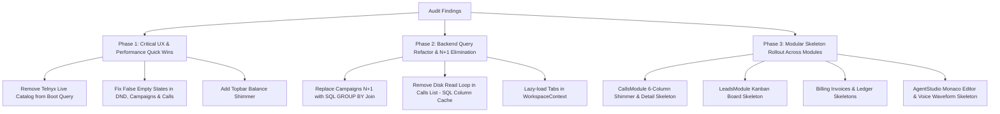

# UI/UX Skeletons, Loading States & Backend Optimization Audit
**Project:** Voxly AI Voice Agent Platform  
**Target:** Frontend (`voxly-ai/src`) & Backend (`server/`)  
**Date:** October 2026  
**Status:** Complete Architectural & Engineering Audit

---

## Executive Summary

A comprehensive, end-to-end architectural audit of the Voxly platform was conducted across every page, tab, modal, and drawer on the frontend, alongside an in-depth audit of all backend database queries, API endpoints, serialization loops, and filesystem operations.

### Key Audit Findings:
1. **Frontend UI/UX Gaps:**
   - **90% of Views Lack Layout-Stable Skeletons:** Skeletons currently only exist for generic overview cards (`ModuleSkeleton`) and the number store (`CatalogSkeleton`). Crucial modules (Calls, Campaigns, DND, Leads, Billing, Settings, Agent Studio) either display raw unstyled text (e.g., `"Loading calls…"`, `"Loading agents…"`) or flash an empty state before jumping into populated data, causing severe Cumulative Layout Shift (CLS).
   - **Eager State Flashes:** Several modules check `array.length === 0` to render "No items found" cards without checking `isLoading`. Users see "No campaigns running" or "No Do Not Call entries" for 300–800ms before items pop into view.
   - **Missing Micro-Animations:** Tab transitions, audio waveforms, AI speech synthesis buffers, and table row updates lack subtle pulse/shimmer feedback.

2. **Backend Burden & Query Inefficiencies:**
   - **Workspace "Big-Bang" Eager Fetch:** On initial boot, `WorkspaceContext.jsx` unconditionally fires **8 simultaneous HTTP requests**, including live carrier inventory searches (`api.telephony.getCatalog(catalogCountry)`) which trigger live outbound HTTPS calls to the Telnyx API, even if the user never visits the Phone Numbers tab.
   - **N+1 Database Query Loops:** `GET /api/campaigns` queries all tenant campaigns, then executes a separate `SELECT COUNT(*) FROM campaign_contacts` query in a Python `for` loop for every single campaign.
   - **Disk I/O Bottleneck in Call History:** `GET /api/calls` executes up to **400 synchronous disk read operations per request** (opening outcome JSONs, parsing YAML call ledgers, and running `os.stat` checks across audio archive formats in a loop).
   - **Unbounded & In-Memory Sorting:** `call_timeline.py` queries up to 1,000 rows (500 calls + 500 ringing attempts) into Python memory and sorts/slices them in Python rather than utilizing database SQL indexes and cursor pagination. `api.leads.list()` hardcodes `limit(500)` without pagination.

---

## Table of Contents
1. [Part 1: Frontend UI/UX Skeleton & Loading Animation Audit](#part-1-frontend-uiux-skeleton--loading-animation-audit)
   - 1.1 Global Application Shell & Navigation
   - 1.2 Overview Module (`OverviewModule.jsx`)
   - 1.3 AI Workforce / Employees Module (`EmployeesModule.jsx`)
   - 1.4 Agent Studio & Sub-Panels (`AgentStudioModule.jsx`)
   - 1.5 Phone Numbers & Telephony (`PhoneNumbersModule.jsx`)
   - 1.6 Campaigns & Outbound Engine (`CampaignsModule.jsx`)
   - 1.7 Do Not Call (DND) Registry (`DncRegistryPanel.jsx`)
   - 1.8 Calls, Transcripts & Recordings (`CallsModule.jsx`)
   - 1.9 Leads & CRM Pipeline (`LeadsModule.jsx`)
   - 1.10 Billing, Wallet & Payments (`BillingModule.jsx`)
   - 1.11 Settings, KYC & Compliance (`SettingsModule.jsx`)
   - 1.12 Platform Admin Module (`AdminModule.jsx`)
   - 1.13 Marketing & Public Surface (`Hero.jsx`, `AuthModal.jsx`, `OnboardingSurveyModal.jsx`)
2. [Part 2: Backend Burden & Data Loading Optimization Audit](#part-2-backend-burden--data-loading-optimization-audit)
   - 2.1 Eager vs. Lazy Loading Architecture
   - 2.2 N+1 Query Inefficiencies & Fixes
   - 2.3 Synchronous Filesystem I/O Removal
   - 2.4 Unbounded Queries & Database-Level Pagination
   - 2.5 Payload Bloat & Data Transfer Projections (Summary vs. Detail DTOs)
3. [Part 3: Recommended Reusable Skeleton Design System](#part-3-recommended-reusable-skeleton-design-system)
4. [Part 4: Priority Implementation Roadmap](#part-4-priority-implementation-roadmap)

---

## Part 1: Frontend UI/UX Skeleton & Loading Animation Audit

### 1.1 Global Application Shell & Navigation

| File & Location | Current Behavior | Problem / UX Risk | Recommended Skeleton & Animation |
|---|---|---|---|
| **Topbar Wallet**<br>`src/console/Topbar.jsx:85-115` | Displays `₹0.00` until `api.billing.getWallet()` resolves. | Jarring visual jump as numbers jump from zero to balance. | Replace balance with `Skeleton` pill (`h-5 w-16 rounded-md bg-[#E4E2EB]/70 animate-pulse`) while wallet is loading. |
| **Topbar Workspace Selector**<br>`src/console/Topbar.jsx:130-160` | Shows initial default workspace label before remote tenancy settles. | Layout flicker on initial render. | Add `h-7 w-32 rounded-lg` skeleton for the workspace dropdown trigger. |
| **Sidebar Badge Counts**<br>`src/console/Sidebar.jsx:80-140` | Badges (call count, employee count) pop in abruptly after workspace load completes. | Layout shift inside sidebar menu items. | Render subtle `h-4 w-6 rounded-full bg-[#E4E2EB]/60 animate-pulse` badge skeleton until counts resolve. |
| **Command Palette**<br>`src/console/CommandPalette.jsx:70-130` | If opened while workspace data is loading, shows empty search state. | User types query but gets "No commands or entities found". | Show 4-row shimmer placeholder (`CommandPaletteSkeleton`) with icon + title + shortcut badge placeholders. |

---

### 1.2 Overview Module (`OverviewModule.jsx`)

| Section | Current Behavior | Problem / UX Risk | Recommended Skeleton & Animation |
|---|---|---|---|
| **Top Metric Cards** (Active Fleet, Phone Lines, Total Calls, Balance) | Currently renders `ModuleSkeleton(cards=4)` **only if** `!agents.length && !calls.length`. If cache has 1 item, flashes partially. | Metric numbers jump and resize cards dynamically. | Implement dedicated `MetricsGridSkeleton` (4 cards, each with `h-3 w-20` label skeleton, `h-8 w-16` stat number skeleton, and `w-8 h-8 rounded-xl` icon placeholder). |
| **Recent Calls Feed** | Renders empty table or waits for whole workspace to settle. | Sudden pop-in of table rows. | 5-row table skeleton with caller name (`w-28`), agent pill (`w-20`), duration (`w-12`), and status badge (`w-16`). |
| **AI Fleet Quick Grid** | Uses `ModuleSkeleton` bottom card which is a generic rectangular box. | Does not match the 3-column interactive agent employee cards. | Render 3 agent card skeletons matching the exact dimensions: avatar circle (`w-10 h-10`), name (`w-32`), status badge (`w-16`), and action buttons (`w-full h-8`). |

---

### 1.3 AI Workforce / Employees Module (`EmployeesModule.jsx`)

| Section | Current Behavior | Problem / UX Risk | Recommended Skeleton & Animation |
|---|---|---|---|
| **Agent Card Grid**<br>`EmployeesModule.jsx:75-95` | Replaced by `ModuleSkeleton cards={3}` which only renders 3 generic blocks, then pops into full cards with tags, phone numbers, and buttons. | Layout flash when transitioning from `ModuleSkeleton` to actual agent cards with action bars. | Implement `AgentCardsGridSkeleton`: 3–6 cards with rounded-2xl border, top row with avatar circle + name + role, middle row with Telugu/English voice pill + DID pill, bottom row with "Open Studio" and "Test Call" button outlines. |
| **Empty State Flash**<br>`EmployeesModule.jsx:130-150` | If `isLoading` is false but network is slow, momentarily flashes "No AI employees yet". | Confuses user into thinking their agents were lost. | Guard with `isLoading ? <AgentCardsGridSkeleton /> : <EmptyState />`. |

---

### 1.4 Agent Studio & Sub-Panels (`AgentStudioModule.jsx`)

| Sub-Panel | Current Behavior | Problem / UX Risk | Recommended Skeleton & Animation |
|---|---|---|---|
| **Studio Header & Selector**<br>`AgentStudioModule.jsx:461-467` | When `selectedAgent` is loading, renders: `<SolidCard><p>Loading agents…</p></SolidCard>`. | Extremely plain and unpolished UX. | Render `AgentStudioHeaderSkeleton`: agent avatar (`w-12 h-12`), title (`h-6 w-48`), status toggle (`h-6 w-20`), tab bar line with 7 tab placeholders. |
| **Overview Tab** (`AgentOverview.jsx`) | Content appears instantly only after full agent model is loaded. | Layout jumps from plain text to complex 2-column metrics + test dialer. | Overview skeleton with Left Column (Prompt Summary, Speech Voice Pill, Phone Number routing card) and Right Column (Performance metrics grid). |
| **Script & Prompt Tab** | Blank white container while Monaco/textarea script is loaded from `active_compiled_brain_version`. | Jarring layout pop when 50+ lines of script text load. | Editor skeleton: simulated line numbers on the left (`1..15`), with 10 pulsing text bars of varying widths (`w-3/4`, `w-1/2`, `w-5/6`) simulating code blocks. |
| **Voice Tab & Speech Preview** | When user clicks "Preview Voice", state is `isPlayingVoice` with a basic spinner or raw text. | User doesn't know whether audio is downloading or generating. | Add active audio waveform shimmer (`WaveformSkeleton`: 8 vertical animated bouncing bars) while audio stream is buffering. |
| **Settings Tab** (`AgentSettingsPanel.jsx`) | Form toggles (recording disclosure, DND toggle) load abruptly. | Toggles pop in with default unchecked states before real config loads. | Form skeleton with 4 toggle card placeholders (`h-16 w-full rounded-xl bg-[#FAF9FD] border`). |
| **Test Call Tab** (`AgentTestCallPanel.jsx`) | Shows generic connect button while WebRTC / WebSocket session connects. | User clicks button repeatedly thinking it didn't trigger. | Pulse animation with radial ripples (`animate-ping`) on microphone circle during connection handshake. |
| **Dial / Bulk Outbound Tab** (`AgentDialBulkPanel.jsx`) | Form textarea has no skeleton while agent assigned DIDs are fetched. | "From" dropdown is disabled or empty, then suddenly populates. | Shimmer on "From" line selector until phone lines are bound. |

---

### 1.5 Phone Numbers & Telephony (`PhoneNumbersModule.jsx`)

| Section | Current Behavior | Problem / UX Risk | Recommended Skeleton & Animation |
|---|---|---|---|
| **Provisioned Numbers Table**<br>`PhoneNumbersModule.jsx:180-240` | Empty table while `api.telephony.getNumbers()` executes. Flashes "No active numbers" card for 400ms. | Content flash on every navigation. | 3-row `PhoneNumberRowSkeleton`: phone icon (`w-6 h-6`), E.164 number (`font-mono w-32`), assigned agent dropdown (`w-40`), status pill (`w-16`), monthly fee (`w-12`). |
| **Number Catalog Store**<br>`PhoneNumbersModule.jsx:565-580` | Has `CatalogSkeleton(rows=4)`, but when user filters by country (`catalogCountry`), the entire store flashes blank. | Country tab switch feels sluggish and broken. | Keep `CatalogSkeleton` rendered during country filter changes, with fade-in transition (`transition-opacity duration-200`). |
| **Telephony Settings Card** (`TelephonySettingsCard.jsx`) | SIP credentials and inbound fallback numbers pop in after load. | User sees blank inputs before credentials appear. | Input placeholder shimmer on SIP URI and fallback forward input. |

---

### 1.6 Campaigns & Outbound Engine (`CampaignsModule.jsx`)

| Section | Current Behavior | Problem / UX Risk | Recommended Skeleton & Animation |
|---|---|---|---|
| **Campaigns List Grid**<br>`CampaignsModule.jsx:535-546` | Shows `No campaigns running` SolidCard whenever `campaigns.length === 0`, even while initial fetch is pending. | Confuses users into thinking campaigns were deleted. | Check `isLoading`: render 3 `CampaignCardSkeleton` blocks (header with name + agent pill, progress bar placeholder `h-2 w-full`, stats grid with 4 metric boxes). |
| **Wizard Step 2 (CSV Upload)** | When file is dropped, `busy` shows a tiny spinner. Large files freeze the card visually. | User thinks upload stalled. | Shimmering file card skeleton showing `fileName`, `fileSize`, with animated progress bar (`0% -> 100%`). |
| **Wizard Step 4 (Data Validation)** | While `api.contacts.normalizePreview` executes, table area is blank or disabled. | User waits 1–3s without visual feedback on rows being processed. | 6-row table skeleton with checkmark badge placeholders and phone number pills. |

---

### 1.7 Do Not Call (DND) Registry (`DncRegistryPanel.jsx`)

| Section | Current Behavior | Problem / UX Risk | Recommended Skeleton & Animation |
|---|---|---|---|
| **Active / Deactivated DND Table**<br>`DncRegistryPanel.jsx:230-310` | `const [loading, setLoading] = useState(false);` exists in state but **is never rendered in the JSX**! While loading, it renders "No Do Not Call entries" empty state! | False empty state on every search, tab switch, or pagination click. | `DncTableSkeleton`: Table header with 5 column placeholders, followed by 5 skeleton rows with phone number (`font-mono w-28`), source badge (`w-24`), reason (`w-36`), date (`w-20`), action button (`w-16`). |
| **Bulk DND Import** | Form button shows basic text while processing. | No feedback on large number list processing. | Add animated progress bar showing progress through uploaded batch. |

---

### 1.8 Calls, Transcripts & Recordings (`CallsModule.jsx`)

| Section | Current Behavior | Problem / UX Risk | Recommended Skeleton & Animation |
|---|---|---|---|
| **Status Tab Filter Pills**<br>`CallsModule.jsx:590-610` | Tab count badges `(0)` flash before `api.calls.stats()` returns. | Counts jump from `(0)` to real numbers. | Subtle pulse shimmer on count parentheses until stats resolve. |
| **Call History Table**<br>`CallsModule.jsx:675-681` | Uses raw text: `<tr><td colSpan={6}>Loading calls…</td></tr>`. | Raw plain text looks like an unfinished prototype. | Implement `CallsTableSkeleton`: 6 rows with Caller avatar + name (`w-32`), Agent pill (`w-24`), Status pill (`w-16`), Duration monospace (`w-12`), Outcome snippet (`w-40`), Date/time (`w-24`). |
| **Call Detail Inspector Panel**<br>`CallsModule.jsx:731-850` | When a call row is clicked, details pop into view abruptly. | No transition or skeleton for recording player, transcript, or callback card. | `CallDetailSkeleton`: Top header with call reference pill, audio player skeleton (`h-14 w-full rounded-xl bg-[#FAF9FD]`), 4 speech bubble skeletons simulating conversational turn-by-turn chat. |
| **Audio Recording Player** (`RecordingPlayer`) | When play is clicked on an unbuffered call, audio downloads with a small spinner in the play button. | No indication of audio waveform or duration. | Animated soundwave equalizer bars (`h-6 w-32 flex gap-1 items-end`) while audio mix buffers. |

---

### 1.9 Leads & CRM Pipeline (`LeadsModule.jsx`)

| Section | Current Behavior | Problem / UX Risk | Recommended Skeleton & Animation |
|---|---|---|---|
| **Kanban Board** (5 Stage Columns)<br>`LeadsModule.jsx:180-260` | Columns render completely empty while leads fetch from backend. | Empty board feels barren and broken on every open. | `KanbanBoardSkeleton`: 5 stage columns, each with a column header skeleton (`h-4 w-24`) and 2–3 card skeletons inside (`rounded-xl p-3 bg-white border border-[#E4E2EB]` with name, phone, and intent badges). |
| **Table View**<br>`LeadsModule.jsx:265-350` | Shows empty table with no loading indicator. | Content flash when leads load. | `LeadsTableSkeleton`: 5 rows with Name, Phone, Email, Stage badge, Notes snippet, and Action button outline. |

---

### 1.10 Billing, Wallet & Payments (`BillingModule.jsx`)

| Section | Current Behavior | Problem / UX Risk | Recommended Skeleton & Animation |
|---|---|---|---|
| **Wallet Balance Cards**<br>`BillingModule.jsx:150-210` | Balance numbers and minutes jump from uninitialized state to loaded values. | Large numbers (`$0.00` -> `$150.00`) shift card width and layout. | Balance card skeleton (`h-10 w-28 bg-[#E4E2EB]/80 rounded-lg animate-pulse`) for both USD and INR displays. |
| **Invoices Table**<br>`BillingModule.jsx:360-410` | Renders blank table while `api.billing.listInvoices()` completes. | No loading indicator at all. | 3-row `InvoiceRowSkeleton` (Invoice ID, Date, Amount, Download PDF button). |
| **Ledger Transactions Table**<br>`BillingModule.jsx:420-480` | Blank table body while `api.billing.listTransactions(40)` runs. | Table pops into view suddenly. | 6-row `TransactionRowSkeleton` (Timestamp, Type pill, Reference ID, Amount). |

---

### 1.11 Settings, KYC & Compliance (`SettingsModule.jsx`)

| Section | Current Behavior | Problem / UX Risk | Recommended Skeleton & Animation |
|---|---|---|---|
| **Identity & KYC Card** (`VerifyIdentityCard.jsx`) | Card checks Didit session status via API; shows nothing or blank status before state arrives. | User sees "Not Started" momentarily even if already approved. | KYC card shimmer skeleton showing identity badge, status pill placeholder, and action button placeholder. |
| **Telephony Compliance Section** | Renders blank while checking regulatory numbers requirements. | Layout shifts after compliance rules fetch. | Checklist skeleton with 3 checkmark placeholders and description lines. |

---

### 1.12 Platform Admin Module (`AdminModule.jsx`)

| Section | Current Behavior | Problem / UX Risk | Recommended Skeleton & Animation |
|---|---|---|---|
| **Overview Metric Cards**<br>`AdminModule.jsx:98-115` | Wrapped in `{overview && (...)}`. While `overview` is null, the entire top section is completely missing! | Massive layout shift when 4 large cards suddenly pop into the DOM. | `AdminMetricsSkeleton`: 4 cards grid (`h-24 w-full rounded-2xl bg-white border border-[#E4E2EB] p-4`). |
| **Tenant Selector & Adjust Form** | Tenant select dropdown is empty or unpopulated while tenants query runs. | Dropdown flashes as options are injected. | Shimmer on tenant selector dropdown until tenant list arrives. |

---

### 1.13 Marketing & Public Surface

| Component | Current Behavior | Problem / UX Risk | Recommended Skeleton & Animation |
|---|---|---|---|
| **3D Hero Scene** (`Hero.jsx` / `LazyVoxlyScene.jsx`) | Displays PNG image fallback (`VoxlyBot_preview.png`) before WebGL scene initializes. Good practice, but transition between 2D PNG and 3D Canvas is abrupt. | Robot model pops into existence with a flash. | Add a smooth fade-in crossfade (`transition-opacity duration-500`) when Canvas emits `onCreated`. |
| **Onboarding Survey Modal** (`OnboardingSurveyModal.jsx`) | Form submit button shows basic spinner text. | Submission of multi-step telemetry feels generic. | Add step transition slide animation (`transform transition-transform duration-300`) between Step 1, 2, and 3. |

---

## Part 2: Backend Burden & Data Loading Optimization Audit

### 2.1 Eager vs. Lazy Loading Architecture

#### Critical Finding: The "Workspace Big-Bang" Query (`WorkspaceContext.jsx:175-204`)
Whenever any authenticated user enters the dashboard or refreshes the page, `WorkspaceContext` executes **8 concurrent requests** regardless of the route the user is visiting:
```javascript
// src/console/context/WorkspaceContext.jsx
const [fetchedCalls, fetchedLeads, fetchedCampaigns, fetchedWallet, fetchedCatalog, fetchedCallStats] =
  await Promise.all([
    capture('Calls', () => api.calls.list({ limit: 100, agentMap }), []),
    capture('Leads', () => api.leads.list(), []),
    capture('Campaigns', () => api.campaigns.list(), []),
    capture('Wallet', () => api.billing.getWallet(), null),
    capture('Number catalog', () => api.telephony.getCatalog(catalogCountry), []),
    capture('Call summary', () => api.calls.stats(), null),
  ]);
```

#### Why This Hurts Performance:
1. **Live Carrier API Leak:** `api.telephony.getCatalog(catalogCountry)` calls `GET /api/telephony/numbers/search`, which invokes:
   ```python
   # server/routes/app_telephony.py:258
   numbers = await TelnyxClient().search_available_numbers(country=country, limit=10)
   ```
   **This means an external carrier HTTPS request to Telnyx is made on EVERY page refresh**, even if the user only wanted to view their settings or overview!
2. **Database Overload:** Querying 100 calls, 500 leads, all campaigns, and call stats on boot places immense pressure on PostgreSQL/SQLite connection pools.
3. **Route Irrelevance:** A user on `#dashboard/settings` does not need the number purchase catalog, 100 recent calls, or campaigns.

#### Optimization Recommendation:
- **Core Boot Payload:** Only fetch lightweight tenant metadata, `agents.list()`, `phoneNumbers.list()`, and `wallet.summary()`.
- **Lazy Fetch Per Tab:**
  - Defer `calls.list` and `calls.stats` until `#dashboard/calls` or `#dashboard/overview` mounts.
  - Defer `campaigns.list` until `#dashboard/campaigns` mounts.
  - Defer `leads.list` until `#dashboard/leads` mounts.
  - Defer `telephony.getCatalog` **exclusively** to when the user clicks the "Buy Number" tab or modal!

---

### 2.2 N+1 Query Inefficiencies & Fixes

#### Issue: `GET /api/campaigns` N+1 SQL Count (`server/routes/campaigns.py:124-159`)
```python
# server/routes/campaigns.py
result = await db.execute(select(Campaign).where(Campaign.tenant_id == tenant_id).order_by(Campaign.created_at.desc()))
rows = result.scalars().all()

out = []
for r in rows:
    # BUG: N+1 queries! Executes 1 SQL query per campaign!
    cnt = await db.scalar(
        select(func.count()).select_from(CampaignContact).where(CampaignContact.campaign_id == r.campaign_id)
    ) or 0
```
- **Burden:** If a tenant has 50 campaigns, this issues **51 sequential queries** to PostgreSQL.
- **Fix:** Use a single aggregated SQL query with `LEFT OUTER JOIN` and `GROUP BY`:
  ```python
  stmt = (
      select(Campaign, func.count(CampaignContact.id).label("total_contacts"))
      .outerjoin(CampaignContact, CampaignContact.campaign_id == Campaign.campaign_id)
      .where(Campaign.tenant_id == tenant_id)
      .group_by(Campaign.campaign_id)
      .order_by(Campaign.created_at.desc())
      .limit(limit)
      .offset(offset)
  )
  ```
  This reduces 51 queries to **1 single fast query** with index optimization.

---

### 2.3 Synchronous Filesystem I/O Removal

#### Issue: `GET /api/calls` Disk Read Loop (`server/routes/calls.py:217-267`)
```python
# server/routes/calls.py:190
enriched = [_enrich_timeline_item(item) for item in items]
```
For every single call in the list, `_enrich_call_list_item` runs:
1. `read_outcome(cid)` — Opens, reads, and JSON-deserializes post-call analysis from disk.
2. `call_ledger.review_fields(cid)` — Opens and parses YAML/JSON ledger file from disk.
3. `audio_archive.recording_source(cid)` — Executes multiple `os.path.exists` / `stat` filesystem calls to check `.mp3`, `.wav`, and Telnyx recording paths.

- **Burden:** When requesting 100 calls, this triggers **300 to 500 synchronous disk read operations** inside a single HTTP request handler, blocking the Python async event loop!
- **Fix:**
  - Persist `summary`, `cost_usd`, `cost_inr`, and `has_recording` directly into the database row (`calls` table) during post-call finalization.
  - Return these columns directly in the SQL select query. Never hit the filesystem during list queries.
  - Reserve disk reading strictly for `GET /api/call/{id}/transcript` or `GET /api/call/{id}/outcome`.

---

### 2.4 Unbounded Queries & Database-Level Pagination

| Endpoint | Current Implementation | Problem | Recommended Optimization |
|---|---|---|---|
| `GET /api/calls` & `list_timeline`<br>`server/call/call_timeline.py:120-155` | Queries 500 calls + 500 attempts into memory, sorts in Python: `items.sort(key=_sort_key, reverse=True)`. | Memory spike; duplicate queries in `timeline_stats`. Full scan of timeline on every call. | Push sorting and pagination directly into SQL: `ORDER BY started_at DESC LIMIT :limit OFFSET :offset`. |
| `GET /api/leads`<br>`server/routes/app_leads.py:56-76` | Hardcoded `.limit(500)`. No pagination parameters (`page`, `offset`, `cursor`). | Returns all 500 leads with full notes on every fetch. Slow payload over mobile networks. | Add `page: int = 1`, `limit: int = 50`. Add index on `leads(tenant_id, agent_id, updated_at DESC)`. |
| `GET /api/campaigns`<br>`server/routes/campaigns.py:124-159` | Queries all campaigns for tenant without `limit` or `offset`. | Older accounts with 100+ campaigns will suffer degraded response times. | Add standard pagination: `limit: int = 20`, `offset: int = 0`. |

---

### 2.5 Payload Bloat & Data Transfer Projections (Summary vs. Detail DTOs)

| Endpoint | Bloated Fields in List Responses | Unused by List UI | Optimization Action |
|---|---|---|---|
| `GET /api/agents` | Serializes complete internal memory schemas, recording disclosure text, environment flags. | List views in Overview and Workforce Studio only display name, role, status, language, and assigned phone line. | Create `AgentSummaryDTO` for list views (drops heavy prompt rules, full memory schema). Keep full projection for `GET /api/agents/{id}`. |
| `GET /api/calls` | Returns raw traceback data, carrier disposition codes, pipeline routing internals. | Call table only displays caller name/number, agent name, duration, status, outcome string, and timestamp. | Separate `CallSummaryDTO` (for table view) from `CallDetailDTO` (loaded on-demand when call drawer opens). Saves ~65% JSON payload size. |
| `GET /api/leads` | Returns large free-text `notes` field for every lead in the fleet. | Table and Kanban views only render name, stage, and phone number. Notes are only viewed inside the detail modal. | Exclude or truncate `notes` to 60 characters in list response; fetch full notes on modal click. |

---

## Part 3: Recommended Reusable Skeleton Design System

To establish visual continuity across the entire Voxly platform, the following standardized skeleton components should be added to [voxly-ai/src/console/ui/Skeleton.jsx](file:///d:/voice%20agent/voxly-ai/src/console/ui/Skeleton.jsx):

```jsx
// Recommended additions to src/console/ui/Skeleton.jsx

/** Standard table rows skeleton matching 4-to-6 column layouts */
export function TableRowsSkeleton({ rows = 5, cols = 5 }) {
  return (
    <div className="divide-y divide-[#E4E2EB] animate-pulse">
      {Array.from({ length: rows }).map((_, i) => (
        <div key={i} className="py-3.5 px-4 flex items-center justify-between gap-4">
          <div className="flex items-center gap-3 flex-1">
            <Skeleton className="w-8 h-8 rounded-lg shrink-0" />
            <div className="space-y-1.5 flex-1">
              <Skeleton className="h-3 w-36" />
              <Skeleton className="h-2 w-24" />
            </div>
          </div>
          {cols >= 3 && <Skeleton className="h-4 w-24 hidden sm:block" />}
          {cols >= 4 && <Skeleton className="h-4 w-20 hidden md:block" />}
          {cols >= 5 && <Skeleton className="h-5 w-16 rounded-full" />}
        </div>
      ))}
    </div>
  );
}

/** Metrics KPI card skeleton */
export function MetricsGridSkeleton({ count = 4 }) {
  return (
    <div className="grid grid-cols-1 sm:grid-cols-2 lg:grid-cols-4 gap-4 animate-pulse">
      {Array.from({ length: count }).map((_, i) => (
        <div key={i} className="p-4 rounded-2xl border border-[#E4E2EB] bg-white space-y-3">
          <div className="flex items-center justify-between">
            <Skeleton className="h-3 w-20" />
            <Skeleton className="w-7 h-7 rounded-lg" />
          </div>
          <Skeleton className="h-8 w-24" />
          <Skeleton className="h-2 w-16" />
        </div>
      ))}
    </div>
  );
}

/** Kanban stage column skeleton */
export function KanbanSkeleton({ columns = 5 }) {
  return (
    <div className="grid grid-cols-1 md:grid-cols-3 lg:grid-cols-5 gap-4 animate-pulse">
      {Array.from({ length: columns }).map((_, colIdx) => (
        <div key={colIdx} className="bg-[#FAF9FD] border border-[#E4E2EB] rounded-2xl p-3 space-y-3">
          <div className="flex justify-between items-center pb-2 border-b border-[#E4E2EB]">
            <Skeleton className="h-4 w-24" />
            <Skeleton className="h-4 w-6 rounded-full" />
          </div>
          <div className="space-y-2">
            <div className="bg-white border border-[#E4E2EB] rounded-xl p-3 space-y-2">
              <Skeleton className="h-3.5 w-3/4" />
              <Skeleton className="h-2.5 w-1/2" />
              <div className="flex justify-between pt-1">
                <Skeleton className="h-4 w-12 rounded-full" />
                <Skeleton className="h-4 w-16" />
              </div>
            </div>
            <div className="bg-white border border-[#E4E2EB] rounded-xl p-3 space-y-2">
              <Skeleton className="h-3.5 w-2/3" />
              <Skeleton className="h-2.5 w-1/3" />
            </div>
          </div>
        </div>
      ))}
    </div>
  );
}

/** Interactive Audio & Waveform Shimmer */
export function WaveformSkeleton() {
  return (
    <div className="flex items-end gap-1 h-6 py-1 px-2 bg-[#F0EEF6] rounded-lg">
      {[40, 70, 30, 90, 60, 100, 50, 80].map((h, i) => (
        <div
          key={i}
          style={{ height: `${h}%` }}
          className="w-1 bg-[#6344E7]/40 rounded-full animate-pulse"
        />
      ))}
    </div>
  );
}
```

---

## Part 4: Priority Implementation Roadmap



### High Priority (Immediate ROI):
1. **Unlink Live Telnyx Search on Boot:** In `WorkspaceContext.jsx`, remove `api.telephony.getCatalog` from the initial `loadWorkspaceData` bundle. Trigger it strictly inside `PhoneNumbersModule` on demand.
2. **Fix False Empty State Flashes:** Update `DncRegistryPanel.jsx`, `CampaignsModule.jsx`, and `CallsModule.jsx` so that `loading === true` renders a skeleton instead of "No items found" cards.
3. **Resolve Campaigns N+1 SQL Query:** Update `server/routes/campaigns.py:list_campaigns` to aggregate `CampaignContact` counts using `func.count()` with `LEFT JOIN` in a single SQL query.
4. **Eliminate Disk I/O Loop in `list_calls`:** Cache call summary, duration, cost, and recording presence in PostgreSQL/SQLite `calls` table columns.

### Medium Priority:
1. **Implement `TableRowsSkeleton` in `CallsModule` & `DncRegistryPanel`:** Replace raw text `"Loading calls…"` with structured 6-column shimmering row placeholders.
2. **Implement `KanbanSkeleton` in `LeadsModule`:** Render 5 stage columns with pulsing placeholder cards.
3. **Implement `BillingModule` Skeletons:** Balance card pulse, invoice rows shimmer, and transaction ledger rows shimmer.
4. **Implement `AgentStudio` Skeletons:** Header skeleton and script editor line placeholders.

### Low Priority / Polish:
1. **Audio Equalizer Shimmer:** Animated waveform bars while neural speech buffers in Agent Studio and Hero audio demo.
2. **3D Hero Crossfade:** Smooth opacity transition when Three.js canvas initializes over preview PNG.
