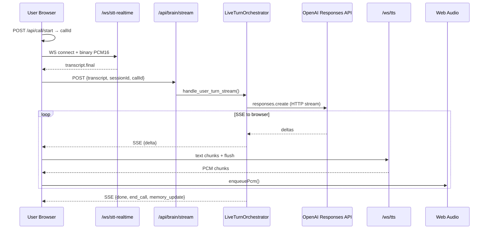

# Voice Agent — Technical Architecture Report (As Implemented)

**Generated:** 2026-09-06  
**Scope:** Runtime behavior traced from source code. Comments and docs are not treated as authoritative.  
**Constraint:** Read-only analysis — no code was modified.

---

## Executive Summary

The voice agent is a **modular pipeline** with a shared conversational brain:

```
Audio in → STT (Sarvam WebSocket) → transcript.final → LLM (OpenAI Responses API, HTTP per turn)
       → streamed text chunks → TTS (Sarvam/Cartesia WebSocket) → audio out
```

**Browser** and **PSTN** converge on the same `LiveTurnOrchestrator` and upstream STT/TTS connectors. They differ in **where audio enters and exits** (browser WebSockets + Web Audio vs Telnyx media WebSocket + RTP pacing).

The system is **not** using OpenAI Realtime API. LLM calls are **stateless HTTP** with reconstructed context every turn. STT waits for **final** transcripts before invoking the LLM. LLM output and TTS audio are **streamed** (sentence-chunked), so playback can begin before the model finishes.

---

## 1. Call Lifecycle

### 1.1 PSTN (Telnyx) — End-to-End

| Stage | File | Function / Class | Endpoint / Event |
|-------|------|------------------|------------------|
| Outbound dial | `server/routes/dev_telephony.py` | `dev_telephony_outbound()` → `_outbound_telnyx()` | `POST /api/dev/telephony/outbound` |
| Stack prep | `server/services/pstn_stack.py` | `prepare_pstn_dial_stack()` | — |
| Telnyx REST | `server/services/telnyx_client.py` | `TelnyxClient.create_outbound_call()` | `POST https://api.telnyx.com/v2/calls` |
| Webhook | `server/routes/telnyx.py` | `telnyx_webhook()` | `POST/GET /api/telnyx/webhook` |
| Stream fallback | `server/routes/telnyx.py` | `_ensure_telnyx_streaming()` | `POST /calls/{id}/actions/streaming_start` |
| Media WS | `server/routes/telnyx_ws.py` | `telnyx_stream_ws()` | `WebSocket /ws/telnyx-stream?token=…` |
| Bridge | `server/services/telnyx_pstn_bridge.py` | `TelnyxPstnBridge` | Handles `connected`, `start`, `media`, `error`, `stop` |
| Call registry | `server/call/call_lifecycle_service.py` | `CallLifecycleService.start()` | Called from `TelnyxPstnBridge._on_start()` |
| Voice loop | `server/services/pstn_voice_core.py` | `PstnVoiceLoop` | `start_call()`, `feed_user_pcm16()`, `_run_turn()` |
| STT | `server/services/sarvam_ws.py` | `connect_stt_realtime()` | `wss://api.sarvam.ai/speech-to-text-realtime/ws` |
| LLM | `server/call/live_turn_orchestrator.py` | `LiveTurnOrchestrator.handle_user_turn_stream()` | In-process (no HTTP on PSTN) |
| TTS | `server/services/pstn_turn_tts.py` | `PstnTurnTtsSession` | Upstream TTS WS per turn |
| Audio egress | `server/services/telnyx_pstn_bridge.py` | `_send_agent_wire()`, `_out_worker()` | Telnyx `{"event":"media"}` |
| Barge-in | `server/services/pstn_voice_core.py` | `_should_commit_barge()`, `interrupt_tts()` | **Disabled:** `ENABLE_PSTN_BARGE_IN = False` |
| Hangup (agent) | `server/call/call_lifecycle_service.py` | `end(reason="agent_hangup")` | After gated `end_call.should_end` |
| Hangup (caller) | `TelnyxPstnBridge._cleanup()` | `end(reason="pstn_hangup")` | On `stop` or WS disconnect |

**PSTN `session_id`:** Unique per call: `pstn-telnyx-{call_control_id}` (set in `TelnyxPstnBridge._on_start()` line 210).

### 1.2 Browser (Web) — End-to-End

| Stage | File | Function / Class | Endpoint |
|-------|------|------------------|----------|
| Call start | `web/components/live/LiveVoiceSession.tsx` | `startCall()` | `POST /api/call/start` |
| Mic capture | `web/public/pcm-worklet.js` | `PCMProcessor` | 16 kHz PCM via AudioWorklet |
| STT | `server/routes/ws.py` | `ws_stt_realtime()` | `WebSocket /ws/stt-realtime` |
| Brain | `server/routes/brain.py` | `brain_stream_route()` | `POST /api/brain/stream` (SSE) |
| Orchestrator | `server/call/live_turn_orchestrator.py` | `handle_user_turn_stream()` | Same as PSTN |
| TTS | `web/lib/voice/turn-tts-pipeline.ts` | `TurnTtsPipeline` | `WebSocket /ws/tts` |
| Playback | `web/lib/voice/streaming-audio-playback.ts` | `StreamingAudioPlayback` | Web Audio @ ~24 kHz |
| Barge-in | `web/components/live/LiveVoiceSession.tsx` | `doBargeIn()` | `POST /api/session/interrupt` |
| Call end | `LiveVoiceSession.tsx` | `endCall()` | `POST /api/call/end` |

Legacy path: `client/app.js` — same endpoints, older TTS/MSE fallback.

### 1.3 Sequence Diagram — PSTN Call

```mermaid
sequenceDiagram
    participant C as Customer (PSTN)
    participant TX as Telnyx
    participant WH as /api/telnyx/webhook
    participant WS as /ws/telnyx-stream
    participant BR as TelnyxPstnBridge
    participant VL as PstnVoiceLoop
    participant STT as Sarvam STT WS
    participant OR as LiveTurnOrchestrator
    participant OAI as OpenAI Responses API
    participant TTS as Sarvam/Cartesia TTS WS
    participant LC as CallLifecycleService

    Note over C,LC: Outbound dial (dev path)
    WH->>TX: streaming_start (if needed)
    TX->>WS: WebSocket connect
    WS->>BR: TelnyxPstnBridge.run()
    BR->>LC: start(agent_id, session_id=pstn-telnyx-{control_id})
    LC->>LC: memory_manager.init(call_id)<br/>conversation_manager.clear(session_id)
    BR->>VL: start_call() → open_stt()
    VL->>STT: connect_stt_realtime (linear16 @ 16kHz)

    loop Each utterance
        C->>TX: RTP audio (inbound)
        TX->>BR: event=media (base64)
        BR->>VL: feed_user_pcm16()
        VL->>STT: {"event":"audio_input","audio":"..."}
        STT-->>VL: transcript.partial (barge path; disabled on PSTN)
        STT-->>VL: transcript.final
        VL->>OR: handle_user_turn_stream(transcript, call_id, session_id)
        OR->>OAI: responses.create(stream=True) [new HTTP request]
        loop LLM streaming
            OAI-->>OR: response.output_text.delta
            OR-->>VL: {"delta": "..."}
            VL->>VL: drain_complete_sentences()
            VL->>TTS: {"type":"text"} per sentence
            TTS-->>VL: audio chunks (base64)
            VL->>BR: on_agent_wire(pcm/mulaw)
            BR->>TX: event=media (20ms paced)
            TX->>C: audio
        end
        OR->>OR: conversation_manager.add_turn()<br/>memory_manager.apply_proposals()
    end

    Note over C,LC: Termination
    alt Agent hangup
        OR->>LC: end(call_id, agent_hangup)
        VL->>TX: hangup action
    else Caller hangup
        TX->>BR: event=stop
        BR->>LC: end(call_id, pstn_hangup)
    end
```

### 1.4 Sequence Diagram — Browser Call



---

## 2. STT Architecture

### 2.1 Provider & Model (Default)

| Setting | Value | Source |
|---------|-------|--------|
| Provider | **Sarvam** | `server/providers/registry.py` — default tier stacks |
| Model | **`saaras:v3-realtime`** | `server/providers/resolver.py` (medium/premium tiers) |
| Cartesia STT | Opt-in (`ENABLE_CARTESIA` + API key) | `server/providers/cartesia_stt.py` |

### 2.2 Initialization

| Path | Init location |
|------|---------------|
| Browser | `ws_stt_realtime()` → `_connect_stt_upstream()` → `SarvamSTTAdapter.connect_realtime()` or `connect_stt_realtime()` |
| PSTN | `PstnVoiceLoop.open_stt()` → same `_connect_stt_upstream()` |

**Connection URL** (`server/services/sarvam_ws.py`):
```
wss://api.sarvam.ai/speech-to-text-realtime/ws
  ?language_code=te-IN
  &model=saaras:v3-realtime
  &stream_type=fast|balanced|simulated
  &mode=transcribe
  &endpointing=vad
  &encoding=linear16
  &sample_rate=16000|8000
  [&silence_duration_ms=400]
```

### 2.3 Streaming vs Batch

| Mode | Used in live calls? | API |
|------|---------------------|-----|
| **Realtime WebSocket** | **Yes** (browser + PSTN) | Sarvam WS |
| REST batch | No on live path | `POST /api/stt` → `sarvam_stt_service.py` |

### 2.4 Partial vs Final Transcripts

| Event | Sent to LLM? | Purpose |
|-------|--------------|---------|
| `transcript.partial` | **No** | UI display; barge-in detection (browser; PSTN if enabled) |
| `vad.speech_start` / `vad.speech_end` | **No** | Barge timing (browser) |
| **`transcript.final`** | **Yes** — triggers `_run_turn()` / `handleSttFinal()` | Turn boundary |

**Code path (PSTN):** `PstnVoiceLoop._stt_reader()` — only `transcript.final` calls `_run_turn(text)`.

### 2.5 VAD & Endpointing

- **VAD location:** Sarvam provider (not local server VAD).
- **Endpointing param:** `endpointing=vad` (default) or `manual`.
- **Silence threshold:** `silence_duration_ms` — default **400 ms** (`server/services/voice_stt_runtime.py`, `DEFAULT_STT_SILENCE_MS`).
- **Stream type:** `fast` (default), overridable via Test Studio `sttStreamType`.

**"User finished speaking" event:** `transcript.final` from Sarvam STT WebSocket.

### 2.6 Concurrency During LLM

| Behavior | Implementation |
|----------|----------------|
| STT keeps receiving audio during LLM | **Yes** — `feed_user_pcm16()` continues sending `audio_input` |
| New `transcript.final` during busy turn | Queued in `_pending_transcript`; processed after `_turn_busy` clears (`pstn_voice_core.py` lines 317–320, 447–450) |
| Turn serialization | `turn_coordinator.lock_for(call_id)` in orchestrator; `_turn_busy` flag in PSTN loop |

### 2.7 Interruption / Barge-in

| Channel | Can interrupt? | Mechanism |
|---------|----------------|-----------|
| **Browser** | **Yes** | `doBargeIn()`: abort brain SSE, close TTS WS, stop playback, `POST /api/session/interrupt` |
| **PSTN** | **No (default)** | `ENABLE_PSTN_BARGE_IN = False` in `pstn_voice_core.py` line 29 |

When PSTN barge is enabled (code exists, not active):
1. `transcript.partial` → `_should_commit_barge()` (≥3 words, 700 ms after TTS, 200 ms hold, echo guard)
2. `TelnyxPstnBridge._barge_in()` — invalidate `generation_id`, drain `_out_queue`, send `{"event":"clear"}` to Telnyx
3. `PstnTurnTtsSession.interrupt()` — cancel reader, close TTS WS (no upstream cancel API)

**Partial TTS during interruption:** Outbound queue drained; generation ID invalidated so stale frames are dropped.

---

## 3. LLM / OpenAI Architecture

### 3.1 API Used

| API | Used? | Where |
|-----|-------|-------|
| **OpenAI Responses API** | **Yes (primary)** | `client.responses.create()` in `openai_brain_service.py` |
| Chat Completions | Fallback only (DeepSeek) | `deepseek_llm.py` |
| Realtime API | **No** | — |
| Gemini REST | Optional fallback | `gemini_llm.py` |

### 3.2 Exact API Call (Live Turn)

```python
# server/services/openai_brain_service.py ~line 948
stream = await client.responses.create(
    model=use_model,
    input=input_messages,          # rebuilt every turn
    max_output_tokens=...,
    store=False,                   # not stored by OpenAI
    stream=True,
    text=TEXT_FORMAT_LIVE_TURN,    # when structured_live_turn enabled
    prompt_cache_key="telugu-voice:v5:cb-{digest}",
    prompt_cache_options={"mode": "explicit", "ttl": "30m"},
    temperature=...,
    reasoning=...,                 # for reasoning models
)
```

**Stream events consumed:**
- `response.output_text.delta` → yield `{"delta": ...}` to TTS pipeline
- `response.completed` → turn complete
- `error` → `AppError`

### 3.3 Per-Turn Behavior

| Question | Answer |
|----------|--------|
| New HTTP request per turn? | **Yes** |
| Persistent WebSocket to OpenAI? | **No** |
| Data sent | Developer brain + memory projection + rolling summary + last N history turns + current transcript |
| Full history resent? | **Brain block yes**; conversation history = last **`brain_context_turns`** (default **2** complete turns = 4 messages) |
| Input streamed to OpenAI? | **No** — full `input` array per request |
| Output streamed? | **Yes** — `response.output_text.delta` |
| Response started event | First `response.output_text.delta` (logged as `BRAIN_FIRST_DELTA`) |
| Response complete event | `response.completed` → `conversation_manager.add_turn()` |

### 3.4 Input Message Layout

Built by `build_live_input()` / `build_brain_request_input()` in `server/agent/instruction_builder.py`:

| Index | Role | Content |
|-------|------|---------|
| 0 | `developer` | Compiled brain text (+ `prompt_cache_breakpoint` if caching) |
| 1 | `user` | `[Memory projection]\n{facts/prefs/context}` |
| 2 | `user` | `[Rolling summary]\n{summary}` (if present) |
| 3…N-1 | `user`/`assistant` | Recent history from `conversation_manager` |
| N | `user` | Current STT transcript (raw) |

### 3.5 All OpenAI API Call Sites (Runtime)

| Location | Purpose | API |
|----------|---------|-----|
| `openai_brain_service.generate_response()` | Non-stream brain | `responses.create` |
| `openai_brain_service.generate_response_stream()` | **Live turns** | `responses.create(stream=True)` |
| `providers/openai_llm.py` | Adapter wrapper | Delegates to above |
| `brain/agent_script_compiler.py` | Compile agent brief → script | `responses.create` (structured) |
| `brain/business_prompt_optimizer.py` | Optimize business prompt | LLM via optimizer |
| `brain/session_brain_compiler.py` | Session brain merge | Via optimizer |
| `call/post_call_pipeline.py` | Post-call outcome extraction | Provider adapter |
| `session/voice_session.py` | Legacy voice session path | `generate_response` |

---

## 4. Memory Architecture

### A. Agent Configuration

| What | Where | Key | Lifecycle |
|------|-------|-----|-----------|
| Test Studio instructions | `instruction_store._store` + disk | **`sessionId`** | Created on `POST /api/instructions`; persisted `{data_dir}/session_overrides.json` via `session_persist.py` |
| Published agent brain | `compiled_brain_service` + DB | **`agent_id`** → `compiled_version` | Compiled via `compile_for_agent()`; stored in `CompiledBrainSnapshot` table |
| Runtime settings (model, STT, TTS) | `runtime_settings` + disk | **`sessionId`** | `{data_dir}/session_overrides.json` → `runtime` |
| Locked at call start | `CallContext.compiled_brain_text` | **`call_id`** | Copied in `call_lifecycle_service._lock_compiled_brain()` |

**Survives call end?** Yes (instructions, agent brain).  
**Survives server restart?** Yes (disk + DB).  
**Sent to OpenAI?** Brain text sent every turn (developer message).  
**Stored by OpenAI?** `store=False` — not persisted on OpenAI side.

### B. Conversation Memory (Current Call)

| What | Where | Key | Lifecycle |
|------|-------|-----|-----------|
| Hot turn history (LLM context) | `conversation_manager._store` | **`session_id`** | **Cleared** on `call_lifecycle_service.start()` |
| Per-call working memory | `memory_manager._state` | **`call_id`** | `init(call_id)` on call start; `apply_proposals()` each turn |
| Transcript archive | `call_ledger` → `transcript.jsonl` | **`call_id`** | Append each turn; sealed on call end |
| Active call registry | `call_context._CALLS` | **`call_id`**; index `_BY_SESSION[session_id]` | `put()` on start; `drop_session_pointer()` on end |

**`conversation_manager` structure:**
```python
_store[session_id] = {
    "messages": [{"role": "user"|"assistant", "content": str}],  # max 8 msgs
    "updatedAt": float,
    "turnCount": int,
    "bargePending": bool,
    "bargeHeard": str,
}
```

**`memory_manager` snapshot (Object B):**
```python
{
    "facts": {key: value},        # max 32 keys
    "preferences": {key: value},  # max 16 keys
    "important_context": str,
    "summary": str,
}
```
Disk: `{call_dir}/memory_snapshot.json`, `memory_events.jsonl`, `memory_projections.jsonl`.

### C. Customer Memory Across Calls

**Not implemented.** There is no `customer_id` entity.

- `caller_id` (telephony) seeds `facts.phone` for the **current call only** (`call_lifecycle_service.start()` lines 148–154).
- Prior call `memory_snapshot.json` / `outcome.json` are **never loaded** into a new call.
- Post-call `outcome.json` is archival only.

### D. Prompt / Instruction Storage

| Layer | File | Key |
|-------|------|-----|
| Raw behaviour/business | `instruction_store` | `sessionId` |
| Agent brief → script | `agent_script_compiler` | `sessionId` (saved via `instruction_store.save_agent_script()`) |
| Dual-prompt session brain | `session_brain_compiler` | `sessionId` |
| Platform + business (production) | `compiled_brain_service` | `agent_id` |

### E. Cached Prompt / Context

| Mechanism | File | Key |
|-----------|------|-----|
| OpenAI prompt prefix cache | `prompt_cache_key.py` | `sha256(compiled_version\|budget)[:12]` or `sha256(brain\|budget)[:12]` |
| In-memory compiled brain | `compiled_brain_service._COMPILED_CACHE` | `compiled_version` |
| Redis memory cache (optional) | `redis_memory_cache.py` | `call_id` (snapshot mirror) |

Eligibility: `ENABLE_PROMPT_CACHING=true`, brain ≥ 1024 tokens, GPT-5.6 for explicit breakpoint.

### F. Application / Session State

| State | Location | Key |
|-------|----------|-----|
| Provider stack (locked) | `CallContext.resolved_stack` | `call_id` |
| PSTN bridge registry | `active_telnyx_bridges` | `call_control_id` |
| Turn locks | `turn_coordinator._locks` | `call_id` |
| Telnyx call registry | `telnyx_call_registry` | `call_control_id` |
| DB call record | `call_store` | `call_id` |

### Leak Analysis

| Risk | Can leak? | Mitigation in code |
|------|-----------|-------------------|
| Between calls (same user) | **No** (working memory) | Fresh `memory_manager.init(call_id)` each call |
| Between calls (conversation) | **No** if `/api/call/start` runs | `conversation_manager.clear(session_id)` on start |
| Between calls (conversation) | **Yes** if brain called without new call start | `/api/brain` without `callId` reuses `session_id` history |
| Between customers | **No dedicated customer model** | Isolation = `session_id` + `call_id`; PSTN uses unique `pstn-telnyx-{control_id}` |
| Between tenants | Partial | `tenant_id` on `CallContext`; enforcement depends on route auth |

---

## 5. Conversation History

### Flow

```
Call start → conversation_manager.clear(session_id)
User speaks → STT final → LLM → conversation_manager.add_turn(session_id, user, assistant)
Next turn → get_context_for_brain(session_id, max_turns=2) → prepended to OpenAI input
```

### Code References

| Operation | File | Function |
|-----------|------|----------|
| Store | `conversation_manager.py` | `add_turn()` — appends to `_store[session_id]["messages"]` |
| Retrieve | `conversation_manager.py` | `get_context_for_brain()` — last `max_turns * 2` messages |
| Clear | `conversation_manager.py` | `clear(session_id)` |
| Barge reconcile | `conversation_manager.py` | `note_barge()` — marks `[interrupted]` |
| Create (implicit) | `conversation_manager.py` | `_ensure(session_id)` on first access |

### CALL A vs CALL B

| Scenario | Shared history? |
|----------|-----------------|
| Normal browser/PSTN with `call/start` | **No** — cleared on each start |
| Same `sessionId`, no new call start | **Yes** — history persists in `_store` |
| Different `call_id`, same `session_id` after start | **No** — cleared at new call start |

PSTN: each call gets `session_id = pstn-telnyx-{call_control_id}` — unique per Telnyx control ID.

### CUSTOMER A vs CUSTOMER B

| Scenario | Shared history? |
|----------|-----------------|
| Different `session_id` / `call_id` | **No** |
| Same browser `sessionId` (e.g. shared Test Studio tab) | **Yes** — same instruction + conversation store |
| No `customer_id` concept | Cross-customer recall **not implemented** |

---

## 6. Agent Instructions / Prompt

### Compilation Pipeline

```
Agent brief (natural language)
  → agent_script_compiler.compile_agent_from_brief()     [LLM: responses.create + JSON schema]
  → AgentScriptResult (agent_script, role, key_facts, …)
  → instruction_store.save_agent_script(sessionId, …)
  → brain_prompt_composer / session_brain_compiler.assemble
  → Final brain text (SECTION_SAFETY + spoken_pack + script + call_end_policy + STATIC_OUTPUT_RULES + language footer)
  → Locked onto CallContext.compiled_brain_text at call start
  → build_live_input() → OpenAI developer message every turn
```

**Alternative path (dual-prompt Test Studio):**
```
behaviour + business
  → session_brain_compiler.compile_session_brain()
  → business_prompt_optimizer (LLM)
  → instruction_store.save_compiled()
```

### Compile Frequency

| Artifact | When compiled |
|----------|---------------|
| Agent script from brief | On user action (`POST /api/instructions` compile) — **not every call** |
| Session brain | On save/compile in Test Studio |
| Production agent brain | On publish (`compiled_brain_service.compile_for_agent()`) |
| Runtime prompt | **Brain text locked at call start** — not recompiled per turn |

### Sent to OpenAI

| Component | Every turn? |
|-----------|-------------|
| Full compiled brain (developer message) | **Yes** |
| Memory projection | **Yes** (if `working_memory_enabled` + `call_id`) |
| Rolling summary | **Yes** (if present) |
| Last 2 turn-pairs | **Yes** |
| Current transcript | **Yes** |

### Static vs Dynamic Parts

| Part | Static / Dynamic | Source |
|------|------------------|--------|
| `SECTION_SAFETY` | Static | `prompts/brain_prompt.py` |
| Spoken number pack | Static per language | `agent_voice_rules.spoken_pack_for()` |
| Agent script body | Static per compile | `agent_script_compiler` / `instruction_store` |
| Call end policy | Semi-static | `call_end_policy_section()` |
| `STATIC_OUTPUT_RULES` | Static | `brain/sections.py` |
| Language footer | Static per language | `language_runtime_footer()` |
| Memory projection | **Dynamic** | `memory_manager` per turn |
| Rolling summary | **Dynamic** | Updated every N turns |
| Conversation history | **Dynamic** | `conversation_manager` |
| Transcript | **Dynamic** | Current STT final |

### Prompt Caching

**Yes, when enabled:**
- `ENABLE_PROMPT_CACHING=true` (default)
- Brain ≥ `PROMPT_CACHE_MIN_TOKENS` (1024)
- GPT-5.6: explicit `prompt_cache_breakpoint` + `prompt_cache_key`
- Gemini: implicit prefix cache
- Tracked in `prompt_cache_tracker`

---

## 7. Realtime API Migration Possibility

**Target architecture (not implemented):**
```
Customer → Telnyx → OpenAI Realtime (persistent) → Cartesia TTS → Telnyx → Customer
```

| Component | Verdict | Notes |
|-----------|---------|-------|
| **STT (Sarvam WS)** | **REPLACE** | Realtime API includes built-in audio input + VAD |
| **LLM (Responses HTTP)** | **REPLACE** | Would become Realtime WebSocket session |
| **TTS (Sarvam/Cartesia WS)** | **KEEP or MODIFY** | Could keep Cartesia streaming; Realtime can output audio natively (would replace TTS entirely if used) |
| **Telnyx media layer** | **MODIFY** | Still need RTP ↔ PCM bridge; may forward audio to Realtime instead of Sarvam |
| **WebSocket layer (`ws.py`)** | **MODIFY** | Browser path would connect to different upstream |
| **Memory (`memory_manager`)** | **KEEP** | Still need per-call facts; would inject via Realtime session instructions or periodic updates |
| **Agent instructions** | **KEEP** | Compiled brain still needed; loaded as session instructions on Realtime connect |
| **Barge-in logic** | **REPLACE/MODIFY** | Realtime has server-side interruption; current `live-guards` / `echo_guard` partially obsolete |
| **`LiveTurnOrchestrator`** | **REPLACE** | Turn-based HTTP orchestration incompatible with persistent session |
| **`conversation_manager`** | **MODIFY** | May sync from Realtime conversation items instead of manual `add_turn` |
| **`PstnVoiceLoop`** | **REPLACE** | Monolithic STT→LLM→TTS loop replaced by Realtime session + wire adapter |
| **`pstn_turn_tts.py`** | **KEEP** (if external TTS) | Still useful if Realtime outputs text only |
| **`call_lifecycle_service`** | **KEEP** | Call start/end, ledger, post-call still needed |
| **`instruction_store` / compilers** | **KEEP** | Brain compilation unchanged |
| **`end_call_validate`** | **MODIFY** | Hangup gating logic reusable; trigger mechanism changes |

---

## 8. Cartesia (TTS)

### When Used

- **Not the default.** Default TTS = Sarvam `bulbul:v3`.
- Cartesia registers when `ENABLE_CARTESIA=true` + `CARTESIA_API_KEY`.
- Selected via stack resolver / Test Studio stack override (`provider: cartesia`).
- TTS fallback chain: `["sarvam", "cartesia"]` (`dev_fallback_store.py`).

### Call Path

| Step | Location |
|------|----------|
| Stack resolution | `resolver.py` → Cartesia in TTS slot |
| WS connect | `_connect_tts_upstream()` → `CartesiaTTSAdapter.connect_stream()` → `cartesia_tts_ws.py` |
| PSTN | `PstnTurnTtsSession.open()` — forces L16 @ 16 kHz wire |

### Protocol

| Aspect | Value |
|--------|-------|
| Transport | **WebSocket** (`wss://api.cartesia.ai/tts/websocket`) |
| REST alternative | `POST /tts/bytes` (not used on live path) |
| Input | **Text chunks** (Sarvam-compatible shim: `config`, `text`, `flush`) |
| Not token-level | Sentences/clauses from `drain_complete_sentences()` |
| Output format | `pcm_s16le` raw, base64 in WS messages |
| Default voice | `CARTESIA_DEFAULT_VOICE_ID` |

### Audio Path (PSTN + Cartesia)

```
LLM delta → pstn_text_chunker → PstnTurnTtsSession.send_text()
  → Cartesia WS → PCM16 @ 16kHz chunks
  → _emit_audio_chunk() → _chunk_l16_rtp() (20ms frames)
  → TelnyxPstnBridge._out_queue → _out_worker() (20ms sleep)
  → Telnyx {"event":"media"} → PSTN
```

### Streaming & Interruption

| Question | Answer |
|----------|--------|
| TTS before LLM finishes? | **Yes** — sentence chunks sent as LLM streams |
| Interruptible? | Browser: yes (close WS, stop playback). PSTN: disabled. No upstream cancel API — client-side drop |

### Telnyx Format Requirements

| Telnyx mode | Format |
|-------------|--------|
| Default (configured) | **L16 @ 16 kHz**, mono, 20 ms frames (640 bytes) |
| Alternate | PCMU/PCMA @ 8 kHz (160 bytes/frame) |
| MP3 mode | 24 kHz MP3 blobs, 1 msg/sec limit |

Transcoding: `server/services/audio_transcode.py`, `telnyx_pstn_bridge._send_agent_wire()`.

---

## 9. Telnyx / PSTN

### Wire Format (Actual)

| Parameter | Telnyx default | Code constant |
|-----------|----------------|---------------|
| Codec | **L16** | `TELNYX_RTP_CODEC` in `telnyx_client.py` |
| Sample rate | **16000 Hz** | `TELNYX_RTP_SAMPLE_RATE = 16000` |
| Channels | Mono | `channels=1` |
| Frame size | **20 ms** | `_out_worker()` sleeps `0.02s`; `_chunk_l16_rtp()` |
| Encoding | Base64 in JSON `media.payload` | Telnyx stream protocol |

Dial parameters (`TelnyxClient.create_outbound_call`):
- `stream_track: both_tracks`
- `stream_bidirectional_codec: L16`
- `stream_bidirectional_sampling_rate: 16000`
- `send_silence_when_idle: true`

### WebSocket Events (Telnyx → Server)

| Event | Handler |
|-------|---------|
| `connected` | Log |
| `start` | `_on_start()` — lifecycle, voice loop |
| `media` | `_on_media()` — decode, skip `track=outbound`, feed STT |
| `error` | Log |
| `stop` | Cleanup, end call |

### WebSocket Events (Server → Telnyx)

| Event | Purpose |
|-------|---------|
| `media` | Outbound audio (base64 RTP) |
| `clear` | Barge-in — flush Telnyx playback buffer |

### Buffering & Pacing

| Mechanism | Value |
|-----------|-------|
| Outbound queue | `asyncio.Queue(maxsize=20)` = **400 ms** max (`MAX_AUDIO_QUEUE_FRAMES`) |
| Pace | `_out_worker()` — **20 ms** per frame |
| Jitter handling | Queue-based pacing; no adaptive jitter buffer in app code |
| Inbound | Passed through to STT immediately (no app-level jitter buffer) |

### VAD

- **Not local.** Sarvam STT VAD on upstream WebSocket.
- PSTN does not run client-side VAD on inbound RTP.

### Barge-in (Telnyx)

- Code: `_barge_in()` sends `clear`, drains queue, invalidates `generation_id`
- **Disabled:** `ENABLE_PSTN_BARGE_IN = False`

### Playback Cancellation

- Generation ID invalidation drops enqueued frames
- `clear` event to Telnyx
- Active TTS WS closed on `interrupt_tts()`

---

## 10. Web Voice vs PSTN

| Component | Web (Browser) | PSTN (Telnyx) | Same/Different |
|-----------|---------------|---------------|----------------|
| Audio input | Mic → AudioWorklet 16 kHz PCM | Telnyx RTP → decode → PCM16 | **Different** transport |
| STT provider | Sarvam realtime WS | Sarvam realtime WS | **Same** upstream |
| STT sample rate | 16 kHz | 16 kHz (Telnyx) / 8 kHz (Exotel/Plivo) | **Different** per bridge |
| VAD | Sarvam + browser mic-gate | Sarvam only | **Different** (browser adds RMS gate) |
| Turn trigger | `transcript.final` | `transcript.final` | **Same** |
| LLM | `LiveTurnOrchestrator` | `LiveTurnOrchestrator` | **Same** |
| LLM transport | HTTP SSE to browser | In-process async iterator | **Different** transport |
| Memory | `memory_manager[call_id]` | `memory_manager[call_id]` | **Same** |
| Conversation history | `conversation_manager[session_id]` | `conversation_manager[session_id]` | **Same** mechanism |
| Instructions | `CallContext.compiled_brain_text` | `CallContext.compiled_brain_text` | **Same** |
| LLM streaming | Yes (SSE deltas) | Yes (async for) | **Same** logic |
| TTS provider | Sarvam/Cartesia WS | Sarvam/Cartesia WS | **Same** upstream |
| TTS chunking | `StreamingTextChunker` (TS) | `drain_complete_sentences()` (Py) | **Same** algorithm |
| Audio output | Web Audio PCM ~24 kHz | RTP L16/PCMU paced 20 ms | **Different** |
| Interruption | Enabled (client barge) | Disabled (`ENABLE_PSTN_BARGE_IN=False`) | **Different** |
| Call termination | `POST /api/call/end` | Lifecycle + Telnyx hangup | **Different** triggers |
| `session_id` | Client-provided | `pstn-telnyx-{call_control_id}` | **Different** assignment |

**Same conversational brain?** **Yes** — both use `live_turn_orchestrator.handle_user_turn_stream()` with locked `CallContext.compiled_brain_text` and the same `build_live_input()` path when `call_id` is present.

---

## 11. Latency Breakdown

### Pipeline Stages (Actual Behavior)

```
[Mic/RTP capture] → continuous
  + [STT buffering + VAD silence] → waits for ~400ms silence → transcript.final
  + [Turn detection] → 0 (final = turn boundary)
  + [LLM HTTP round-trip] → new request per turn
  + [LLM TTFT] → first response.output_text.delta
  + [Text chunking] → waits for sentence/clause (MIN 14–28 chars first chunk)
  + [TTS first audio] → after first text chunk + flush pipeline
  + [Audio buffering] → browser: PCM queue; PSTN: up to 400ms outbound queue
  + [Telephony] → 20ms frame pacing to Telnyx
```

### Does the System Wait for FULL STT → FULL LLM → FULL TTS?

| Stage | Waits for full? |
|-------|-----------------|
| STT → LLM | **Yes** — only `transcript.final` triggers brain |
| LLM → TTS | **No** — deltas chunked to sentences; TTS starts on first complete sentence |
| TTS → playback | **No** — audio chunks streamed as received |
| Full turn complete before next | **Mostly yes** — `_turn_busy` queues overlapping finals (PSTN) |

### Estimated Latency Contributors (order of impact)

1. **STT endpointing** — 400 ms default silence (`DEFAULT_STT_SILENCE_MS`)
2. **LLM HTTP + TTFT** — new TCP/TLS request per turn; logged as `BRAIN_FIRST_DELTA`
3. **First-chunk text gating** — `FIRST_CHUNK_MIN_CHARS = 28` delays first TTS send
4. **TTS synthesis latency** — upstream WS round-trip to first audio chunk
5. **PSTN outbound queue** — up to 400 ms buffer + 20 ms/frame pacing
6. **Browser mic-gate tail** — `PLAYBACK_TAIL_MS = 900` blocks mic after TTS
7. **Barge guard delays** — 700 ms min after speak start (browser)

### Unnecessary Waits (observed in code)

- Full STT final before any LLM work (no partial-to-LLM)
- Full HTTP request setup per turn (no persistent LLM connection)
- First TTS chunk waits for sentence boundary (intentional latency tradeoff)
- PSTN barge disabled — cannot shorten agent monologue via interruption

---

## 12. API Call Inventory (One PSTN Conversation)

| # | Service | Protocol | Endpoint | Connection | Streaming | Direction | Purpose |
|---|---------|----------|----------|------------|-----------|-----------|---------|
| 1 | Telnyx | HTTPS | `POST /v2/calls` | Per dial | No | Out | Place outbound call |
| 2 | Telnyx | HTTPS | `POST /api/telnyx/webhook` | Per event | No | In | Call state events |
| 3 | Telnyx | WSS | `/ws/telnyx-stream` | **Persistent per call** | Bidirectional media | Both | RTP audio bridge |
| 4 | Sarvam | WSS | `wss://api.sarvam.ai/speech-to-text-realtime/ws` | **Persistent per call** | Yes (partials + final) | In audio, out text | STT |
| 5 | OpenAI | HTTPS | `POST /v1/responses` | **New per turn** | Response stream | Out req, in deltas | LLM brain |
| 6 | Sarvam/Cartesia | WSS | TTS WebSocket | **Per reply turn** | Yes (audio chunks) | Out text, in audio | TTS |
| 7 | Telnyx | HTTPS | `POST /calls/{id}/actions/hangup` | Per hangup | No | Out | Agent-initiated end |
| 8 | Internal | — | `call_ledger`, `memory_manager` | In-process | — | — | Persistence |
| 9 | OpenAI (post-call) | HTTPS | `responses.create` | Per call end | No | Out | Outcome extraction |

**Keepalives:** STT/TTS send `ping` every 20 seconds.

---

## 13. Memory Diagram

### Per-Call Flow (As Implemented)

```
Agent (DB: agents table)
  │
  ├─► CompiledBrainSnapshot (agent_id → compiled_version → compiled_text)
  │     Locked at call start → CallContext.compiled_brain_text
  │
  └─► Test Studio overrides (instruction_store[config_session_id])
        agentBrief → agent_script_compiler → brainPrompt

Call (call_id = UUID)
  │
  ├─► CallContext (in-memory, call_id key)
  │     session_id, agent_id, tenant_id, resolved_stack, compiled_brain_text
  │
  ├─► conversation_manager (session_id key) ← CLEARED on call start
  │     messages[] — last 2 turns sent to LLM
  │
  ├─► memory_manager (call_id key) ← FRESH on call start
  │     facts, preferences, summary → memory_projection → LLM input[1]
  │
  ├─► call_ledger (call_id key)
  │     transcript.jsonl — audit, not direct LLM input
  │
  └─► OpenAI request (per turn)
        developer: compiled_brain_text
        user: memory projection + history + transcript

Post-call (async)
  └─► outcome.json, working_memory.json export — NOT loaded into future calls
```

### Customer / Cross-Call (As Implemented)

```
Customer (caller_id / phone number)
  │
  └─► facts.phone seeded ONCE per call in memory_manager[call_id]
        │
        ▼
      [Call ends — snapshot archived to disk]
        │
        ▼
      [Next call — NEW call_id, NEW memory_manager.init()]
        │
        ✗ NO automatic recall of prior facts
```

**Separated or mixed?**
- **Agent config** vs **per-call memory**: **Separated** (different keys: `agent_id`/`sessionId` vs `call_id`)
- **Conversation history** vs **working memory**: **Separated** (`session_id` vs `call_id`) but both cleared/fresh on call start
- **Customer across calls**: **Not separated** — because **cross-call customer memory does not exist**

---

## 14. Critical Findings

| # | Question | Answer |
|---|----------|--------|
| 1 | **Current exact architecture?** | Modular pipeline: Sarvam STT WS → OpenAI Responses API HTTP (per turn) → Sarvam/Cartesia TTS WS → audio out. Shared `LiveTurnOrchestrator`. Browser uses SSE + WS proxies; PSTN runs in-process via `PstnVoiceLoop` + `TelnyxPstnBridge`. |
| 2 | **Where is conversation memory stored?** | Hot: `conversation_manager._store[session_id]`. Per-call facts: `memory_manager._state[call_id]`. Archive: `{data_dir}/calls/{call_id}/transcript.jsonl`. |
| 3 | **Current memory key?** | Conversation: **`session_id`**. Working memory: **`call_id`**. Agent config: **`sessionId`** (Test Studio) or **`agent_id`** (published). |
| 4 | **Can memory leak between calls?** | **Working memory: No** (fresh `init` per call). **Conversation: No** if `call/start` runs (clears history). **Yes** if `/api/brain` used without starting a new call. |
| 5 | **Can memory leak between customers?** | **No cross-customer memory exists.** Risk only if two customers share the same `sessionId` (e.g. hardcoded `"default"`). PSTN uses unique `pstn-telnyx-{control_id}`. |
| 6 | **OpenAI: HTTP or WebSocket?** | **HTTP** — `AsyncOpenAI.responses.create()` per turn. |
| 7 | **STT streaming into LLM?** | **No** — waits for **`transcript.final`**. Partials are not sent to LLM. |
| 8 | **LLM output streamed?** | **Yes** — `response.output_text.delta` events. |
| 9 | **TTS streaming?** | **Yes** — WebSocket audio chunks; sentence-level text input. |
| 10 | **LLM + customer audio concurrent?** | **Partially** — audio still flows to STT during LLM; overlapping finals queued (`_pending_transcript`). |
| 11 | **Customer interruption cancels response?** | **Browser: Yes.** **PSTN: No** (`ENABLE_PSTN_BARGE_IN = False`). |
| 12 | **Agent instructions sent once or repeatedly?** | **Full brain text resent every turn** (developer message). Locked at call start, not recompiled. |
| 13 | **Prompt caching used?** | **Yes** when `ENABLE_PROMPT_CACHING=true`, brain ≥ 1024 tokens, supported model (GPT-5.6 explicit; Gemini implicit). |
| 14 | **What prevents cross-customer conversation reuse?** | No `customer_id`. Isolation via unique `call_id` + `session_id`. Call start clears history. No automatic recall. **Weak point:** shared `sessionId` without call lifecycle. |
| 15 | **What must change for OpenAI Realtime?** | Replace STT+LLM HTTP path with persistent Realtime WS; rewrite `PstnVoiceLoop` and browser brain transport; redesign turn orchestration, barge-in, and history sync. |
| 16 | **What can remain unchanged?** | Agent compilation (`agent_script_compiler`, `instruction_store`), call lifecycle, post-call pipeline, Telnyx media bridge (modified not replaced), memory fact model (with new injection path), end-call validation logic. |
| 17 | **5 biggest latency bottlenecks?** | (1) STT 400 ms silence endpointing, (2) per-turn LLM HTTP cold start, (3) LLM TTFT, (4) first-sentence chunk gating before TTS, (5) PSTN 20 ms frame pacing + 400 ms queue. |
| 18 | **5 biggest memory/context problems?** | (1) No cross-call customer memory, (2) conversation keyed by `session_id` not `call_id`, (3) only 2 turns in LLM context (`BRAIN_CONTEXT_TURNS=2`), (4) `/api/brain` without `callId` bypasses working memory + call lock, (5) stored turns truncated (120 char assistant / 300 char user caps). |

---

## Appendix: Key File Index

| Area | Path |
|------|------|
| PSTN voice loop | `server/services/pstn_voice_core.py` |
| Telnyx bridge | `server/services/telnyx_pstn_bridge.py` |
| PSTN TTS session | `server/services/pstn_turn_tts.py` |
| Live turn orchestrator | `server/call/live_turn_orchestrator.py` |
| OpenAI brain service | `server/services/openai_brain_service.py` |
| Conversation history | `server/agent/conversation_manager.py` |
| Working memory | `server/call/memory_manager.py` |
| Call lifecycle | `server/call/call_lifecycle_service.py` |
| Call context | `server/call/call_context.py` |
| Instruction store | `server/agent/instruction_store.py` |
| Agent script compiler | `server/brain/agent_script_compiler.py` |
| Session brain compiler | `server/brain/session_brain_compiler.py` |
| Compiled brain (production) | `server/brain/compiled_brain_service.py` |
| Brain routes | `server/routes/brain.py` |
| WebSocket STT/TTS | `server/routes/ws.py` |
| Telnyx WS route | `server/routes/telnyx_ws.py` |
| Sarvam WS connectors | `server/services/sarvam_ws.py` |
| Cartesia TTS WS | `server/services/cartesia_tts_ws.py` |
| Text chunking | `server/services/pstn_text_chunker.py`, `web/lib/voice/text-chunker.ts` |
| Browser live session | `web/components/live/LiveVoiceSession.tsx` |
| Prompt caching | `server/services/prompt_cache_key.py` |
| Provider registry | `server/providers/registry.py` |
| Stack resolver | `server/providers/resolver.py` |

---

*This document reflects the codebase as of commit `909e858` on branch `working-branch-04-09-2026`. Re-trace after significant changes.*
