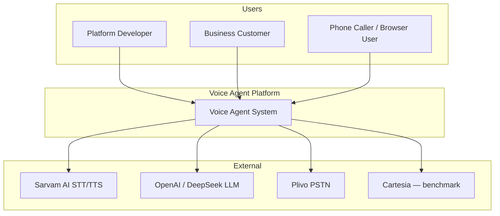
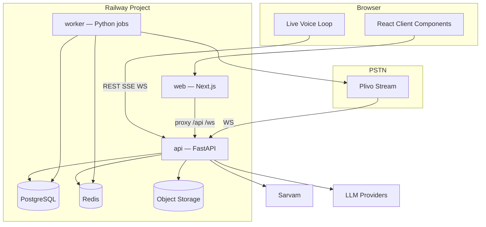

# System Context

C4-style context and container diagram for the target Voice Agent Platform MVP.

**Current build:** Single FastAPI server + vanilla browser SPA (`ARCHITECTURE.md` v0.2.0-phase5).  
**Target:** Multi-service Railway deployment with Next.js frontend.

---

## 1. System context (C4 Level 1)



### Actors

| Actor | Goal |
|-------|------|
| Platform Developer | Configure tiers, platform brain, providers, promote stacks |
| Business Customer | Author agent brain, manage numbers, view calls/campaigns |
| Caller | Voice conversation via browser or phone |

---

## 2. Container diagram (C4 Level 2)



### Container responsibilities

| Container | Technology | Responsibilities |
|-----------|------------|------------------|
| **web** | Next.js 14 App Router | Marketing SSR, Dev Portal, Business Console, Test Studio; no secrets |
| **api** | FastAPI | REST, WebSocket proxy (STT/TTS/Plivo), live turn orchestration, call lifecycle |
| **worker** | Python (Celery/RQ/arq TBD) | Post-call retries, campaign dialer, retention jobs |
| **PostgreSQL** | Railway plugin | Tenants, agents, brains, calls index, campaigns |
| **Redis** | Railway plugin | Job queue, dialer concurrency |
| **Bucket** | Railway storage | Audio WAV/MP3, large exports |

---

## 3. Configuration layers (L1–L4)

Independent layers — changing one does not require changing another. Full ownership: [02-module-ownership.md](./02-module-ownership.md).

| Layer | Controls | Locked at |
|-------|----------|-----------|
| **L1** Provider stack | STT + LLM + TTS provider/model | `call/start` |
| **L2** Compiled brain | Platform + optimized business + rules | `call/start` |
| **L3** Conversation state | Memory B, projection C, recent turns | Per turn (in-call) |
| **L4** Telephony transport | Browser vs Plivo PSTN | `call/start` |

**Not layers:** Tier (L1 bundle selector), voice preset (VAD/barge tuning), session (transport), call (archive unit).

---

## 4. Data object boundaries (A / B / C)

| Object | Scope | Sent to live LLM? |
|--------|-------|-------------------|
| **A** Call ledger | Full transcript + audio refs | Never |
| **B** Internal memory | Facts, prefs, summary, event log | Never (full JSON) |
| **C** Memory projection | Compact render of B | Yes (dynamic tail) |

Detail: [data-models/memory-ledger-outcome.md](./data-models/memory-ledger-outcome.md)

---

## 5. Hot path vs cold path

| Path | Latency budget | Components |
|------|----------------|------------|
| **Hot** | <1.6s to first audio | STT final → orchestrator → LLM stream → TTS |
| **Warm** | <500ms async | Memory merge, ledger append, audio buffer write |
| **Cold** | Seconds (post-hangup) | Post-call outcome, mix.wav, campaign analytics |

**Rule:** Hot path never awaits cold path work.

---

## 6. Environment topology

| Environment | Database | Storage | Config mode |
|-------------|----------|---------|-------------|
| Development | Local PostgreSQL | `data/` local | `frontend` (default) |
| Staging | Railway Postgres | Railway bucket | `env` |
| Production | Railway Postgres | Railway bucket | `env` |

---

## 7. Evolution from current build

```text
CURRENT                          TARGET (per phase)
───────                          ──────────────────
client/app.js (SPA)        →     web/ (Next.js)           [Phase 5]
session_id only            →     call_id + ledger         [Phase 3]
instruction_store (RAM)    →     versioned brains         [Phase 2]
Hard-coded Sarvam/OpenAI   →     provider registry        [Phase 1]
2-turn memory              →     B/C structured memory    [Phase 4]
No telephony               →     Plivo + campaigns        [Phase 5]
```

Existing `server/` modules are **extended**, not rewritten — adapters wrap current Sarvam/OpenAI services.

---

## 8. Related documents

- [02-module-ownership.md](./02-module-ownership.md)
- [infrastructure/railway-deployment.md](./infrastructure/railway-deployment.md)
- [architecture/03-observability-and-slos.md](./03-observability-and-slos.md)
- [architecture/04-security-rbac-and-promotion.md](./04-security-rbac-and-promotion.md)
- [implementation/PRD-TRACEABILITY-AUDIT.md](../implementation/PRD-TRACEABILITY-AUDIT.md)
