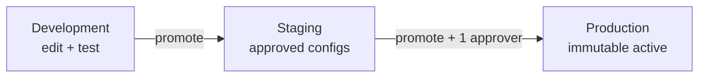

# Security, RBAC & Configuration Promotion

Auth, tenant isolation, Dev Portal security, role model, and environment promotion.

**Normative PRDs:** [`prd/13-api-data-security-contracts.md`](../prd/13-api-data-security-contracts.md) §10, [`prd/17-product-decisions.md`](../prd/17-product-decisions.md) §9–10

---

## 1. Auth priority (MVP)

| Surface | Priority | Mechanism |
|---------|----------|-----------|
| **Dev Portal** (`/dev/*`) | **P0** | `DEV_PORTAL_USERNAME`, `DEV_PORTAL_PASSWORD` from env |
| **Business Console** (`/app/*`) | **P2** | Stub tenant header / shared dev cred until customer auth |

### Dev Portal session rules

- httpOnly, secure cookies (production)
- CSRF token on all mutating routes
- Rate limits on login (reuse `rate_limiter.py`)
- Route prefix `/dev` separated from customer routes
- Optional bcrypt password hash upgrade path

---

## 2. Role model

### MVP platform roles (`prd/17` §10)

| Role | Dev Portal | Notes |
|------|------------|-------|
| **Administrator** | Full access | Can promote to production |
| **Developer** | Full access | Can promote to production |
| **Custom roles** | Extensible | `roles` + `role_permissions` tables — create new permission sets |

### Customer roles (when Business auth ships — P2)

| Role | Business brain | Calls | Platform brain |
|------|----------------|-------|----------------|
| Customer Viewer | read summary | read | — |
| Customer Operator | read | read + annotate | — |
| Customer Admin | edit/publish | read | read tier only |
| Voice Engineer | read + test | read + traces | — |
| Platform Admin | read | read | edit/activate |
| Auditor | read versions | read + export | read versions |

Full matrix: [`prd/15`](../prd/15-architecture-ownership-and-singularity.md) §9.

**Enforcement:** server-side on every endpoint; UI hides controls but is not authoritative.

---

## 3. Tenant isolation

- Every query scoped by `tenant_id` from authenticated session
- Cross-tenant ID access → `404 Not Found` (not 403 revealing existence)
- Object storage keys: `{tenant_id}/calls/{call_id}/...`
- Signed audio URLs: tenant + call scoped, time-limited

---

## 4. Secret isolation

| Rule | Detail |
|------|--------|
| Provider keys | API + Worker services only |
| Catalog | `configured: true/false` only — no key material |
| Logs | Redact secrets, auth headers |
| Brain secrets | Platform brain body never to customer APIs |
| Rotation | No brain recompile required for key rotation |

---

## 5. Configuration promotion workflow

Environments: **development → staging → production** (`prd/17` §2).



### Promotable artifacts

| Artifact | Promoted via |
|----------|--------------|
| Tier assignments (L1) | Dev Portal stack UI |
| Platform brain version | Platform brain activate (separate) |
| Business brain version | Agent publish (per tenant) |
| Provider fallback chains | Dev Portal |

### Dev Portal APIs (`prd/13` §2)

| Endpoint | Purpose |
|----------|---------|
| `GET /api/dev/stack/tiers` | Current tier → combination mapping |
| `PUT /api/dev/stack/tiers/{tier}` | Set STT/LLM/TTS per tier |
| `POST /api/dev/stack/test` | Test combination without affecting prod |
| `GET /api/dev/providers/status` | Health + fallback chains |
| `PUT /api/dev/providers/fallback` | Configure fallback pairs |
| `POST /api/dev/promote` | Promote stack config to staging/production |
| `POST /api/promotions/{id}/rollback` | Rollback promoted config |

### Promotion rules

- **One** Administrator or Developer approval sufficient (no two-person rule in MVP)
- Every promotion writes `audit_log` entry: actor, before/after version, environment, reason
- In-flight calls **never** pick up promoted config — locked at `call/start`
- Production uses `VOICE_AGENT_CONFIG_MODE=env` — client cannot override stack
- **Business Console (customer):** shows tier label and read-only resolved stack; provider matrix and promotion hidden (`prd/01` §13)

---

## 6. Error & fallback policy summary

Per `prd/13` §11 — no silent fallback:

| Failure | Behavior |
|---------|----------|
| STT disconnect | Bounded reconnect; never fabricate transcript |
| LLM failure | Retry per policy; approved fallback only; log in trace |
| TTS failure | Reconnect; approved fallback TTS; never replay audible text |
| Memory op invalid | Reject op; keep previous B; continue call |
| Memory merge timeout | Keep previous B; metric `memory_extraction_timeout` |
| Post-call failure | Retain ledger/audio; mark failed; Worker retries |
| Plivo disconnect | Idempotent `call/end` |
| Provider disabled | Block at `call/start` or resolver validation |

---

## 7. Telephony & webhook security

| Control | Detail |
|---------|--------|
| Plivo HTTP webhooks | Signature validation per official docs |
| Plivo media WS | WSS + short-lived call-bound token |
| Campaign dial | Verify consent + DNC + calling window before dial |
| Callback URLs | Allowlist — no arbitrary SSRF destinations |
| Recording consent | `RECORDING_CONSENT_REQUIRED` → disclosure TTS on PSTN connect |

---

## 8. Data protection

- Encryption in transit (HTTPS/WSS) and at rest (Railway Postgres + bucket)
- `CALL_RETENTION_DAYS=90` default; Worker deletion job
- Export and deletion events in `audit_log`
- PII masking in list views per role (phone partial mask for Viewer)
- Legal hold — post-MVP enhancement

---

## 9. Audit log schema

```sql
audit_log (
  id UUID PK,
  tenant_id UUID,
  actor_id TEXT,
  action TEXT,           -- brain_publish, tier_promote, export, ...
  resource_type TEXT,
  resource_id TEXT,
  before_version TEXT,
  after_version TEXT,
  environment TEXT,
  reason TEXT,
  request_id TEXT,
  created_at TIMESTAMPTZ
)
```

---

## 10. Implementation phases

| Capability | Phase |
|------------|-------|
| Tenant scoping on DB queries | 1 (default tenant), 5 (full) |
| Dev Portal env auth | 5 |
| RBAC middleware | 5 |
| Custom roles schema | 5 |
| Promotion APIs + audit | 5 |
| Plivo signature validation | 5 |
| Customer auth (OAuth/email) | Post-MVP |
