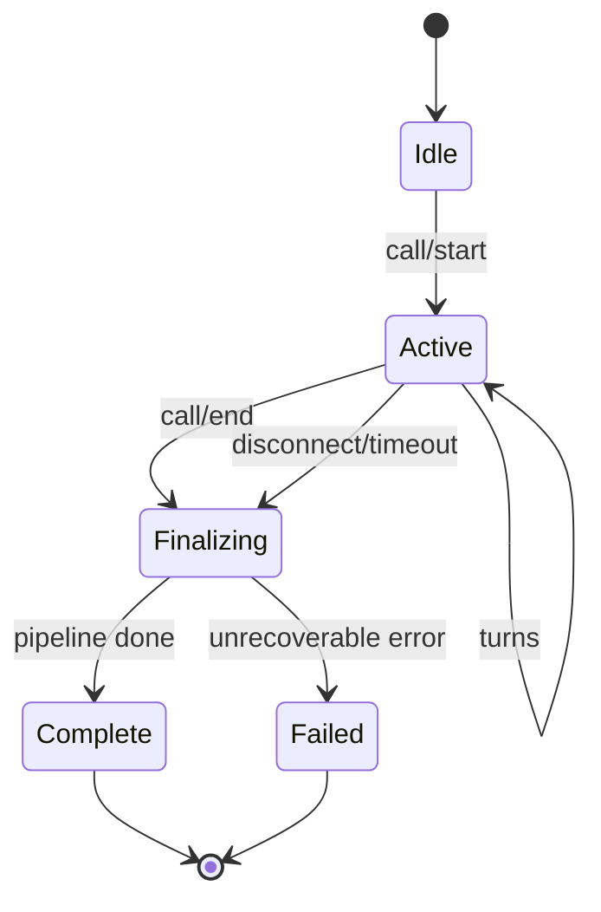
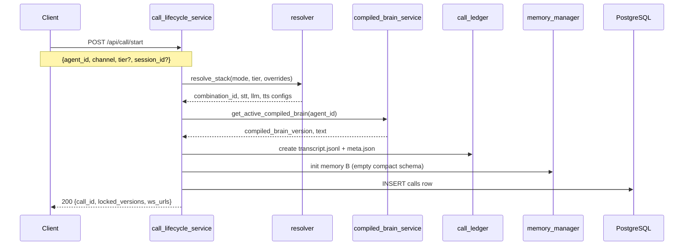
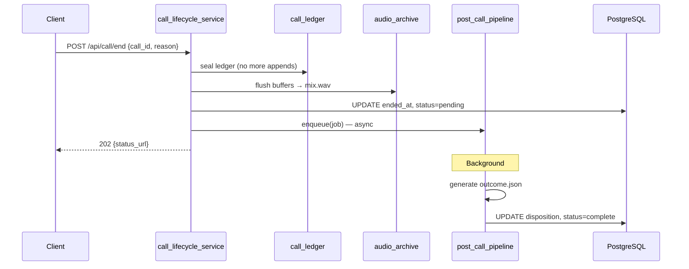

# Call Lifecycle Flow

Start, active call, end, and finalization.

**Owner:** `call/call_lifecycle_service.py`  
**Phase:** 3

---

## 1. State machine



---

## 2. Start flow



### Locked at start

| Artifact | Field |
|----------|-------|
| L1 | `combination_id`, provider configs |
| L2 | `compiled_brain_version` |
| L4 | `channel` (browser \| pstn) |

### `meta.json` example

```json
{
  "call_id": "uuid",
  "tenant_id": "uuid",
  "agent_id": "uuid",
  "session_id": "optional",
  "channel": "browser",
  "tier": "medium",
  "combination_id": "abc123",
  "compiled_brain_version": "cb_v001",
  "started_at": "ISO8601",
  "environment": "development"
}
```

---

## 3. Active call

- Client passes `call_id` on WS connect (`?call_id=...`)
- Each turn appends to ledger A (async)
- Audio archive buffers PCM/MP3 (async)
- `conversation_manager` holds truncated recent turns per session
- Memory B evolves per turn (Phase 4)

### Concurrent call policy

`CALL_AUTO_END_ON_START=true` (default):

- New `call/start` auto-ends previous active call for same session
- Alternative: return `409 Conflict` if configured

---

## 4. End flow



### End reasons

`user_stop`, `timeout`, `error`, `transfer`, `browser_unload`, `pstn_hangup`

### Idempotency

Second `call/end` with same `call_id` → **202** with same `status_url` (not 200).

---

## 5. Auto-finalize triggers

| Trigger | Handler |
|---------|---------|
| Browser `beforeunload` | Client sends `call/end` beacon |
| WS disconnect (all clients gone) | Server timer → auto-end |
| PSTN hangup event | Plivo webhook → end |
| Idle timeout | Configurable `CALL_IDLE_TIMEOUT_SEC` |

---

## 6. Finalization status API

`GET /api/call/{call_id}/finalization`

```json
{
  "call_id": "uuid",
  "status": "complete",
  "components": {
    "ledger": "complete",
    "audio": "complete",
    "outcome": "complete"
  },
  "ended_at": "ISO8601",
  "retry_available": false
}
```

States: `pending` → `processing` → `complete` | `failed`

---

## 7. Read APIs

| Endpoint | Returns |
|----------|---------|
| `GET /api/calls` | Paginated index (filters: agent, disposition, date) |
| `GET /api/call/{id}` | Metadata + finalization status |
| `GET /api/call/{id}/transcript` | Full ledger A |
| `GET /api/call/{id}/audio` | Signed URL or stream |

---

## 8. Failure recovery

| Scenario | Behavior |
|----------|----------|
| Server crash mid-call | On restart: calls with `ended_at` null + stale heartbeat → auto-finalize or mark failed |
| Partial audio flush | Finalization status `audio: failed`; retry job |
| Post-call LLM failure | `outcome: failed`; `POST .../outcome/retry` |

---

## 9. Migration from current session model

| Current | Target |
|---------|--------|
| `session_id` only | `call_id` per live session; session_id optional transport |
| `POST /api/session/clear` | `call/end` + new `call/start` |
| `conversation_store` localStorage | Server `GET /api/calls` authoritative |
