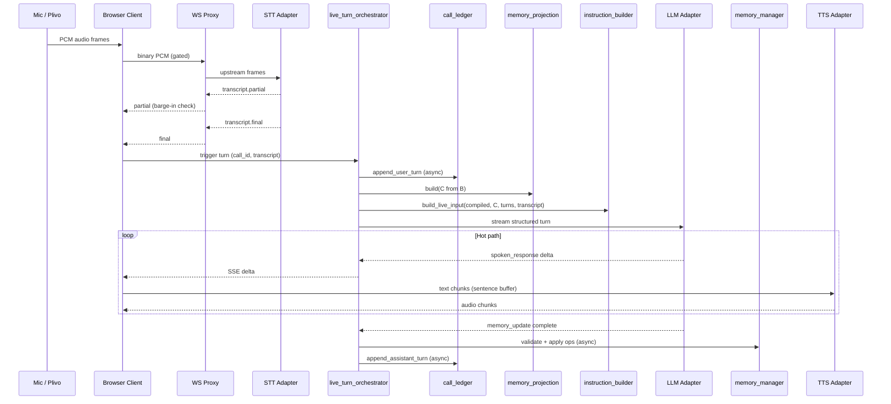

# Live Voice Turn Flow

Hot-path sequence for one user utterance in browser or PSTN mode.

**Owner:** `call/live_turn_orchestrator.py`  
**Phase:** 4 (ledger-only stub in Phase 3)

---

## 1. End-to-end sequence



---

## 2. Client-side pipeline (browser)

Preserved from current `client/app.js` — port to Next.js without behavior change.

```text
transcript.final
  → POST /api/brain/stream?call_id=...  (SSE)
  → SentenceAccumulator (~80 chars / punctuation)
  → WS /ws/tts (warm per turn, persistent session)
  → MediaSource audio/mpeg → autoplay

Barge-in (live-guards.js):
  ≥2-word partial while speaking
  → stop audio (<150ms)
  → abort brain fetch
  → close TTS socket
  → 1.2s echo cooldown
  → keep STT socket open
```

---

## 3. LLM request shape

```python
input = [
    {"role": "developer", "content": compiled_brain_text,  # cache breakpoint
     "prompt_cache_breakpoint": True},                      # if ≥1024 tokens
    {"role": "user", "content": f"[Memory projection]\n{projection_c}"},
    # optional: {"role": "user", "content": f"[Rolling summary]\n{summary}"},
    # ... recent turns from conversation_manager (max 2) ...
    {"role": "user", "content": current_transcript},
]
```

Structured output schema on same request:

```json
{
  "spoken_response": "string",
  "memory_update": {"operations": [...]}
}
```

Settings: `store: false`, `reasoning.effort: none` (voice), stream text deltas for `spoken_response`.

---

## 4. Timing budget

| Stage | Target | Notes |
|-------|--------|-------|
| VAD endpointing | 350–500ms | `silence_duration_ms` |
| STT final | 100–300ms | After last word |
| Brain first delta | 300–800ms | Streaming |
| First audible | +150–400ms | Sentence buffer + TTS WS |
| **Total TTFA** | **0.9–1.6s** | Overlapping stages |

Memory merge runs **after** first delta — not in critical path.

---

## 5. Provider resolution

At `call/start`, L1 stack locked. Per turn:

```python
stack = call_context.resolved_stack  # immutable
stt = registry.get_stt(stack.stt.provider)
llm = registry.get_llm(stack.llm.provider)
tts = registry.get_tts(stack.tts.provider)
```

WS handlers read `call_id` → load locked stack. No per-turn re-resolution.

---

## 6. Error handling

| Error | Behavior |
|-------|----------|
| LLM timeout | Retry ≤2 with backoff; user hears apology via TTS |
| `insufficient_quota` | Fail-fast, no retry loop |
| STT disconnect | Reconnect upstream; preserve call_id |
| Memory op invalid | Log + skip op; do not block response |
| Barge-in mid-stream | Abort LLM + TTS; discard partial assistant turn |

---

## 7. PSTN differences (Phase 5)

Same orchestrator; L4 transport differs:

```text
Plivo μ-law 8k → audio_transcode → PCM 16k → STT
TTS output → audio_transcode → Plivo playAudio
Barge-in → Plivo clearAudio (same ≥2-word policy)
```

---

## 8. Metrics per turn

Recorded to call trace:

- `stt_latency_ms`, `brain_ttft_ms`, `tts_first_byte_ms`
- `tokens_input`, `tokens_cached`, `tokens_output`
- `memory_ops_applied`, `memory_merge_ms`
- `provider`, `model`, `fallback_used`
