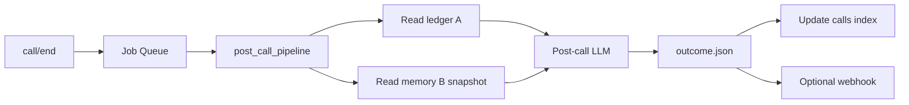
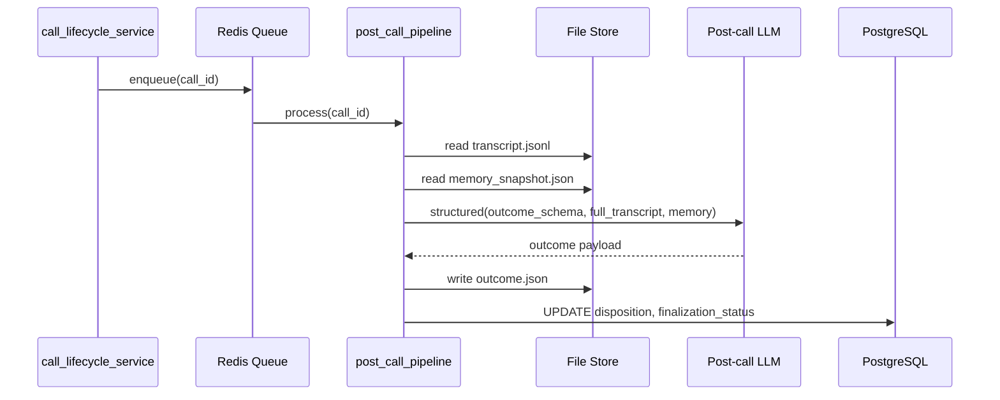

# Post-Call Pipeline Flow

Async analysis after hang-up — outcome, summaries, disposition.

**Owner:** `call/post_call_pipeline.py`  
**Phase:** 4  
**Runs on:** Worker service (Phase 5) or API background task (Phase 4 dev)

---

## 1. Pipeline overview



**Input:** Full transcript (A) + final memory snapshot (B)  
**Output:** `outcome.json` — does **not** mutate B (read-only)

---

## 2. Sequence



---

## 3. LLM request

Uses **cheaper model** — `POST_CALL_LLM_MODEL` env (default: same family, lower cost tier).

Not the live conversation model requirement — post-call may use different model.

### Input construction

```text
System: You analyze completed voice calls. Output structured JSON only.
User:
  [Full transcript]
  {transcript_jsonl_formatted}

  [Final working memory]
  {memory_snapshot}

  [Agent context]
  agent_id, business type hints from compiled brain metadata
```

### Output schema

```json
{
  "disposition": "qualified",
  "disposition_confidence": 0.0,
  "summary_te": "string",
  "summary_en": "string",
  "next_action": "string|null",
  "extracted_fields": {},
  "objections": [],
  "notes": "string|null"
}
```

`text.format: json_schema` — Structured Outputs, not prompt-described JSON.

---

## 4. Disposition rubric

| Value | Criteria hint |
|-------|---------------|
| `new_lead` | First contact, info captured |
| `interested` | Positive signals, no qualification yet |
| `qualified` | Meets agent's qualification criteria |
| `site_visit_planned` | Concrete appointment |
| `callback_required` | Explicit follow-up needed |
| `not_interested` | Clear rejection |
| `wrong_number` | Wrong party |
| `converted` | Sale/booking completed |
| `no_outcome` | <3 turns or inconclusive |

Golden fixture tests validate rubric consistency.

---

## 5. Retry semantics

| Condition | Action |
|-----------|--------|
| LLM timeout | Retry ≤3 with backoff |
| Invalid schema | Retry once with repair prompt |
| Persistent failure | `finalization.outcome = failed`; alert |
| Manual retry | `POST /api/call/{id}/outcome/retry` |

Idempotent: re-run overwrites `outcome.json` with new `generated_at`.

---

## 6. Optional integrations (post-MVP)

| Integration | Trigger |
|-------------|---------|
| CRM webhook | On outcome complete (`CRM_WEBHOOK_URL`) |
| Email notification | Customer Admin config |
| Campaign callback | Worker schedules follow-up dial |

CRM execution **not in MVP** — webhook stub only.

---

## 7. Performance

| Metric | Target |
|--------|--------|
| Time to outcome (p95) | <60s after call/end |
| Blocking call/end | Never — always 202 immediately |
| Cost per outcome | Minimize via cheaper model + single call |

---

## 8. File artifacts

```text
data/calls/{call_id}/
├── outcome.json          # Primary output
└── outcome_attempts.jsonl  # Retry audit (optional)
```

---

## 9. Worker migration (Phase 5)

Phase 4: `asyncio.create_task` in API process (dev acceptable).  
Phase 5: Move to dedicated Worker service with Redis queue for:

- Post-call analysis
- Retention cleanup
- Campaign scheduling

**Production:** post-call and campaign dialer run on **Worker service** via Redis — not in-process-only (`prd/13` §9).
