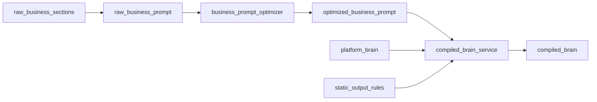

# Brain Compilation Data Model

Versioned prompt layers (L2) — Platform Brain, Business Brain, and compiled output.

**Normative spec:** [`prd/12-brain-business-memory-spec.md`](../prd/12-brain-business-memory-spec.md) §1–6

---

## 1. Brain artifacts

| Artifact | Owner | Customer visible? |
|----------|-------|-------------------|
| `platform_brain` | Platform Admin | No (redacted preview) |
| `raw_business_sections` | Customer Admin | Yes (editor) |
| `raw_business_prompt` | Server (deterministic) | No |
| `optimized_business_prompt` | Optimizer LLM | Summary only |
| `static_output_rules` | Platform | No |
| `compiled_brain` | `compiled_brain_service` | Preview (redacted) |

---

## 2. Section taxonomy

### Default sections (8)

| Type key | UI title |
|----------|----------|
| `identity_purpose` | Identity & Purpose |
| `facts` | Business Facts |
| `actions_limits` | Actions & Limits |
| `flow_qualification` | Qualification Flow |
| `flow_callback` | Callback / Appointment Flow |
| `scope_redirects` | Scope & Redirects |
| `guardrails` | Guardrails |
| `faq` | FAQ |
| `custom` | User-defined |

### Section record

```json
{
  "section_id": "uuid",
  "type": "facts",
  "title": "Business Facts",
  "enabled": true,
  "order": 20,
  "raw_text": "We operate from 9am to 7pm IST.",
  "created_at": "ISO8601",
  "updated_at": "ISO8601",
  "updated_by": "user_id"
}
```

### Raw assembly rules

1. Sort by `order`, filter `enabled`
2. Wrap each section in stable delimiters: `<!-- section:{type}:{section_id} -->`
3. Concatenate `raw_text` verbatim — **no semantic rewriting**
4. Output: `raw_business_prompt` + `source_checksum` (sha256)

---

## 3. Optimization pipeline

**Trigger:** explicit `optimize` or `publish` — never per-turn or per-call.



### Optimizer output

```json
{
  "optimized_business_prompt": "...",
  "preserved_facts": ["Hours: 9am-7pm IST"],
  "preserved_rules": ["Never quote prices not in facts"],
  "deduplicated_items": ["..."],
  "conflicts": [
    {
      "severity": "blocking",
      "source_section_ids": ["..."],
      "description": "Conflicting refund policy",
      "recommended_resolution": "..."
    }
  ],
  "source_checksum": "sha256",
  "optimizer_model": "gpt-5.6-luna",
  "optimizer_version": "v1",
  "optimized_at": "ISO8601"
}
```

Blocking conflicts prevent publish.

---

## 4. Compiled brain

**Owner:** `brain/compiled_brain_service.py` — sole L2 writer

```text
compiled_brain_text =
  platform_brain.body
  + "\n\n" + optimized_business_prompt
  + "\n\n" + static_output_rules.text
```

### Version record

```json
{
  "compiled_brain_version": "cb_v20260825_001",
  "platform_brain_version": "pb_v3",
  "business_brain_version": "bb_v12",
  "static_rules_version": "sr_v1",
  "checksum": "sha256",
  "token_estimate": 1842,
  "compiled_at": "ISO8601"
}
```

### Lock at call/start

Every call record stores `compiled_brain_version`. In-flight calls **never** pick up a newly published brain.

---

## 5. Live LLM integration

`instruction_builder` places `compiled_brain_text` in `input[0]` developer role.

### Caching requirements

- Stable prefix ≥1024 tokens for `gpt-5.6*` caching
- `prompt_cache_key` = hash(`compiled_brain_version` + token budget)
- `store: false` on live turns
- Dynamic content (memory C, turns) **after** cache breakpoint

### Migration from current

| Current | Target |
|---------|--------|
| `brain_prompt_composer.py` | Logic → `compiled_brain_service` |
| `instruction_store` per session | `business_brain_store` per agent |
| `prompts/brain_prompt.py` core rules | Seed into platform brain v1 |

---

## 6. Database tables

```sql
platform_brain_versions (
  version_id TEXT PK,
  body TEXT,
  status TEXT,  -- draft | active | archived
  activated_at TIMESTAMPTZ,
  created_by TEXT
)

business_brain_sections (
  section_id UUID PK,
  agent_id UUID FK,
  type TEXT,
  title TEXT,
  raw_text TEXT,
  "order" INT,
  enabled BOOLEAN
)

business_brain_versions (
  version_id TEXT PK,
  agent_id UUID FK,
  optimized_prompt TEXT,
  optimizer_report JSONB,
  source_checksum TEXT,
  status TEXT,  -- draft | published
  published_at TIMESTAMPTZ
)

compiled_brain_snapshots (
  compiled_version TEXT PK,
  platform_version TEXT,
  business_version TEXT,
  static_rules_version TEXT,
  compiled_text TEXT,
  checksum TEXT,
  token_estimate INT
)
```

---

## 7. Platform brain content areas

Developer-only document covering:

- Global safety and refusal rules
- Language policy (Telugu-first, code-mix)
- Memory/output contract (references structured `spoken_response` + `memory_update`)
- Spoken style defaults
- Disposition awareness (high-level, not per-call)

Customers receive **layer summary** only: "Platform rules active — 12 safety constraints."
