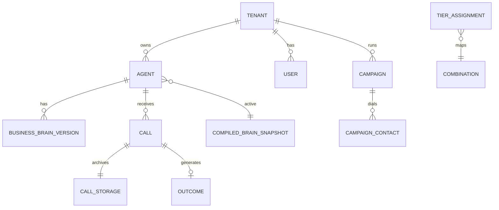

# Entities & Persistence

Core domain entities, relationships, and persistence boundaries.

**API contracts:** [`prd/13-api-data-security-contracts.md`](../prd/13-api-data-security-contracts.md)

---

## 1. Entity relationship



---

## 2. Core entities

### Tenant

| Field | Type | Notes |
|-------|------|-------|
| `tenant_id` | UUID | Root isolation boundary |
| `name` | string | Business name |
| `plan` | enum | Future billing |
| `created_at` | timestamp | |

**Dev default:** auto-create `default` tenant.

### Agent

| Field | Type | Notes |
|-------|------|-------|
| `agent_id` | UUID | Canonical config unit |
| `tenant_id` | UUID FK | |
| `name` | string | |
| `status` | enum | draft \| active \| archived |
| `active_compiled_brain_version` | string | Pointer to snapshot |
| `default_tier` | enum | low \| medium \| premium |
| `languages` | string[] | e.g. `["te-IN", "en-IN"]` |
| `environment` | enum | development \| staging \| production |

**No agent limit** per product decision.

### Call

| Field | Type | Notes |
|-------|------|-------|
| `call_id` | UUID | Archive unit |
| `tenant_id`, `agent_id` | UUID | |
| `session_id` | string | Browser transport (optional) |
| `channel` | enum | browser \| pstn |
| `direction` | enum | inbound \| outbound |
| `campaign_id` | UUID | Optional — outbound campaigns |
| `combination_id` | string | Locked L1 |
| `compiled_brain_version` | string | Locked L2 |
| `tier` | enum | |
| `started_at`, `ended_at` | timestamp | |
| `finalization_status` | enum | pending \| complete \| failed |
| `disposition` | enum | From outcome |
| `storage_path` | string | File/bucket prefix |

### Combination

Hash of resolved L1 stack — benchmark and promotion unit.

```json
{
  "combination_id": "sha256_prefix",
  "stt": {"provider": "sarvam", "model": "saaras:v3-realtime"},
  "llm": {"provider": "openai", "model": "gpt-5.6-luna"},
  "tts": {"provider": "sarvam", "model": "bulbul:v3", "speaker": "shubh"}
}
```

### Campaign entities (`prd/18`)

| Entity | Description |
|--------|-------------|
| `campaign` | Scheduled program bound to agent + number pool |
| `campaign_contact` | Callee row: phone, consent, DNC, attempt count |
| `campaign_run` | Execution instance (scheduled or manual start) |
| `dial_attempt` | One outbound attempt → `call_id` on connect |

---

## 3. Storage split

| Data | Store | Retention |
|------|-------|-----------|
| Entity metadata | PostgreSQL | Permanent (agents) / 90d (calls index) |
| Call transcript + audio | File store / bucket | `CALL_RETENTION_DAYS` |
| Memory events | File store with call | Same as call |
| Brain versions | PostgreSQL | Permanent |
| Compiled snapshots | PostgreSQL | Permanent |
| In-flight state | RAM | TTL per session |
| Job queue | Redis | Ephemeral |

### Call directory layout

```text
data/calls/{call_id}/
├── meta.json
├── transcript.jsonl          # A
├── memory_events.jsonl
├── memory_snapshot.json      # B final
├── user.pcm
├── agent.mp3
├── mix.wav
└── outcome.json
```

---

## 4. Environment model

| Environment | Purpose | Data isolation |
|-------------|---------|----------------|
| `development` | Engineer testing | Default tenant, local DB |
| `staging` | Pre-prod validation | Separate Railway env |
| `production` | Customer traffic | Full tenant isolation |

Promotion workflow: stack tiers, brain versions, and provider assignments move dev → staging → production with approval.

---

## 5. Identifiers — naming cleanup

| Deprecated | Use instead |
|------------|-------------|
| `customer_id` in APIs | `agent_id` + `tenant_id` from auth |
| "Customer brain" (UI) | Business brain |
| "Main brain" (dev UI) | Platform brain |
| Session as archive unit | `call_id` |

---

## 6. RBAC scope (entity-level)

| Role | tenants | agents | calls | platform_brain |
|------|---------|--------|-------|----------------|
| Customer Viewer | own | read | read | — |
| Customer Admin | own | CRUD | read | — |
| Platform Admin | all | read | read | edit |
| Voice Engineer | assigned | read/test | read+traces | — |

Full matrix: [02-module-ownership.md](../02-module-ownership.md) §9 in PRD 15.

---

## 7. Phase rollout of tables

| Phase | Tables |
|-------|--------|
| 1 | `tenants`, `agents` (stub), `tier_assignments` |
| 2 | `platform_brain_versions`, `business_brain_*`, `compiled_brain_snapshots` |
| 3 | `calls` |
| 4 | (outcome columns on calls; files) |
| 5 | `users`, `roles`, `role_permissions`, `campaigns`, `campaign_contacts`, `campaign_runs`, `dial_attempts`, `audit_log`, `phone_numbers` |
