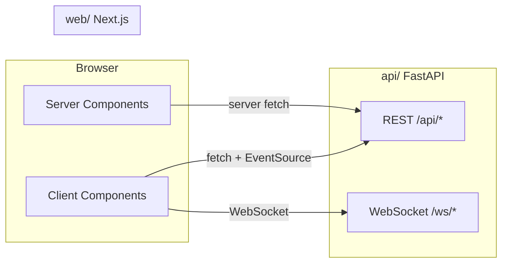

# Next.js Frontend / Backend Split

Responsibility boundary between `web/` (Next.js) and `server/` (FastAPI).

**Normative PRD:** [`prd/19-frontend-backend-nextjs-railway.md`](../../prd/19-frontend-backend-nextjs-railway.md)  
**Phase:** 5 (reference `client/` until then)

---

## 1. Golden rule

| Layer | Owns |
|-------|------|
| **web/** (Next.js) | UI, SSR/SSG, client live voice loop, auth cookies |
| **server/** (FastAPI) | Provider keys, WS proxy, orchestration, persistence |
| **worker/** | Background jobs |

**No provider secrets in client bundles.**  
**No new features in `client/` after Phase 5 starts.**

---

## 2. Responsibility matrix

| Concern | Frontend (web) | Backend (api) |
|---------|----------------|---------------|
| Marketing pages | SSR/SSG, SEO metadata | — |
| Dev Portal UI | Stack config forms | Tier APIs, validation |
| Business brain editor | Section forms, preview | Compile, optimize, publish |
| Live voice | Mic, WS client, barge-in, playback | STT/TTS WS proxy, brain SSE |
| Calls list/detail | Tables, audio player, trace UI | Call CRUD, signed URLs |
| Campaigns UI | Create/schedule forms | Worker dialer, Plivo |
| Auth | Login forms, session cookies | Credential verify, RBAC |
| Provider catalog display | Read-only from API | Registry, resolver |

---

## 3. Communication patterns



| Pattern | Use case |
|---------|----------|
| Server Components + fetch | Calls list, agent config, brain versions |
| Client Components | Live voice, real-time trace, audio playback |
| SSE (`EventSource`) | Brain streaming deltas |
| WebSocket | STT PCM upstream, TTS audio downstream |
| Server Actions (optional) | Form mutations with revalidation |

### URL strategy

| Environment | API base |
|-------------|----------|
| Local dev | `http://localhost:8000` |
| Production | `https://api.example.com` (direct for WS) |
| SSR internal | `http://api.railway.internal:8000` |

---

## 4. Live voice port map

Historical `client/` → target `web/`:

| Source | Target | Notes |
|--------|--------|-------|
| `client/app.js` | `web/components/live/LiveVoiceSession.tsx` | Main orchestrator |
| `client/live-guards.js` | `web/lib/live-guards.ts` | Barge-in policy — **behavior parity required** |
| `client/pcm-worklet.js` | `web/public/pcm-worklet.js` | AudioWorklet — copy verbatim |
| `client/audio_playback_manager.js` | `web/lib/audio-playback.ts` | FIFO queue, unlock overlay |
| `client/audio_utils.js` | `web/lib/audio-utils.ts` | RMS gate, helpers |
| `client/conversation_store.js` | `web/lib/call-cache.ts` | Offline cache only; server SoT |

### Live session API sequence (unchanged)

```text
1. POST /api/call/start {agent_id}
2. WS connect /ws/stt-realtime?call_id=...
3. On transcript.final:
   POST /api/brain/stream?call_id=... (SSE)
   WS /ws/tts?call_id=... (text chunks → audio)
4. POST /api/call/end on stop/unload
```

---

## 5. Route structure (App Router)

```text
web/app/
├── (marketing)/
│   ├── page.tsx              # Landing
│   ├── pricing/page.tsx
│   └── docs/page.tsx
├── dev/
│   ├── login/page.tsx
│   ├── stack/page.tsx
│   ├── platform-brain/page.tsx
│   └── agents/page.tsx
├── app/
│   ├── agents/page.tsx
│   ├── agents/[id]/brain/page.tsx
│   ├── agents/[id]/test/page.tsx   # Test Studio + live voice
│   ├── calls/page.tsx
│   ├── calls/[id]/page.tsx
│   └── campaigns/page.tsx
├── sitemap.ts
└── robots.ts
```

Navigation per [`prd/11-ui-information-architecture.md`](../../prd/11-ui-information-architecture.md) — **not** legacy `client/console_tabs.js`.

---

## 6. Tech stack

| Layer | Choice |
|-------|--------|
| Framework | Next.js 14+ App Router |
| Language | TypeScript |
| Styling | Tailwind v4 + design tokens (`.better-react-web-ui.md`) |
| Components | shadcn/ui (per project skills) |
| Data | Server Components + SWR/React Query for client polls |

---

## 7. Auth split

| Portal | MVP auth | Cookie scope |
|--------|----------|--------------|
| Dev Portal | Env username/password | `dev_session` |
| Business Console | Shared dev cred → P2 customer auth | `app_session` |

API validates session on every mutating request. UI hiding is not sufficient — server enforces RBAC.

---

## 8. SEO (marketing only)

| Requirement | Implementation |
|-------------|----------------|
| Metadata | `generateMetadata()` per page |
| Sitemap | `app/sitemap.ts` |
| Robots | `app/robots.ts` |
| JSON-LD | Organization + Product schema |
| Performance | `next/image`, font optimization, Core Web Vitals targets |

App console routes (`/app/*`, `/dev/*`) — `noindex`.

---

## 9. Deprecation of `client/`

| Milestone | Action |
|-----------|--------|
| Phase 5 start | Freeze `client/` — reference only |
| Test Studio ported | Live voice E2E on Next.js passes |
| Production deploy | Remove static mount from `server/app.py` |
| Post-launch | Archive or delete `client/` |

---

## 10. Error handling (frontend)

Display API errors consistently:

```typescript
interface ApiError {
  error: {
    code: string;
    message: string;
    retryable: boolean;
    request_id?: string;
  };
}
```

Map `insufficient_quota`, `provider_disabled`, `call_not_found` to user-friendly Telugu/English messages.
