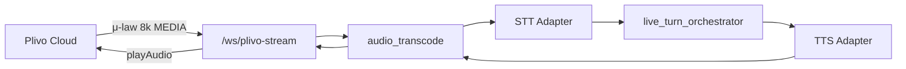
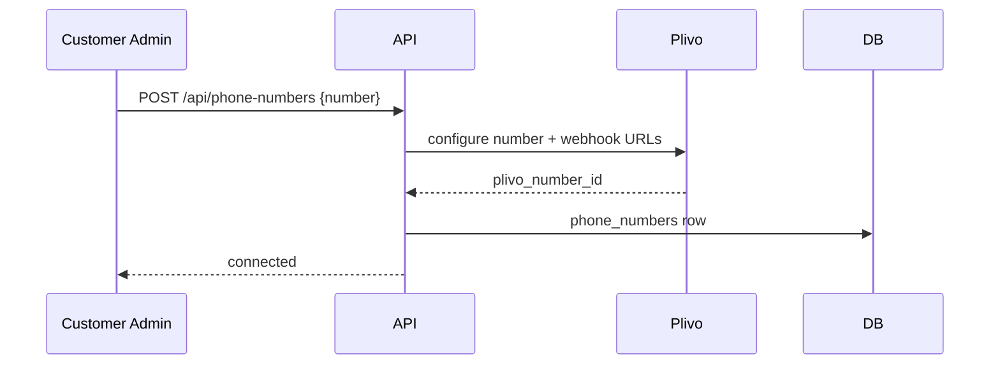

# Plivo & Campaigns Integration

PSTN telephony and outbound campaign architecture.

**Normative PRDs:** [`prd/09-plivo-telephony-integration.md`](../../prd/09-plivo-telephony-integration.md), [`prd/18-campaign-outbound.md`](../../prd/18-campaign-outbound.md)  
**Phase:** 5

---

## 1. Scope (MVP locked)

| Feature | Priority |
|---------|----------|
| Outbound campaigns | **High** — product owner priority |
| Inbound PSTN | MVP |
| Number auto-connect | MVP |
| Consent flow | Production gate |
| Barge-in | Reuse `live-guards.js` policy via `clearAudio` |

---

## 2. PSTN architecture



### Module ownership

| Module | Layer | Role |
|--------|-------|------|
| `routes/plivo_ws.py` | L4 | WebSocket endpoint |
| `services/plivo_stream.py` | L4 | Event parsing, call mapping |
| `services/audio_transcode.py` | L4 | μ-law ↔ PCM 16k |
| `call/call_lifecycle_service.py` | — | Same start/end as browser |
| `call/live_turn_orchestrator.py` | — | Same turn logic |

**Shares:** `call_id`, ledger A, memory B/C, post-call pipeline.

---

## 3. Call flow (inbound)

```text
1. PSTN call → Plivo number
2. Plivo HTTP webhook → api POST /api/plivo/answer
3. Response XML: <Stream url="wss://api.../ws/plivo-stream">
4. call/start (channel=pstn, caller_id from Plivo)
5. Bidirectional audio stream
6. Same STT → brain → TTS loop as browser
7. Hangup webhook → call/end (reason=pstn_hangup)
```

### Barge-in

When user interrupts agent speech:

```python
await plivo_session.send({"event": "clearAudio"})
# Same ≥2-word partial policy as live-guards.js
```

---

## 4. Audio transcoding

| Direction | Transform |
|-----------|-----------|
| Plivo → STT | μ-law 8kHz mono → PCM 16kHz mono |
| TTS → Plivo | PCM/MP3 → μ-law 8kHz chunks |

`audio_transcode.py` — stateless frames where possible; buffer for rate conversion.

---

## 5. Number provisioning



Auto-assign first number for new tenant (product decision) — thereafter customer-managed.

---

## 6. Outbound campaigns

**Runs on Worker service** — never blocks API hot path.

### Components

```text
worker/
├── campaign_scheduler.py    # Cron / scheduled start
├── dialer.py                # Redis queue consumer
├── plivo_outbound.py        # Initiate calls
└── retry_policy.py          # Max attempts, backoff
```

### Campaign entity

```json
{
  "campaign_id": "uuid",
  "tenant_id": "uuid",
  "agent_id": "uuid",
  "name": "August leads",
  "status": "scheduled",
  "schedule": {"start_at": "ISO8601", "calling_window": "09:00-18:00 IST"},
  "retry_rules": {"max_attempts": 3, "interval_minutes": 60},
  "concurrency": 5
}
```

### Dial flow

```text
1. Scheduler enqueues contacts → Redis
2. Dialer pops contact (respects concurrency + DNC)
3. Plivo outbound API → connect to agent stack
4. On answer: `call/start` (`channel=pstn`, `direction=outbound`, `campaign_id`) + stream
5. Same voice loop as inbound
6. On end: post-call outcome; update contact status
7. Retry if no_answer / busy per rules
```

### DNC (Do Not Call)

```sql
dnc_list (tenant_id, phone_e164, reason, added_at)
```

Dialer checks before every attempt. Violation = hard block + audit log.

---

## 7. Consent

| Environment | Requirement |
|-------------|-------------|
| Development | Simplified — internal testing |
| Production | Consent capture before campaign dial; recording disclosure on connect |

Hook: `RECORDING_CONSENT_REQUIRED` env → play disclosure TTS on connect.

---

## 8. Channel comparison

| Dimension | Browser | PSTN |
|-----------|---------|------|
| Audio | PCM 16k native | μ-law 8k transcoded |
| Barge-in | Client abort + WS | Plivo clearAudio |
| Latency budget | 0.9–1.6s TTFA | +50–100ms transcode |
| Artifacts | Same call_id structure | Same |
| Trace flag | `channel: browser` | `channel: pstn` |

Benchmark dimension: browser vs PSTN in Test Studio (when benchmarks enabled).

---

## 9. Environment variables

```text
PLIVO_AUTH_ID=
PLIVO_AUTH_TOKEN=
PLIVO_APP_ID=
PLIVO_WEBHOOK_BASE_URL=https://api.example.com
CAMPAIGN_MAX_CONCURRENCY=5
CAMPAIGN_DEFAULT_RETRY_ATTEMPTS=3
RECORDING_CONSENT_REQUIRED=true
```

---

## 10. APIs (normative — `prd/13` §7, `prd/18` §5)

| Method | Path | Purpose |
|--------|------|---------|
| `GET\|POST` | `/api/plivo/answer` | Inbound webhook |
| `WS` | `/ws/plivo-stream` | Bidirectional audio (WSS + call-bound token) |
| `POST` | `/api/plivo/stream-status` | Stream lifecycle events |
| `POST` | `/api/plivo/hangup` | Hangup webhook |
| `GET` | `/api/plivo/status` | Integration health |
| `GET\|POST` | `/api/campaigns` | Campaign CRUD |
| `POST` | `/api/campaigns/{id}/contacts/import` | CSV import |
| `POST` | `/api/campaigns/{id}/start` | Start/schedule |
| `POST` | `/api/campaigns/{id}/pause` | Pause dialer |
| `POST` | `/api/campaigns/{id}/cancel` | Cancel |
| `GET` | `/api/campaigns/{id}/analytics` | Attempts, connects, dispositions |
| `GET\|POST` | `/api/dnc` | DNC list |

Env: `PLIVO_AUTH_ID`, `PLIVO_AUTH_TOKEN`, `PLIVO_NUMBER`, `PLIVO_PUBLIC_BASE_URL`, `ENABLE_PLIVO`.

**Security:** Validate Plivo HTTP webhook signatures; media WS uses WSS + short-lived call-bound token (`prd/13` §10).

Plivo is **L4 transport** — not an STT/LLM/TTS registry entry.
