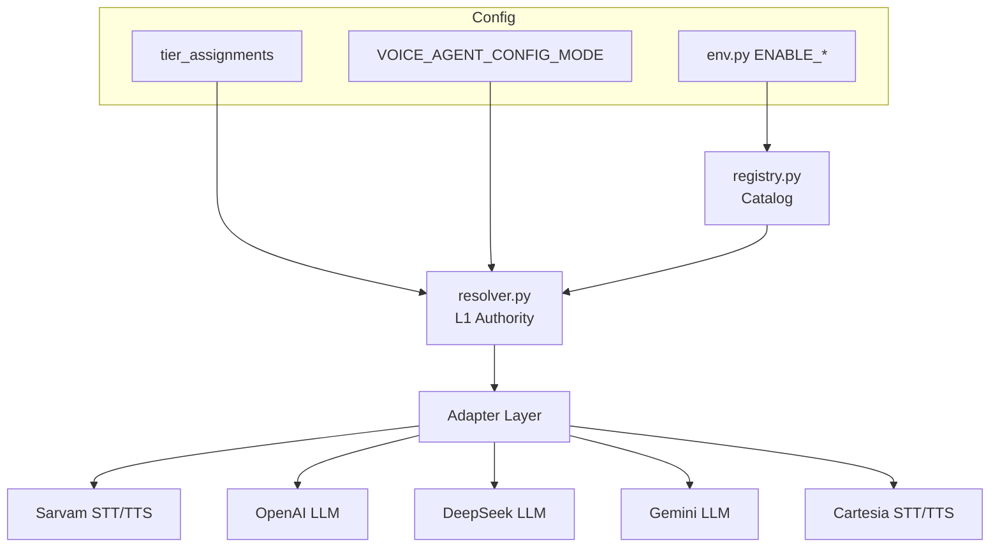

# Provider Platform Integration

Provider registry, adapter contracts, tier resolution, and fallback chains.

**Normative PRD:** [`prd/03-provider-platform.md`](../../prd/03-provider-platform.md)  
**Phase:** 1 (foundation), 5 (additional providers)

---

## 1. Architecture



---

## 2. Provider catalog (MVP)

| Provider | Stage | MVP status | Languages |
|----------|-------|------------|-----------|
| Sarvam | STT, TTS | **Production default** | Telugu, code-mix, Hindi |
| OpenAI | LLM | **Production default** | Multilingual |
| DeepSeek | LLM | Dev/testing | Multilingual |
| Gemini | LLM | Benchmark | Multilingual |
| Cartesia Ink-2 | STT | English benchmark only | English |
| Cartesia Ink Whisper | STT | Multilingual experiments (not Telugu prod) | Multilingual |
| Cartesia Sonic 3.5 | TTS | Premium Telugu after benchmark | Multiple |

**Cartesia Telugu:** Not production until officially verified ([`prd/17`](../../prd/17-product-decisions.md) §4).

---

## 3. Adapter contracts

### STTAdapter

```python
class STTConfig(BaseModel):
    provider: str
    model: str
    language: str
    mode: Literal["rest", "realtime"]
    vad_config: dict | None

class STTAdapter(Protocol):
    provider_id: str
    async def transcribe_rest(self, audio: bytes, config: STTConfig) -> TranscriptResult: ...
    async def connect_realtime(self, config: STTConfig) -> RealtimeSTTSession: ...
    def supported_languages(self) -> list[str]: ...
```

### LLMAdapter

```python
class LLMAdapter(Protocol):
    provider_id: str
    async def stream_live_turn(
        self,
        input_messages: list[dict],
        schema: LiveTurnSchema | None,
        config: LLMConfig,
    ) -> AsyncIterator[StreamEvent]: ...
    async def structured_completion(
        self, input_messages: list[dict], schema: dict, config: LLMConfig
    ) -> dict: ...
    def supports_structured_output(self) -> bool: ...
    def supports_prompt_caching(self) -> bool: ...
```

### TTSAdapter

```python
class TTSAdapter(Protocol):
    provider_id: str
    async def synthesize_rest(self, text: str, config: TTSConfig) -> bytes: ...
    async def connect_stream(self, config: TTSConfig) -> RealtimeTTSSession: ...
```

---

## 4. Registry

**Owner:** `providers/registry.py`

Loaded at app lifespan from env:

```text
ENABLE_SARVAM=true
ENABLE_OPENAI=true
ENABLE_DEEPSEEK=false
ENABLE_GEMINI=false
ENABLE_CARTESIA=false
```

`get_catalog()` returns safe metadata for `GET /api/settings/catalog`:

- Provider name, stages, models, languages
- `enabled`, `configured` (key present), `healthy` (last probe)
- No API keys or raw error messages

---

## 5. Resolver (L1)

**Owner:** `providers/resolver.py` — **sole authority at call/start**

### Inputs

| Field | Source |
|-------|--------|
| `mode` | `VOICE_AGENT_CONFIG_MODE` (default `frontend`) |
| `tier` | `VOICE_AGENT_TIER` or client selection |
| `environment` | development \| staging \| production |
| `stack_override` | Dev only; rejected in production |
| `agent.languages` | Validation constraint |

### Output: ResolvedStack

```json
{
  "combination_id": "sha256_prefix",
  "stt": {"provider": "sarvam", "model": "saaras:v3-realtime", "config": {}},
  "llm": {"provider": "openai", "model": "gpt-5.6-luna", "config": {}},
  "tts": {"provider": "sarvam", "model": "bulbul:v3", "config": {"speaker": "shubh"}}
}
```

### Validation

- Provider enabled in registry
- API key configured
- Language supported by model
- Streaming required → realtime capability present
- Structured output required for live turns → LLM capability check

---

## 6. Tier bundles

Three tiers: `low`, `medium`, `premium`

**Not pre-defined** — developer assigns via Dev Portal ([`prd/17`](../../prd/17-product-decisions.md) §4).

```sql
tier_assignments (environment, tier, combination_id, approved_by, effective_at)
```

Production uses `VOICE_AGENT_CONFIG_MODE=env` — tier from env, not client.

---

## 7. Fallback chains

On provider failure, try configured fallback. **Never silent swap** — log in call trace.

Example (configured in Dev Portal):

```json
{
  "tts": [
    {"provider": "cartesia", "model": "sonic-3.5"},
    {"provider": "sarvam", "model": "bulbul:v3"}
  ]
}
```

| Rule | Detail |
|------|--------|
| Log | `fallback_used: true`, `original_provider`, `fallback_provider` |
| UI | Trace shows fallback event |
| Telugu | Sarvam STT fallback only for Telugu production |

---

## 8. WebSocket factory

Current: hard-coded Sarvam in `ws.py`.  
Target:

```python
stack = get_call_stack(call_id)
stt_adapter = registry.get_stt(stack.stt.provider)
session = await stt_adapter.connect_realtime(stack.stt.config)
# bidirectional proxy unchanged — client protocol stable
```

Client protocol unchanged: binary PCM + JSON events.

---

## 9. Voice presets vs tiers

| Concept | Purpose |
|---------|---------|
| **Tier** | L1 provider/model bundle (LOW/MEDIUM/PREMIUM) |
| **Voice preset** | VAD, barge-in, TTS pace/temp, buffer sizes |

Do not conflate. Voice presets from `voice_defaults.py` apply within a resolved stack.

---

## 10. Implementation wrappers (Phase 1)

Initial adapters wrap existing services — no behavior change:

| Adapter | Wraps |
|---------|-------|
| `sarvam_stt.py` | `sarvam_stt_service.py`, `sarvam_ws.py` |
| `sarvam_tts.py` | `sarvam_tts_service.py`, `sarvam_ws.py` |
| `openai_llm.py` | `openai_brain_service.py` |

New providers in Phase 5: `deepseek_llm.py`, `gemini_llm.py`, `cartesia_*.py`.
