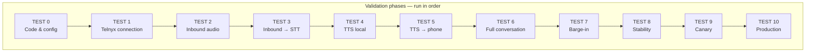
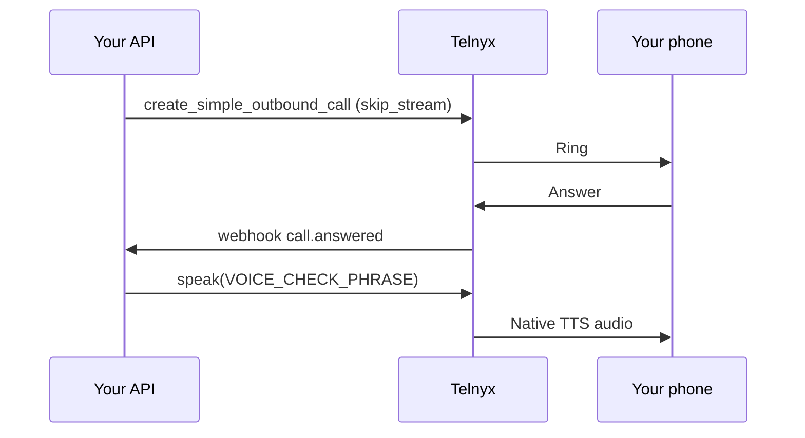
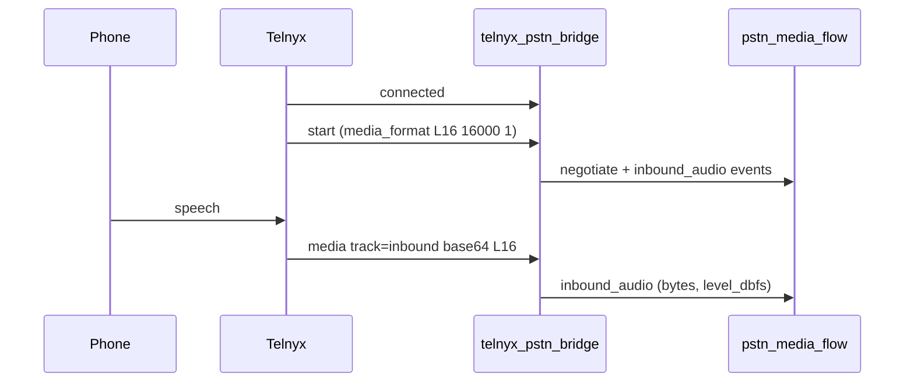
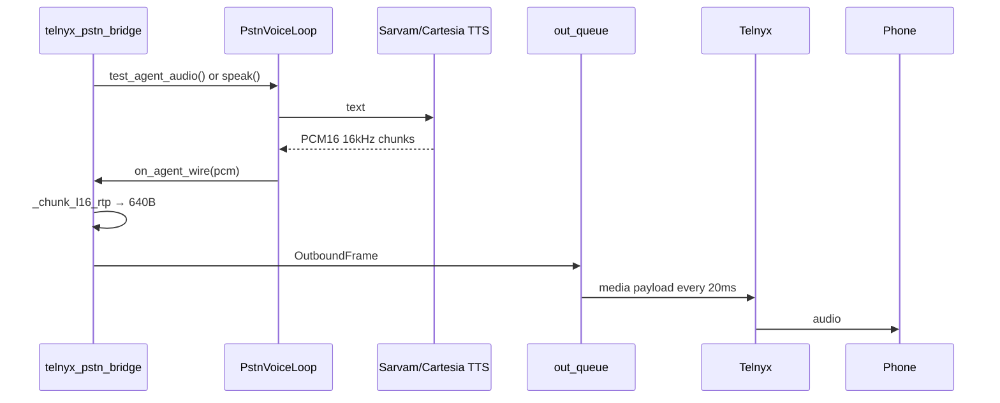

# Telnyx + Agent validation pipeline (TEST 0 → TEST 10)

**Date:** 4 September 2026  
**Status:** Implementation guide — run in order; do not skip gates  
**Companion docs:** [two-way-voice-stream.md](./two-way-voice-stream.md) (codec architecture), [plivo-and-campaigns.md](./plivo-and-campaigns.md) (PSTN lifecycle patterns)

This document is the **step-by-step validation ladder** for aligning the **current voice agent** (Sarvam or Cartesia STT/TTS, OpenAI LLM, Telugu-capable brain) with the **Telnyx PSTN media pipeline**.

Each test isolates one layer. A failure at TEST *N* means you must not advance to TEST *N+1* until the gate passes. The goal is to prove, with evidence at every step, that bytes on the wire match what Telnyx, Sarvam, and Cartesia expect — and that the caller can hear the agent.

---

## 0. How to read this document

| Column | Meaning |
|--------|---------|
| **Isolates** | What is in scope for this test; everything else is assumed working or bypassed |
| **Gate** | Objective pass criteria — all must be true before the next test |
| **Tools** | UI, API, script, or pytest you run |
| **Code pins** | Files that implement or validate this layer |

### Production audio contract (non-negotiable)

From [two-way-voice-stream.md](./two-way-voice-stream.md):

| Layer | Format |
|-------|--------|
| Telnyx WebSocket wire | `L16` — signed 16-bit **little-endian** mono PCM @ **16 kHz** |
| Outbound frame size | **640 bytes** every **20 ms** (paced by `_out_worker`) |
| Sarvam STT/TTS | `linear16` @ 16000 |
| Cartesia STT/TTS | `pcm_s16le` @ 16000 |
| Browser Test Studio TTS | **24 kHz** — do **not** reuse that config on PSTN |



### Where to work in the UI

| Surface | Path | Use for |
|---------|------|---------|
| Dev Environment | `/dev/environment` | API keys, `enable_telnyx`, Cartesia/Sarvam toggles, tunnel URL |
| Test Studio → PSTN tab | Agent Test Studio → PSTN · Telephony | Handshake, outbound dial, Telnyx checklist, **Live Media Flow** debugger |

**Dev panel alignment (4 Sep 2026):** PSTN outbound from Test Studio now matches validation scripts — tier-only stack (`medium` default), `te-IN` default, no `test-studio` TTS session, Telnyx L16 path. Browser mic tab still uses 24 kHz WebSocket TTS; PSTN tab uses 16 kHz `merge_pstn_tts_config`.
| Live Media Flow debugger | Shown during active Telnyx call | Stage health, negotiated codec, latencies, diagnostic buttons |

---

## Prerequisites (before TEST 0)

1. **API + web running locally** (or on a reachable dev host).
2. **Public HTTPS tunnel** to the API — Telnyx must reach:
   - `POST /api/telnyx/webhook` (Call Control events)
   - `WSS /ws/telnyx-stream?token=…` (bidirectional media)
3. **Environment variables** (or Dev Environment overlay):

```env
ENABLE_TELNYX=true
TELNYX_API_KEY=...
TELNYX_CONNECTION_ID=...        # Call Control Application ID
TELNYX_PHONE_NUMBER=+91...      # Active outbound caller ID
TELNYX_OUTBOUND_VOICE_PROFILE_ID=...  # optional — auto-discovered
PUBLIC_API_BASE_URL=https://your-tunnel.example   # must match tunnel
```

4. **Provider selection:** Dev Environment → `telephony_provider=telnyx`, or PATCH `/api/dev/telephony/provider`.
5. **Agent brief compiled** for the agent you will dial with (identity, opening, work scope) — see `server/brain/agent_script_compiler.py`.

---

## TEST 0 — Code / config validation

**Goal:** Prove the repository, offline tests, and static configuration are correct **before** spending Telnyx minutes or debugging live audio.

**Isolates:** Python modules, TTS merge logic, G.711 transcode helpers, Telnyx dial parameters. No phone call.

### What this test validates

| Check | Why it matters |
|-------|----------------|
| `merge_pstn_tts_config(..., wire_mode="rtp_l16")` → `linear16` @ 16000 | PSTN TTS must not use browser 24 kHz |
| `TelnyxClient.create_outbound_call` requests L16 + rtp + 16000 + `both_tracks` | Wrong dial params → wrong wire format |
| G.711 round-trip (PCMU ↔ PCMA) | Degraded path still works if Telnyx negotiates μ-law |
| Session stack infers Cartesia/Sarvam models from runtime | Wrong STT model → garbage transcripts |
| Agent script has no `[agent name]` placeholders | Broken opening on first PSTN turn |

### Code pins

| File | Role |
|------|------|
| `server/services/tts_config.py` | `merge_pstn_tts_config` |
| `server/services/telnyx_client.py` | `TELNYX_RTP_CODEC`, `create_outbound_call`, `start_streaming` |
| `server/services/pstn_voice_core.py` | `pstn_wire_mode`, `ENABLE_PSTN_BARGE_IN` (must stay `False` until TEST 7) |
| `server/providers/session_stack.py` | `infer_stt_from_runtime`, `infer_tts_from_runtime` |
| `server/brain/agent_script_compiler.py` | Identity / work-scope resolution |
| `server/tests/test_pstn_tts_config.py` | L16 config assertions |
| `server/tests/test_telnyx_pstn_bridge.py` | Dial parameter assertions |
| `server/tests/test_session_stack.py` | Cartesia/Sarvam inference |
| `server/tests/test_agent_brief.py` | Script identity gates |

### Steps

**0.1 — Run the PSTN unit test suite**

```bash
cd "D:\voice agent"
python -m pytest server/tests/test_pstn_tts_config.py server/tests/test_telnyx_pstn_bridge.py server/tests/test_pstn_media_flow.py server/tests/test_pstn_voice_core.py server/tests/test_session_stack.py server/tests/test_agent_brief.py -q
```

**0.2 — Run codec path API self-test (no call)**

```bash
# Dev login + POST /api/dev/telephony/media-flow/test-codec
curl -s -X POST http://127.0.0.1:8000/api/dev/login -H "Content-Type: application/json" -d "{\"username\":\"dev\",\"password\":\"devpass\"}" -c /tmp/cookies.txt
# Then POST test-codec with CSRF header from login response
```

Or in Test Studio during any session: **Live Media Flow → Test codec** (exercises the same transcode helpers).

**0.3 — Verify Telnyx client constants**

Confirm in `server/services/telnyx_client.py`:

- `TELNYX_RTP_CODEC = "L16"`
- `TELNYX_RTP_SAMPLE_RATE = 16000`
- `stream_bidirectional_mode = "rtp"`
- `stream_bidirectional_sampling_rate = 16000`
- `send_silence_when_idle = true`

**0.4 — Verify barge-in state**

In `server/services/pstn_voice_core.py`:

```python
ENABLE_PSTN_BARGE_IN = True  # enabled after TEST 7; required for production
```

For TEST 6 only (no barge-in), temporarily set `False` or use `run_test6_conversation.py --offline`.

**0.5 — Compile agent brief (optional but recommended)**

POST `/api/instructions` with your agent brief. Confirm `agentScript` contains `AGENT IDENTITY`, `OPENING`, `WORK SCOPE`, and no bracket placeholders.

### Gate (TEST 0)

| # | Criterion |
|---|-----------|
| 0.1 | All pytest files above pass |
| 0.2 | `test-codec` returns `ok: true`, 160-byte μ-law frames |
| 0.3 | `merge_pstn_tts_config` for `rtp_l16` → `speech_sample_rate=16000`, `output_audio_codec=linear16` |
| 0.4 | `ENABLE_PSTN_BARGE_IN` matches target (True for production; False only for TEST 6 gate) |
| 0.5 | Agent script compiles with real name/opening (if using custom brief) |

### Common failures

| Symptom | Likely cause | Fix |
|---------|--------------|-----|
| `test_pstn_tts_config` fails on sample rate | Browser TTS config leaked into PSTN | Use `wire_mode="rtp_l16"` in `PstnVoiceLoop` |
| `test_telnyx_pstn_bridge` fails | Dial params reverted | Restore L16/rtp/16000 in `create_outbound_call` |
| Placeholders in script | Brief missing identity | Use `resolve_script_identity` path; recompile brief |

---

## TEST 1 — Telnyx connection

**Goal:** Prove Telnyx credentials, Mission Control wiring, webhook reachability, and **native Telnyx audio to the handset** — with **no agent, no WebSocket stream, no Sarvam/Cartesia**.

**Isolates:** Telnyx API auth, Call Control app, Outbound Voice Profile, webhook delivery, `speak` API.

### Architecture for this test



### Code pins

| File | Role |
|------|------|
| `server/services/telnyx_client.py` | `handshake()`, `create_simple_outbound_call()`, `speak()` |
| `server/services/telnyx_provisioning.py` | `telnyx_setup_status()`, `run_standard_setup()` |
| `server/routes/telnyx.py` | `_run_voice_check` on `call.answered` |
| `server/routes/dev_telephony.py` | `/voice-check`, `/telnyx/setup`, `/telnyx/checklist` |
| `scripts/run_voice_check.py` | CLI automation |

### Steps

**1.1 — Apply standard Telnyx setup**

- UI: Test Studio → PSTN → **Apply standard setup**
- API: `POST /api/dev/telephony/telnyx/setup`

This ensures: webhook URL → `{PUBLIC_API_BASE}/api/telnyx/webhook`, OVP linked, recording on.

**1.2 — Review checklist**

- UI: Telnyx Mission Control checklist card
- API: `GET /api/dev/telephony/telnyx/checklist`

Required for US/CA:

- Call Control app active
- Webhook configured
- Outbound voice profile on app
- Phone number active
- Account balance > 0

For India (`+91`): additionally `international_india` **or** verify destination number on trial.

**1.3 — Handshake**

- UI: **Test handshake** / **Re-test handshake**
- API: `POST /api/dev/telephony/handshake`

Expect `ok: true` and balance string.

**1.4 — Voice check call (critical)**

```bash
python scripts/run_voice_check.py --to +91XXXXXXXXXX --base-url https://your-tunnel.example
```

Or API: `POST /api/dev/telephony/voice-check` with `{ "toE164": "+91..." }`.

**Answer the phone.** You must hear:

> *"Telnyx voice check. This is a test message only… Signal test one. Signal test two. Signal test three."*

**1.5 — Confirm registry**

`GET /api/dev/telephony/calls` → `voice_check_speak_sent: true`, no `voice_check_error`.

### Gate (TEST 1)

| # | Criterion |
|---|-----------|
| 1.1 | Checklist: `call_control_app`, `webhook_configured`, `outbound_profile_on_app`, `phone_number_active` all true |
| 1.2 | Handshake OK |
| 1.3 | Voice-check call: **you heard** the English phrase clearly |
| 1.4 | `voice_check_speak_sent: true` in call registry |

### Common failures

| Symptom | Likely cause | Fix |
|---------|--------------|-----|
| Call never rings | Wrong `TELNYX_PHONE_NUMBER`, India not whitelisted | Run setup; verify destination or upgrade Telnyx account |
| Rings, silence | Webhook not reaching API | Fix tunnel; confirm `PUBLIC_API_BASE_URL` matches tunnel |
| `voice_check_error` | `speak` rejected | Check OVP, connection ID, call state |
| Heard phrase but checklist red | Stale checklist | Re-run setup; refresh status |

**Do not proceed** if you cannot hear Telnyx native `speak` — downstream WebSocket tests will also fail.

---

## TEST 2 — Telnyx inbound audio

**Goal:** Prove Telnyx opens the media WebSocket, negotiates **L16 @ 16 kHz**, and the bridge receives **inbound** PCM from the caller.

**Isolates:** WebSocket connect, `start` / `media_format`, inbound `media` frames, track filtering. STT may run but is not the gate.

### Architecture



### Code pins

| File | Role |
|------|------|
| `server/routes/telnyx_ws.py` | WebSocket endpoint |
| `server/services/telnyx_pstn_bridge.py` | Inbound decode, `track=outbound` drop |
| `server/services/pstn_media_flow.py` | `negotiate()`, `inbound_audio` stage |
| `server/routes/telnyx.py` | `_ensure_telnyx_streaming` on answer |

### Steps

**2.1 — Place full outbound call (with stream)**

- UI: Test Studio → PSTN → **Place outbound call** (agent + tier locked)
- Ensure tunnel WebSocket URL is shown in handshake card (`wss://…/ws/telnyx-stream`)

**2.2 — Answer and speak**

Answer the phone. Say clearly for 5–10 seconds: *"Testing one two three."*

**2.3 — Inspect Live Media Flow**

Open the debugger panel (Telnyx calls only). Confirm:

| Field | Expected |
|-------|----------|
| `active` | `true` |
| `configured.codec` | `L16` |
| `negotiated.codec` | `L16` |
| `negotiated.sample_rate` | `16000` |
| `negotiated.channels` | `1` |
| `stages.inbound_audio.status` | `healthy` |
| `metrics.inbound_frames` | Increasing while you speak |
| `failures` | No `CODEC_MISMATCH` / `SAMPLE_RATE_MISMATCH` |

API: `GET /api/dev/telephony/media-flow?call_id=<internal_or_control_id>`

**2.4 — Optional: capture inbound PCM**

If debugging noise: log or dump decoded inbound bytes; play with:

```bash
ffplay -f s16le -ar 16000 -ac 1 inbound.raw
```

Garbled audio at this step → endianness or wrong codec (see [two-way-voice-stream.md §2](./two-way-voice-stream.md)).

**2.5 — Isolation: Telnyx speak still works on same call**

Click **Test Telnyx speak** in Live Media Flow. You should hear Telnyx native TTS **even if agent audio is broken**. This separates PSTN leg problems from WebSocket outbound problems.

### Gate (TEST 2)

| # | Criterion |
|---|-----------|
| 2.1 | WebSocket connects; `start.media_format` = L16 / 16000 / 1 |
| 2.2 | `inbound_frames` > 0 while caller speaks |
| 2.3 | No codec negotiation failures in `flow.failures` |
| 2.4 | `inbound_audio.level_dbfs` moves (not stuck at silence) |
| 2.5 | Telnyx speak audible on same call (optional sanity) |

### Common failures

| Symptom | Likely cause | Fix |
|---------|--------------|-----|
| No WebSocket | Tunnel not WSS; token invalid | Fix `PUBLIC_API_BASE_URL`; check `telnyx_stream_tokens` |
| PCMU negotiated | Dial missing L16 params | Fix `create_outbound_call` / `start_streaming` |
| `inbound_frames` = 0 | Wrong track; mic muted | Confirm `track=inbound`; speak louder |
| Noise on ffplay | Endian bug | Compare with Telnyx realtime-ai-demo; report if BE |

---

## TEST 3 — Inbound audio → STT

**Goal:** Prove caller speech reaches the STT adapter and produces a **final transcript** on the PSTN path.

**Isolates:** STT WebSocket (Sarvam `linear16` or Cartesia `pcm_s16le`), audio forwarding from bridge, `stt_final` telemetry. LLM/TTS may fire but are not the gate.

### Code pins

| File | Role |
|------|------|
| `server/services/pstn_voice_core.py` | `PstnVoiceLoop` STT task |
| `server/services/sarvam_ws.py` | Sarvam realtime STT |
| `server/providers/sarvam_stt.py` | STT adapter |
| Cartesia STT | `ink-whisper` for Telugu via session stack |
| `server/services/pstn_media_flow.py` | `stt_audio`, `stt_final` stages |

### Steps

**3.1 — Lock STT stack**

In Dev Environment / runtime settings for the test session:

| Provider | STT model | Notes |
|----------|-----------|-------|
| Sarvam | `saaras:v3-realtime` (or `saaras:v3` mapped) | `encoding=linear16`, `sample_rate=16000` |
| Cartesia | `ink-whisper` | Telugu; **never** `ink-2` on PSTN |

**3.2 — Place call, speak a known phrase**

Suggested phrases:

- Telugu: *"నమస్కారం, నా పేరు రవి."*
- English: *"Hello, this is a speech test."*

Speak once, pause 2 seconds, repeat.

**3.3 — Verify media-flow stages**

| Stage | Expected |
|-------|----------|
| `stt_audio` | `healthy`, bytes increasing |
| `stt_final` | `healthy`, `detail` contains your phrase (may be approximate) |

Health object:

```json
"checks": {
  "telnyx_inbound": true,
  "stt": true,
  ...
}
```

**3.4 — Verify latencies**

`flow.latencies.stt_final_ms` should be present (typically hundreds of ms to low seconds).

**3.5 — Cross-check call archive**

After hangup: `data/calls/<call_id>/transcript.jsonl` should contain a user turn with text resembling your phrase.

### Gate (TEST 3)

| # | Criterion |
|---|-----------|
| 3.1 | `stt_audio` and `stt_final` stages present |
| 3.2 | Transcript text is **recognizably correct** (not empty, not English garbage on Telugu) |
| 3.3 | No `STT_INPUT_FAILURE` in health |
| 3.4 | Wrong-encoding test: if you deliberately send 8 kHz to Cartesia STT, transcript fails — revert to 16 kHz |

### Common failures

| Symptom | Likely cause | Fix |
|---------|--------------|-----|
| `stt_audio` but no `stt_final` | STT WS auth / model | Check API keys; confirm `saaras:v3-realtime` or `ink-whisper` |
| Garbage transcript | Sample rate mismatch | Ensure bridge sends 16 kHz PCM16 to STT |
| English on Telugu | Wrong Cartesia model | Use `ink-whisper`, language `te` |
| High latency only | Network to Sarvam/Cartesia | Note for TEST 8; not a blocker if accurate |

---

## TEST 4 — TTS → local audio

**Goal:** Prove TTS emits **16 kHz linear PCM** suitable for Telnyx L16 **without** involving the phone or WebSocket outbound queue.

**Isolates:** `merge_pstn_tts_config`, Sarvam/Cartesia TTS WebSocket, frame chunking to 640 bytes.

### Code pins

| File | Role |
|------|------|
| `server/services/tts_config.py` | `merge_pstn_tts_config(wire_mode="rtp_l16")` |
| `server/services/sarvam_ws.py` | Sarvam TTS WS |
| `server/services/cartesia_tts_ws.py` | Cartesia `pcm_s16le` mapping |
| `scripts/diag_telnyx_sarvam_alignment.py` | Offline alignment proof |
| `server/services/telnyx_pstn_bridge.py` | `_chunk_l16_rtp` (640 B) |

### Steps

**4.1 — Run Sarvam alignment diagnostic**

```bash
python scripts/diag_telnyx_sarvam_alignment.py
```

Expect:

```
Telnyx expects: L16 @ 16000 Hz (640 B / 20 ms)
Sarvam config: output_audio_codec=linear16, speech_sample_rate=16000
Alignment: OK
Wrote data/diag_telnyx_l16.wav
```

**4.2 — Listen to WAV**

```bash
ffplay data/diag_telnyx_l16.wav
```

Audio must be intelligible Telugu/English test line at correct pitch (not chipmunk = wrong rate).

**4.3 — Cartesia path (if using Cartesia TTS)**

Confirm runtime infers Cartesia when `enable_cartesia=true` and model is `sonic-*`. TTS WS must request:

```json
"output_format": { "container": "raw", "encoding": "pcm_s16le", "sample_rate": 16000 }
```

**4.4 — Frame size check**

After TTS completes, every RTP frame except possibly the last must be **640 bytes**. The diagnostic script reports `bad sizes: none`.

**4.5 — pytest**

```bash
python -m pytest server/tests/test_pstn_tts_config.py -q
```

### Gate (TEST 4)

| # | Criterion |
|---|-----------|
| 4.1 | `diag_telnyx_sarvam_alignment.py` prints `Alignment: OK` |
| 4.2 | WAV plays at natural speed |
| 4.3 | All chunked frames are 640 B (or last frame zero-padded to 640) |
| 4.4 | Cartesia path (if used) uses `pcm_s16le` @ 16000, not 24 kHz |

### Common failures

| Symptom | Likely cause | Fix |
|---------|--------------|-----|
| Chipmunk / slow speech | 24 kHz audio on 16 kHz wire | Force `speech_sample_rate=16000` in PSTN merge |
| `Alignment: FAIL` bad frame sizes | Chunker bug | Fix `chunk_pcm16_frames` / `_chunk_l16_rtp` |
| Silent WAV | Sarvam TTS config rejected | Send `linear16` not `mp3` on realtime WS |

---

## TEST 5 — TTS → Telnyx → phone

**Goal:** Prove **agent-generated TTS** reaches the handset over the **WebSocket outbound** path — the layer that most often breaks in production.

**Isolates:** `PstnVoiceLoop.speak` → wire callback → outbound queue → `_out_worker` → Telnyx `media` frames. STT/LLM may be bypassed via `test_agent_audio`.

### Architecture



### Code pins

| File | Role |
|------|------|
| `server/services/telnyx_pstn_bridge.py` | `_out_worker`, `test_agent_audio`, queue |
| `server/services/pstn_voice_core.py` | `speak()`, TTS streaming |
| `server/routes/dev_telephony.py` | `POST .../test-audio` |
| `scripts/run_signal_test.py` | Automated dial + test-audio |
| `server/services/pstn_media_flow.py` | `tts_audio`, `outbound_sent`, health |

### Steps

**5.1 — Place outbound call and wait for stream active**

Same as TEST 2. Confirm `flow.active === true`.

**5.2 — Run agent audio test (bypasses LLM)**

- UI: Live Media Flow → **Test agent audio**
- API: `POST /api/dev/telephony/media-flow/test-audio?call_id=<control_id>`

Plays:

> *"Signal test one. Signal test two. Signal test three."*  
> then Telugu: *"నమస్కారం, ఇది ఏజెంట్ ఆడియో పరీక్ష."*

**5.3 — Confirm on phone**

You must hear **both** English and Telugu clearly.

**5.4 — Confirm telemetry**

| Metric / stage | Expected |
|----------------|----------|
| `tts_audio` | healthy, large byte count |
| `outbound_queued` | frames queued |
| `outbound_sent` | healthy |
| `metrics.outbound_sent_frames` | >> 0 (roughly duration_s × 50) |
| `health.checks.telnyx_outbound` | `true` |
| `health.failures` | no `OUTBOUND_TRANSMISSION_FAILURE` |
| Outbound event `bytes` | **640** per frame in logs |

**5.5 — Compare with Telnyx speak**

If **Test Telnyx speak** works but **Test agent audio** does not:

- Problem is in **our outbound path** (TTS config, chunking, queue, pacing) — not PSTN leg.

**5.6 — Automated script (optional)**

```bash
python scripts/run_signal_test.py
```

Waits for stream, runs speak + test-audio, prints pipeline events.

### Gate (TEST 5)

| # | Criterion |
|---|-----------|
| 5.1 | **Heard** agent test phrase on phone (English + Telugu) |
| 5.2 | `outbound_sent_frames` > 0; `telnyx_outbound` check true |
| 5.3 | Outbound frames logged at 640 bytes, codec L16 |
| 5.4 | `health.score` ≥ 85 with TTS+outbound stages green |
| 5.5 | Queue duration < 1000 ms (`AUDIO_BACKLOG` absent) |

### Common failures

| Symptom | Likely cause | Fix |
|---------|--------------|-----|
| TTS bytes but no outbound | Queue worker not running; WS send lock | Check `_out_task`; logs for send errors |
| Outbound frames but silence on phone | Wrong codec bytes (24k, mulaw on L16 wire) | Re-run TEST 4; verify `merge_pstn_tts_config` |
| Bursts then drop | Not pacing 20 ms | `_out_worker` sleep; don't batch >30s |
| `AUDIO_BACKLOG` | TTS faster than real-time | Increase `MAX_AUDIO_QUEUE_FRAMES` only after fixing root rate |

**This is the minimum bar for "caller can hear the agent."** Do not run full conversation tests until TEST 5 passes reliably.

---

## TEST 6 — Full conversation without barge-in

**Goal:** Prove the complete agent loop on PSTN: **opening → STT → LLM → TTS → phone** for multiple turns, with barge-in **disabled**.

**Isolates:** Brain prompt, agent script, turn orchestration, memory projection, call lifecycle. `ENABLE_PSTN_BARGE_IN` must remain `False`.

### Code pins

| File | Role |
|------|------|
| `server/services/pstn_voice_core.py` | Full `PstnVoiceLoop` turn loop |
| `server/brain/agent_script_compiler.py` | Opening line, work scope |
| `server/call/call_lifecycle_service.py` | `call_id`, archive |
| `data/calls/<id>/` | `transcript.jsonl`, `trace.json`, `mix.wav` |

### Steps

**6.1 — Prepare agent**

1. Write agent brief (company, name, work scope).
2. Compile via `/api/instructions`.
3. Lock tier/stack in Test Studio (e.g. medium, Sarvam or Cartesia).

**6.2 — Place outbound call**

Answer. **Do not speak first** — wait for agent opening.

**6.3 — Validate opening turn**

| Check | Expected |
|-------|----------|
| Agent speaks first | Opening from script (e.g. *"Namaste! Nenu …"*) |
| Opening content | Matches compiled identity; no placeholders |
| `llm_started` → `tts_audio` → `outbound_sent` | All present on turn 1 |

**6.4 — Multi-turn dialogue**

Run at least **3 turns**:

| Turn | You say | Agent should |
|------|---------|--------------|
| 1 | (listen) | Greet + offer help |
| 2 | Ask in-scope question | Stay in work scope |
| 3 | Ask out-of-scope question | Politely redirect per guardrails |

**6.5 — Inspect artifacts**

After hangup:

- `transcript.jsonl` — user + agent turns in order
- `trace.json` — per-turn latencies
- `mix.wav` — post-call mix (if enabled)
- `outcome.json` — disposition attempt

**6.6 — Latency budget (informal)**

From `flow.latencies` on last turn:

| Segment | Target (dev) |
|---------|----------------|
| STT final | < 2000 ms |
| LLM first token | < 1500 ms |
| TTS first audio | < 800 ms |
| Telnyx first outbound | < 200 ms after TTS audio |

### Gate (TEST 6)

| # | Criterion |
|---|-----------|
| 6.1 | Agent opening plays without user speaking first |
| 6.2 | ≥ 3 coherent turns; transcript matches conversation |
| 6.3 | Agent stays in work scope per script |
| 6.4 | Every turn shows full pipeline in media-flow or trace |
| 6.5 | No duplicate openings; no stuck `turn_busy` |
| 6.6 | `bidirectional_ok: true` on call registry at hangup |

### Common failures

| Symptom | Likely cause | Fix |
|---------|--------------|-----|
| No opening | Greeting extraction failed | Check `extract_opening_greeting` / script OPENING section |
| Agent talks over you | VAD / turn detection | Tune STT end-of-utterance; keep barge-in off for now |
| Wrong language | `language` not passed on dial | Set `language: te-IN` on outbound body |
| LLM but no TTS | speak lock / error in TTS WS | Check `log_tts` / media-flow `tts` stage failed |

---

## TEST 7 — Barge-in

**Goal:** Prove the caller can **interrupt** agent speech; outbound audio stops; Telnyx buffer clears; agent handles the new utterance.

**Isolates:** `ENABLE_PSTN_BARGE_IN`, Telnyx `clear` message, generation invalidation, `interrupted_frames` metric.

### Code pins

| File | Role |
|------|------|
| `server/services/pstn_voice_core.py` | `ENABLE_PSTN_BARGE_IN`, barge handler |
| `server/services/telnyx_pstn_bridge.py` | `clear` on barge, `_invalid_generations` |
| `server/services/pstn_media_flow.py` | `queue_cleared`, `interrupted_frames` |

### Steps

**7.1 — Enable barge-in (only after TEST 5–6 pass)**

In `server/services/pstn_voice_core.py`:

```python
ENABLE_PSTN_BARGE_IN = True
```

Restart API. **Do not enable before outbound audio is proven** — premature barge-in sends `clear` during debugging and hides root causes.

**7.2 — Trigger barge-in**

1. Place call; let agent start a **long** response (ask an open question).
2. While agent is speaking, talk loudly over the agent: *"ఆపు, వినండి."* or *"Stop, listen."*

**7.3 — Expected behavior**

| Observation | Expected |
|---------------|----------|
| On phone | Agent audio stops within ~300–500 ms |
| Media flow | `queue_cleared` event |
| Metrics | `interrupted_frames` > 0 |
| Next turn | New STT final → new LLM → new TTS (not old text resumed) |

**7.4 — Sarvam note**

Sarvam has **no server-side TTS cancel**. Barge-in is **local**: stop consuming TTS stream + Telnyx `clear`. Cartesia may support cancel depending on adapter — still rely on local stop + clear.

**7.5 — Regression**

Re-run TEST 5 once with barge-in on — agent audio test must still be audible when you **don't** interrupt.

### Gate (TEST 7)

| # | Criterion |
|---|-----------|
| 7.1 | Interrupt stops audible agent speech reliably (3/3 trials) |
| 7.2 | `queue_cleared` logged on interrupt |
| 7.3 | Agent responds to **new** user utterance, not stale partial |
| 7.4 | No permanent silence after barge (TEST 5 still passes) |

### Common failures

| Symptom | Likely cause | Fix |
|---------|--------------|-----|
| Agent keeps talking | `clear` not sent | Wire `set_barge_handler` in bridge |
| Silence forever after barge | Generation not invalidated | Check `_invalid_generations` |
| Barge on every inbound noise | Threshold too low | Tune VAD / debounce `_last_barge_at` |

---

## TEST 8 — Multiple calls / stability

**Goal:** Prove the system handles **repeated and overlapping** PSTN sessions without registry leaks, queue stalls, or degraded audio.

**Isolates:** `active_telnyx_bridges`, `telnyx_call_registry`, `pstn_media_flow` store (30-call cap), connection cleanup, provider rate limits.

### Steps

**8.1 — Sequential stress**

Place **5 outbound calls** back-to-back (hang up each within 30 s). After each:

- `active_telnyx_bridges` count returns to 0
- `GET /api/dev/telephony/calls` shows `completed`
- TEST 5 spot-check on call 3 and 5

**8.2 — Long call**

One call duration **≥ 10 minutes**, 10+ turns. Watch:

- `metrics.queue_duration_ms` stays < 1000
- No memory growth warnings in API logs
- `mix.wav` completes

**8.3 — Concurrent calls (if supported)**

Two destinations simultaneously (or two agents). Each call must have isolated:

- `call_id`
- `ws_id`
- media-flow snapshot

**8.4 — Failure recovery**

Mid-call: kill tunnel for 5 s, restore. Document behavior (expected: call fails gracefully; no zombie bridges).

**8.5 — Provider errors**

Revoke STT key temporarily → call should fail with visible `stt` stage `failed`, not hang forever.

### Gate (TEST 8)

| # | Criterion |
|---|-----------|
| 8.1 | 5 sequential calls: all complete, no zombie bridges |
| 8.2 | 10 min call: no `AUDIO_BACKLOG`; transcript complete |
| 8.3 | Concurrent calls (if tested): isolated telemetry |
| 8.4 | Error paths end call with reason in registry |
| 8.5 | Memory-flow store does not grow unbounded (>30 rows pruned) |

---

## TEST 9 — Production canary

**Goal:** Run the **same stack** on production infrastructure with **limited traffic** before full rollout.

**Isolates:** Railway/deploy config, production secrets, production tunnel/domain, monitoring — not local dev overlays.

### Steps

**9.1 — Deploy checklist**

| Item | Verify |
|------|--------|
| `PUBLIC_API_BASE_URL` | Production domain, valid TLS |
| Webhook URL in Telnyx | Points to production `/api/telnyx/webhook` |
| Secrets | `TELNYX_*`, `SARVAM_*` / `CARTESIA_*`, `OPENAI_*` in Railway/host env — not `dev_secrets.json` |
| `ENABLE_PSTN_BARGE_IN` | Match tested value from TEST 7 |
| Recording / compliance | Consent flow if required (see PRD) |

**9.2 — Canary traffic**

- **1–3 numbers** only (team phones + one friendly customer).
- **≤ 20 calls/day** for 48 hours.
- Fixed agent version / compiled brain checksum logged per call.

**9.3 — Automated smoke after deploy**

```bash
python scripts/run_test9_production_canary.py --base-url https://api.production.example
# Or stepwise:
python scripts/run_voice_check.py --base-url https://api.production.example
python scripts/run_test5_outbound_phone.py --base-url https://api.production.example
```

Canary window scoring (after ≥10 calls in 48h):

```bash
python scripts/run_test9_production_canary.py --base-url https://api.production.example --score-only
```

**9.4 — Monitor**

| Signal | Alert threshold |
|--------|-----------------|
| `health.score` < 70 | Investigate |
| `OUTBOUND_TRANSMISSION_FAILURE` | Page |
| `CODEC_MISMATCH` | Page |
| Call `bidirectional_ok: false` rate | > 5% |
| p95 turn latency | > 8 s |

**9.5 — Rollback plan**

- Revert deploy OR set `ENABLE_TELNYX=false`
- Telnyx connection can stay up; agent stops accepting streams

### Gate (TEST 9)

| # | Criterion |
|---|-----------|
| 9.1 | Voice-check + TEST 5 pass on production URL |
| 9.2 | ≥ 10 canary calls with `bidirectional_ok: true` |
| 9.3 | Zero `OUTBOUND_TRANSMISSION_FAILURE` in canary window |
| 9.4 | Post-call archives written to production storage |
| 9.5 | On-call knows rollback steps |

---

## TEST 10 — Production now

**Goal:** General availability for PSTN Telnyx traffic with ongoing SLOs and regression discipline.

### Launch checklist

| Area | Action |
|------|--------|
| Telnyx | India whitelist or verified destinations; billing alerts |
| Agent | Promoted brain version; tier defaults documented |
| Observability | Dashboards on `pstn_media_flow` health, call outcomes |
| Support | Runbook links to this doc + [two-way-voice-stream.md](./two-way-voice-stream.md) |
| Regression | CI runs TEST 0 pytest on every PR; weekly TEST 5 manual on staging |

### Ongoing gates (every release)

1. TEST 0 pytest green.
2. Staging TEST 5 + TEST 6 on real handset.
3. If audio code touched: re-run `diag_telnyx_sarvam_alignment.py`.
4. If barge-in code touched: TEST 7 on staging.
5. Canary 24 h before promoting audio changes to production.

### Production SLOs (initial)

| Metric | SLO |
|--------|-----|
| Call connect rate | ≥ 98% |
| `bidirectional_ok` | ≥ 95% |
| Caller-audible agent (manual sample) | ≥ 99% when bidirectional_ok |
| p95 end-to-end turn | ≤ 6 s |
| Failed calls with no archive | 0% |

---

## Quick reference — APIs & scripts

| Test | Command / endpoint |
|------|-------------------|
| 0 | `pytest server/tests/test_pstn_*.py …` |
| 0 | `POST /api/dev/telephony/media-flow/test-codec` |
| 1 | `python scripts/run_voice_check.py` |
| 1 | `POST /api/dev/telephony/voice-check` |
| 1 | `POST /api/dev/telephony/telnyx/setup` |
| 2–7 | `POST /api/dev/telephony/outbound` |
| 2–7 | `GET /api/dev/telephony/media-flow` |
| 5 | `POST /api/dev/telephony/media-flow/test-audio` |
| 5 | `POST /api/dev/telephony/media-flow/test-telnyx-speak` |
| 5 | `python scripts/run_test5_outbound_phone.py` |
| 5 | `python scripts/run_signal_test.py` (dial + speak + test-audio) |
| 4 | `python scripts/run_test4_local_tts.py` |
| 4 | `python scripts/diag_telnyx_sarvam_alignment.py` (Sarvam-only) |
| 6 | `python scripts/run_test6_conversation.py` |
| 7 | `python scripts/run_test7_barge_in.py` |
| 8 | `python scripts/run_test8_stability.py` |
| 9 | `python scripts/run_test9_production_canary.py --base-url https://api.production.example` |
| 9 | `GET /api/dev/telephony/production-canary/checklist` |
| 9 | `GET /api/dev/telephony/production-canary/status` |
| 10 | `python scripts/run_test10_production_launch.py` |
| 10 | `GET /api/dev/telephony/production-launch/checklist` |
| 10 | `GET /api/dev/telephony/production-launch/slos` |

---

## Health score interpretation

From `pstn_media_flow._health`:

| Score | Meaning |
|-------|---------|
| 100 | All checks true including outbound |
| 71–99 | Pipeline ran; inspect missing stage |
| < 71 | Major gap — see `failures[]` |

Checks map to tests:

| Check | Minimum test |
|-------|----------------|
| `telnyx_inbound` | TEST 2 |
| `stt` | TEST 3 |
| `llm` | TEST 6 |
| `tts` | TEST 4–5 |
| `conversion` | TEST 4–5 |
| `queue` | TEST 5 |
| `telnyx_outbound` | TEST 5 |

---

## Document history

| Version | Date | Notes |
|---------|------|-------|
| 1.0 | 2026-09-04 | Initial TEST 0–10 ladder aligned with `two-way-voice-stream.md` and current repo tooling |
