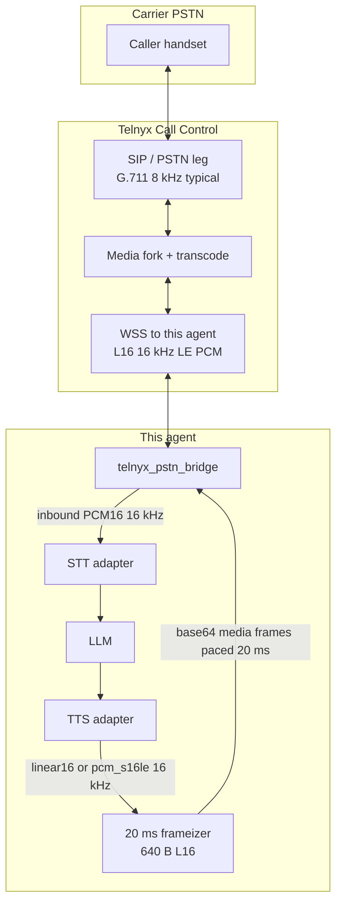
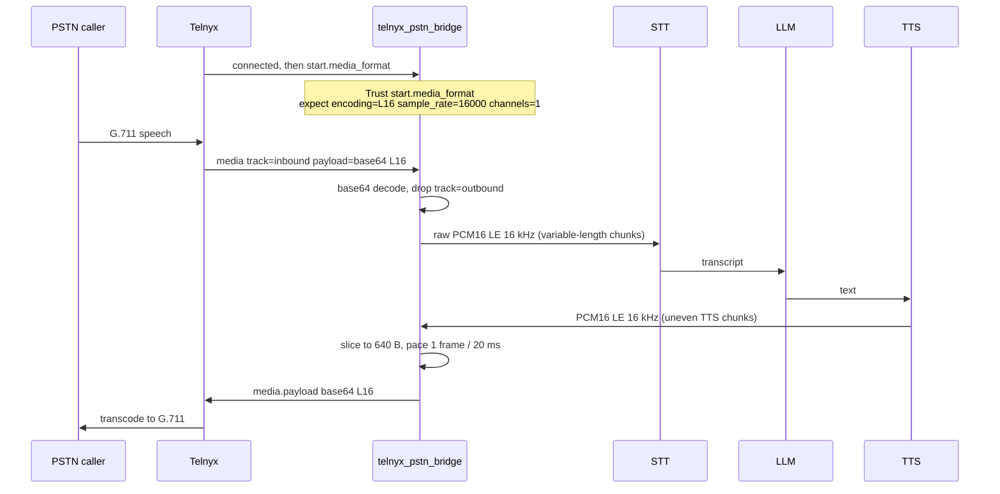
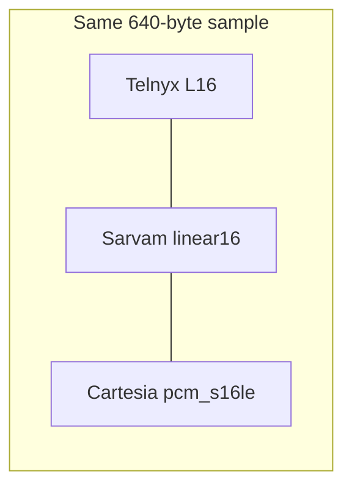
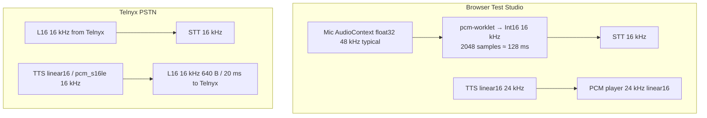

# Two-way voice stream — production architecture

**Date:** 4 September 2026 (revised)  
**Status:** Production target for this agent + Telnyx Call Control  
**Code pins:** `server/services/telnyx_client.py`, `telnyx_pstn_bridge.py`, `tts_config.merge_pstn_tts_config`, `pstn_voice_core.py`

This is the architecture to run the **current agent** (Sarvam or Cartesia STT/TTS, OpenAI LLM, Telugu-capable) on **Telnyx PSTN**. Vendor facts are from official docs. Implementation facts are from this repo. Where those differ, the difference is called out.

---

## 1. Chosen production architecture

**One PCM clock on the Telnyx wire: signed 16-bit little-endian mono PCM at 16 kHz, sent as Telnyx `L16` RTP over WebSocket, 20 ms (640 bytes) outbound.**

That is the only pairing where:

- Telnyx’s AI-oriented stream codec (`L16` @ 16 kHz)
- Sarvam `linear16` / `speech_sample_rate=16000`
- Cartesia `pcm_s16le` / `sample_rate=16000`

are **the same samples**. No μ-law encode, no 24→16 resample, no Opus, on the happy path.

Telnyx still transcodes **PSTN G.711 (typically 8 kHz) ↔ L16 16 kHz** on the carrier side. That hop stays in Telnyx. The agent does not duplicate it.



### 1.1 Call Control fields (this repo already sends these)

From `TelnyxClient.create_outbound_call` / `start_streaming`:

| Field | Production value | Why |
|-------|------------------|-----|
| `stream_url` | `wss://<public-api>/ws/telnyx-stream?token=…` | Telnyx **opens** this socket |
| `stream_track` | **`both_tracks`** | Code already filters `media.track == outbound` so STT only hears the caller. Outbound remains available for debug/archive |
| `stream_codec` | `L16` | Inbound fork format |
| `stream_bidirectional_mode` | `rtp` | Live packets, not queued MP3 |
| `stream_bidirectional_codec` | `L16` | Outbound inject format |
| `stream_bidirectional_sampling_rate` | `16000` | Documented L16 rate |
| `stream_bidirectional_target_legs` | `self` | Play onto this call leg |
| `send_silence_when_idle` | `true` | Keep the RTP stream alive between agent turns |

Do **not** use TeXML `<Stream>` for this agent. TeXML’s published `bidirectionalCodec` list is behind Call Control (some pages still omit `L16`). This stack is Voice API v2 Call Control.

### 1.2 Inbound vs outbound (what actually happens)



**Inbound frames are not guaranteed to be 640 bytes.** Telnyx allows 20 ms–30 s per payload. The bridge feeds whatever length arrives into STT. **Outbound is strictly 640 bytes** and paced at 20 ms (`_out_worker` sleeps 20 ms). That pacing is this agent’s production rule because Telnyx bursts or drops mis-timed RTP even when a larger legal chunk would be accepted.

---

## 2. Codec identity — Telnyx ↔ Sarvam ↔ Cartesia

These three names are **the same PCM** on the production path. Mixing any other name on the Telnyx socket is a bug.

| Layer | Name in that API | Encoding | Endian | Rate | Channels | 20 ms payload |
|-------|------------------|----------|--------|------|----------|---------------|
| Telnyx WS | `L16` | 16-bit signed linear PCM | **Little-endian on the WebSocket** | 16000 | 1 | **640 B** |
| Sarvam STT realtime | query `encoding=linear16` | 16-bit signed PCM | LE (`pcm_s16le` equivalent) | 16000 | 1 | 640 B |
| Sarvam TTS WS | `output_audio_codec=linear16` + `speech_sample_rate=16000` | 16-bit signed PCM | LE | 16000 | 1 | 640 B (after we slice) |
| Cartesia STT | query `encoding=pcm_s16le&sample_rate=16000` | 16-bit signed PCM | LE | 16000 | 1 | 640 B |
| Cartesia TTS WS | `output_format: { container: raw, encoding: pcm_s16le, sample_rate: 16000 }` | 16-bit signed PCM | LE | 16000 | 1 | 640 B (after we slice) |
| This agent PSTN config | `merge_pstn_tts_config(..., wire_mode="rtp_l16")` | always `output_audio_codec=linear16`, `speech_sample_rate=16000` | LE | 16000 | 1 | 640 B |
| Cartesia adapter | maps that config to `pcm_s16le` | same bytes | LE | 16000 | 1 | 640 B |

**Formula (mono):**

```
frame_bytes = sample_rate × 0.020 × bytes_per_sample
L16 / linear16 / pcm_s16le @ 16 kHz: 16000 × 0.02 × 2 = 640
PCMU / PCMA @ 8 kHz:                 8000 × 0.02 × 1 = 160
```

**Endianness (closed for production):** RFC 3551 L16 on SIP/RTP is big-endian. Telnyx’s WebSocket payload is **not** that RTP packet; it is a headerless payload. Telnyx’s own realtime-ai-demo confirmed the WS bytes are **little-endian** (`pcm_s16le`). This agent therefore feeds Telnyx L16 straight into Sarvam `linear16` and Cartesia `pcm_s16le` with **no byte swap**.

If a capture ever sounds like noise, play `ffplay -f s16le -ar 16000 -ac 1 inbound.raw` first. Big-endian would be a Telnyx regression, not the design.

**Naming trap:** Cartesia never uses the string `linear16`. Sarvam never uses `pcm_s16le` on the realtime STT query (it uses `linear16`). Telnyx never uses either of those strings — it uses `L16`. Internally the PSTN TTS merger still says `linear16` for **both** vendors; the Cartesia WS client translates to `pcm_s16le`.



---

## 3. Byte-size table (mono, payload only)

WebSocket JSON + base64 adds ~33% on the Telnyx `payload` string (640 B → 856 base64 chars).

| Path | Codec string | Rate | Bytes/sample | 20 ms | 100 ms | Notes |
|------|--------------|------|--------------|-------|--------|-------|
| **Production Telnyx wire** | `L16` | 16000 | 2 | **640 B** | 3200 B | Outbound pinned; inbound may be longer |
| Sarvam STT in | `linear16` | 16000 | 2 | 640 B | 3200 B | Also allows 8000 Hz |
| Sarvam TTS out | `linear16` | 16000 | 2 | 640 B | 3200 B | **PSTN request** |
| Sarvam TTS out | `linear16` | 24000 | 2 | 960 B | 4800 B | **Browser only** — not Telnyx |
| Sarvam TTS out | `mulaw` | 8000 | 1 | 160 B | 800 B | Not used on Telnyx L16 path |
| Cartesia STT/TTS | `pcm_s16le` | 16000 | 2 | 640 B | 3200 B | **PSTN request** |
| Cartesia TTS | `pcm_mulaw` | 8000 | 1 | 160 B | 800 B | Only if Telnyx were PCMU |
| Cartesia TTS | `pcm_f32le` | 48000 | 4 | 3840 B | 19200 B | Browser / Web Audio, not PSTN |
| Telnyx PCMU (fallback) | `PCMU` | 8000 | 1 | 160 B | 800 B | Code can convert; not the target |
| Telnyx PCMA (fallback) | `PCMA` | 8000 | 1 | 160 B | 800 B | Code can convert; not the target |
| Browser mic worklet | Int16 LE | 16000 | 2 | 640 B | 3200 B | Emits **2048 samples / 128 ms** (4096 B), not 20 ms |

---

## 4. Telnyx — what the docs actually say

Sources: [Media streaming](https://developers.telnyx.com/docs/voice/programmable-voice/media-streaming), [WebSocket AsyncAPI](https://developers.telnyx.com/api-reference/websockets/stream-call-media-over-websocket), [Streaming start](https://developers.telnyx.com/api-reference/call-commands/streaming-start), [Codec release](https://telnyx.com/release-notes/media-streaming-codec-update).

### 4.1 RTP bidirectional codecs (Call Control)

| Codec | Rates Telnyx lists on this API | This agent |
|-------|--------------------------------|------------|
| PCMU | 8 kHz (**default** if you omit codec) | Fallback only |
| PCMA | 8 kHz | Fallback only |
| G722 | Listed as 8 kHz on this stream API (native G.722 is 16 kHz wideband) | Unused |
| OPUS | 8 kHz, 16 kHz | Unused — never concatenate Opus packets |
| AMR-WB | 8 kHz, 16 kHz | Unused |
| **L16** | **16 kHz** | **Production** |

`stream_bidirectional_sampling_rate` enum also includes `8000, 22050, 24000, 48000` and **defaults to 8000**. Pairing **L16 with 16000** is required. Leaving the rate at default 8000 with codec L16 is undefined for this agent — always send `16000`.

Telnyx: *L16 reduces latency and avoids transcoding overhead against AI engines that natively speak linear PCM.* They also say: *sending a different encoding than the call causes transcoding and may degrade quality.* That warning is about **PSTN leg vs stream**, not about Sarvam/Cartesia (those match L16).

### 4.2 Two send-back modes

| Mode | Payload | Limit | Use here |
|------|---------|-------|----------|
| **`rtp`** | Headerless codec bytes, base64 | 20 ms–30 s per message; **one** bidirectional RTP stream per call | **Production** |
| MP3 files | Whole MP3, base64 | **One message per second**, queued | Hold music / prompts only. This bridge can do it; do not use for live turns |

Concatenating **Opus** packets into one frame is a known silence bug (TOC byte). Concatenating **PCM/L16** is **legal** up to 30 s. This agent still sends **20 ms L16** so barge-in and jitter stay small, and because the sender paces one frame every 20 ms.

### 4.3 Lifecycle frames

| Event | Who | Role |
|-------|-----|------|
| `connected` | Telnyx → agent | Protocol `1.0.0` |
| `start` | Telnyx → agent | `media_format` is the **negotiated** wire — not the request |
| `media` | both | `payload` base64; inbound has `track`, `chunk`, `timestamp` |
| `dtmf` | Telnyx → agent | May arrive out of order; use `occurred_at` |
| `mark` / `clear` | both / agent → Telnyx | Playback cursor / barge-in flush |
| `stop` / `error` | Telnyx → agent | End or `100002`–`100005` |

**Always branch on `start.media_format`.** If it is not `L16` / `16000` / `1`, the bridge already converts PCMU/PCMA, but that is a degraded path — log `media.negotiation.mismatch`.

Inbound `media` order is not guaranteed; use `chunk` / `sequence_number` if you reorder. This agent currently processes inbound in arrival order (typical 20 ms cadence is in-order enough).

### 4.4 What we do *not* claim

- India PSTN is not “A-law by default.” A Telnyx **+1** number is usually μ-law on Telnyx’s SIP side. The stream codec is independent either way.
- Inbound is not always 640 B.
- TeXML `<Stream>` is not this architecture.

---

## 5. Sarvam alignment (STT + TTS)

Sources: [Streaming STT](https://docs.sarvam.ai/api-reference-docs/api-guides-tutorials/speech-to-text/streaming-api.md), [STT formats](https://docs.sarvam.ai/api/api-guides-tutorials/speech-to-text/overview), [TTS WebSocket](https://docs.sarvam.ai/api-reference-docs/text-to-speech/stream), [LiveKit production](https://docs.sarvam.ai/api/integration/livekit-production-best-practices). Code: `sarvam_ws.py`.

### 5.1 STT — what we send

Realtime socket used here: `wss://api.sarvam.ai/speech-to-text-realtime/ws`  
Model: `saaras:v3-realtime` (catalog `saaras:v3` is mapped to this).

| Query | Docs | PSTN production |
|-------|------|-----------------|
| `encoding` | `linear16` | `linear16` |
| `sample_rate` | `8000` or `16000` | **`16000`** |
| Body | JSON `{ "event": "audio_input", "audio": "<b64 PCM>" }` | same, from bridge PCM16 |

Sarvam realtime **does not take μ-law**. If Telnyx negotiated PCMU, the bridge decodes to PCM16 16 kHz *before* STT.

Legacy `/speech-to-text/ws` also allows `wav` / `pcm_s16le` / `pcm_l16` / `pcm_raw`. That is not the socket this agent uses for live PSTN.

### 5.2 TTS — what we request on PSTN

`wss://api.sarvam.ai/text-to-speech/ws?model=bulbul:v3&send_completion_event=true`

| Field | Sarvam default | Browser (this app) | **Telnyx PSTN** |
|-------|----------------|--------------------|-----------------|
| `output_audio_codec` | `mp3` (schema default; LiveKit says use `linear16`) | `linear16` | **`linear16`** |
| `speech_sample_rate` | v3: **24000**, v2: 22050; allowed 8000 / 16000 / 22050 / 24000 | **24000** | **16000** |
| `min_buffer_size` | 50 (min 30) | 30 | 30 |
| `max_chunk_length` | 150 | 80 | 80–150 |

Sarvam’s AsyncAPI text still says “currently supports MP3 only” next to an enum that includes `linear16`. That sentence is stale. This agent, Pipecat, and Sarvam’s LiveKit guide all use `linear16` for low latency.

TTS chunks are **not** 20 ms. `PstnVoiceLoop` buffers PCM and the bridge slices to 640 B.

Sarvam has **no server-side TTS cancel**. Barge-in is local: stop consuming TTS + Telnyx `clear`.

---

## 6. Cartesia alignment (STT + TTS)

Sources: [TTS output format](https://docs.cartesia.ai/build-with-cartesia/capability-guides/tts-output-audio-format), [TTS WS](https://docs.cartesia.ai/api-reference/tts/websocket), [STT audio input](https://docs.cartesia.ai/build-with-cartesia/stt/audio-input), [STT WS](https://docs.cartesia.ai/api-reference/stt/websocket). Code: `cartesia_ws.py`, `cartesia_tts_ws.py`.

### 6.1 TTS

WebSocket **only** `container: raw`.

| Field | Allowed | **Telnyx PSTN** | Browser (this app) |
|-------|---------|-----------------|-------------------|
| `encoding` | `pcm_s16le`, `pcm_f32le`, `pcm_mulaw`, `pcm_alaw` | **`pcm_s16le`** | mapped from `linear16` @ 24 kHz in Test Studio |
| `sample_rate` | 8000, 16000, 22050, 24000, 44100, 48000 | **16000** | 24000 |

Cartesia’s own table: `pcm_s16le` + 16000 for voice agents; `pcm_mulaw` + 8000 for Twilio-style telephony. Telnyx L16 is the first of those, not the second.

### 6.2 STT

Required query: `model`, `encoding`, `sample_rate`, `cartesia_version`. Audio is **raw binary** (this repo unwraps JSON then `send(bytes)`).

| PSTN production | Value |
|-----------------|--------|
| encoding | `pcm_s16le` |
| sample_rate | `16000` |
| Telugu model | **`ink-whisper`** (`te`) |
| Do not use for Telugu | `ink-2` (English only; this repo forces `language=en`) |

Wrong encoding/rate often does **not** HTTP 400; transcripts are garbage. Cartesia example pacing is ~100 ms (3200 B). 20 ms (640 B) is valid.

---

## 7. Browser vs PSTN — two clocks, one agent



| | STT in | TTS out |
|--|--------|---------|
| Browser | Int16 LE **16 kHz** | linear16 **24 kHz** (bulbul:v3 native) |
| Telnyx | PCM16 LE **16 kHz** | linear16 / pcm_s16le **16 kHz** |

A 24 kHz TTS chunk on a 16 kHz L16 wire plays fast/high unless resampled. `merge_pstn_tts_config(wire_mode="rtp_l16")` already forces 16000. Do not reuse the browser TTS config object on PSTN.

The browser worklet and the Telnyx bridge are **different sockets**. They share adapters and PCM16-at-16 kHz STT, not the same WebSocket.

---

## 8. How this repo maps it (source of truth)

| Component | What it does on the production path |
|-----------|-------------------------------------|
| `TELNYX_RTP_CODEC = L16`, `TELNYX_RTP_SAMPLE_RATE = 16000` | Requested stream + bidirectional codec/rate |
| `stream_track = both_tracks` | Inbound + outbound; STT ignores `track=outbound` |
| `CallMediaConfig` L16 @ 16000 | `frame_bytes = 640` |
| `_chunk_l16_rtp` | Slice TTS PCM into 640 B, zero-pad the tail |
| `_out_worker` | Send one 640 B frame, sleep 20 ms |
| `merge_pstn_tts_config(..., rtp_l16)` | Sarvam and Cartesia: `linear16` + `speech_sample_rate=16000` |
| `cartesia_tts_ws` | `pcm_s16le` at that sample rate |
| `PstnVoiceLoop` sample_rate 16000, `tts_output_codec=linear16` | `wire_mode=rtp_l16` |
| PCMU/PCMA inbound | Decode/upsample to PCM16 16 kHz, then STT (degraded) |
| `ENABLE_PSTN_BARGE_IN` | **Currently `False`**. Target architecture uses Telnyx `clear` + local TTS stop. Turn it on only after outbound audio is proven |

---

## 9. Degraded path (not the target)

If `start.media_format` is PCMU 8 kHz:

- Inbound: μ-law → PCM16 16 kHz → STT (one extra convert).
- Outbound: TTS still requested as linear16; bridge μ-law encodes to 160 B frames **or** TTS at 8 kHz linear16 then μ-law (`rtp_mulaw` mode). Cartesia can emit `pcm_mulaw` @ 8000; this agent prefers local G.711 encode because Sarvam `mulaw` chunks were unreliable in testing (`tts_config` comment).

Do not mix PCMU bytes into Sarvam `linear16` or Cartesia `pcm_s16le`.

---

## 10. Production rules (short)

1. Request **L16 + 16000 + rtp**. Read **`start.media_format`**.
2. STT and TTS at **16 kHz signed LE PCM** whether the vendor string is `L16`, `linear16`, or `pcm_s16le`.
3. Outbound **exactly 640 B**, paced **20 ms**. Inbound: accept variable length.
4. Drop Telnyx `track=outbound` before STT.
5. Browser TTS stays **24 kHz**; PSTN TTS stays **16 kHz**.
6. Telugu: Sarvam `saaras:v3-realtime` or Cartesia `ink-whisper`. Never Cartesia `ink-2`.
7. No MP3, OPUS, or G722 on the live agent path.
8. Barge-in: Telnyx `clear` + cancel local TTS (enable only after L16 audio is confirmed).

---

## 11. Lab checklist

1. Public `wss://` reachable by Telnyx.
2. Dial/answer/streaming_start includes the table in §1.1.
3. Log `start.media_format` — expect `L16`, `16000`, `1`.
4. Dump inbound: `ffplay -f s16le -ar 16000 -ac 1 inbound.raw`.
5. Confirm outbound logs show `bytes=640` / `codec=L16`.
6. STT a known Telugu phrase; TTS a short line audible on the handset.
7. Then enable barge-in and re-test `clear`.

---

## 12. Sources

| Vendor | Topic | URL |
|--------|--------|-----|
| Telnyx | Media streaming | https://developers.telnyx.com/docs/voice/programmable-voice/media-streaming |
| Telnyx | WebSocket AsyncAPI | https://developers.telnyx.com/api-reference/websockets/stream-call-media-over-websocket |
| Telnyx | Streaming start | https://developers.telnyx.com/api-reference/call-commands/streaming-start |
| Telnyx | L16 codec release | https://telnyx.com/release-notes/media-streaming-codec-update |
| Telnyx | WS L16 is little-endian (their demo) | https://github.com/team-telnyx/realtime-ai-demo |
| Sarvam | Streaming STT | https://docs.sarvam.ai/api-reference-docs/api-guides-tutorials/speech-to-text/streaming-api.md |
| Sarvam | STT formats | https://docs.sarvam.ai/api/api-guides-tutorials/speech-to-text/overview |
| Sarvam | TTS WebSocket | https://docs.sarvam.ai/api-reference-docs/text-to-speech/stream |
| Sarvam | LiveKit / linear16 | https://docs.sarvam.ai/api/integration/livekit-production-best-practices |
| Cartesia | TTS output_format | https://docs.cartesia.ai/build-with-cartesia/capability-guides/tts-output-audio-format |
| Cartesia | TTS WebSocket | https://docs.cartesia.ai/api-reference/tts/websocket |
| Cartesia | STT audio input | https://docs.cartesia.ai/build-with-cartesia/stt/audio-input |
| Cartesia | STT WebSocket | https://docs.cartesia.ai/api-reference/stt/websocket |
