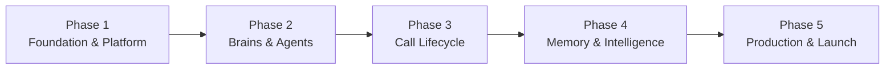

# Implementation Plan — Voice Agent Platform MVP

**Version:** 1.1  
**Date:** 25 August 2026  
**Status:** Aligned with PRD pack v2.0 — see [PRD-TRACEABILITY-AUDIT.md](./PRD-TRACEABILITY-AUDIT.md)

## Purpose

This folder contains the **5-phase implementation plan** for evolving the current Telugu voice agent (`0.2.0-phase5`) into the multi-tenant platform defined in the PRD pack. It consolidates the high-level sequencing in [`prd/08-implementation-roadmap.md`](../prd/08-implementation-roadmap.md) into actionable engineering phases with modules, APIs, tests, and exit criteria.

## Authority and references

| Priority | Document | Role |
|----------|----------|------|
| 1 | [`prd/01-master-prd.md`](../prd/01-master-prd.md) | Product scope and acceptance |
| 2 | [`architecture/`](../architecture/) | Target system design (this repo) |
| 3 | [`prd/15-architecture-ownership-and-singularity.md`](../prd/15-architecture-ownership-and-singularity.md) | Module ownership — read before every phase |
| 4 | [`prd/17-product-decisions.md`](../prd/17-product-decisions.md) | Locked product decisions |
| 5 | Phase files below | Delivery sequencing |

**Current state baseline:** [`prd/00-current-state-audit.md`](../prd/00-current-state-audit.md)  
**Historical build:** [`ARCHITECTURE.md`](../ARCHITECTURE.md) (v0.2.0-phase5 — browser SPA + FastAPI)

## Five phases at a glance

| Phase | Name | PRD roadmap mapping | Primary outcome |
|-------|------|---------------------|-----------------|
| [1](./phase-01-foundation-and-platform.md) | Foundation & Platform | Phase 0–1 | Provider registry, tiers, PostgreSQL bootstrap, regression baselines |
| [2](./phase-02-brains-and-agent-workspace.md) | Brains & Agent Workspace | Phase 2 | Platform + Business brain versioning, compiled brain, agent entity |
| [3](./phase-03-call-lifecycle-and-persistence.md) | Call Lifecycle & Persistence | Phase 3 | `call_id`, ledger A, audio archive, server-owned calls |
| [4](./phase-04-memory-and-post-call-intelligence.md) | Memory & Post-Call Intelligence | Phase 4 | Memory B/C, structured live turns, disposition outcomes |
| [5](./phase-05-production-ui-telephony-and-launch.md) | Production UI, Telephony & Launch | Phase 5–9 (MVP subset) | Next.js consoles, Plivo, campaigns, multi-tenant hardening |

## Cross-phase invariants (never break)

These come from the current production-quality live path and must hold across all phases:

1. **Prompt cache stability** — compiled brain (L2) stays in the cached developer prefix; dynamic memory (C), rolling summary, and recent turns stay after the breakpoint.
2. **Hot path SLO** — spoken response streams to TTS before memory merge or ledger I/O completes.
3. **Singular orchestrators** — `live_turn_orchestrator`, `call_lifecycle_service`, `post_call_pipeline`, `compiled_brain_service` each own their domain (see [`architecture/02-module-ownership.md`](../architecture/02-module-ownership.md)).
4. **Barge-in parity** — `client/live-guards.js` policy preserved; port to Next.js without behavior change.
5. **`store: false`** on live LLM turns unless explicitly migrated with full replay testing.

## Pre-implementation checklist

Before Phase 1 coding:

- [ ] PRD approval checklist in [`prd/README.md`](../prd/README.md) signed off
- [ ] Regression baselines recorded (latency p50/p95, cache hit rate, barge-in tests)
- [ ] Local PostgreSQL install path documented (see Phase 1)
- [ ] Railway project scaffold agreed (web + api + worker)

## Skills, MCPs & testing

**Canonical guide:** [SKILLS-AND-MCP-GUIDE.md](./SKILLS-AND-MCP-GUIDE.md) — skills per phase, Railway MCP, pytest/Playwright matrix, subagents.

Summary:

| Phase | Skills | MCPs |
|-------|--------|------|
| 1 | `pytest`, provider official docs | — |
| 2 | `pytest`, `prd/12` semantic validation | — |
| 3 | `pytest`, `LIVE_TEST=1` optional | — |
| 4 | Golden fixtures, cache regression | — |
| 5 | `web-mvp-design`, `use-railway`, `review-security` | **Railway MCP** (deploy) |

Also see [`prd/16-mvp-implementation-skills.md`](../prd/16-mvp-implementation-skills.md).

## PRD traceability audit

Gap analysis and requirement mapping: [PRD-TRACEABILITY-AUDIT.md](./PRD-TRACEABILITY-AUDIT.md) (updated after PRD cross-check).

## Post-MVP (PRD `08` phases 6–9)

Not in the 5-phase MVP plan:

| PRD phase | Scope |
|-----------|-------|
| 6 | Benchmark sessions, combination matrix, evidence-based promotion, rollback |
| 7 | Cartesia/Gemini production adapters after benchmark pass |
| 8 | Inbound PSTN benchmark dimension (outbound in Phase 5) |
| 9 | Load testing, legal hold, full fleet hardening |

## Storage note

**PostgreSQL is normative** for all environments (`prd/13` §9, `prd/17` §11). Older references to SQLite in `prd/06` are superseded — local dev uses PostgreSQL, not `voice_agent.db`.
