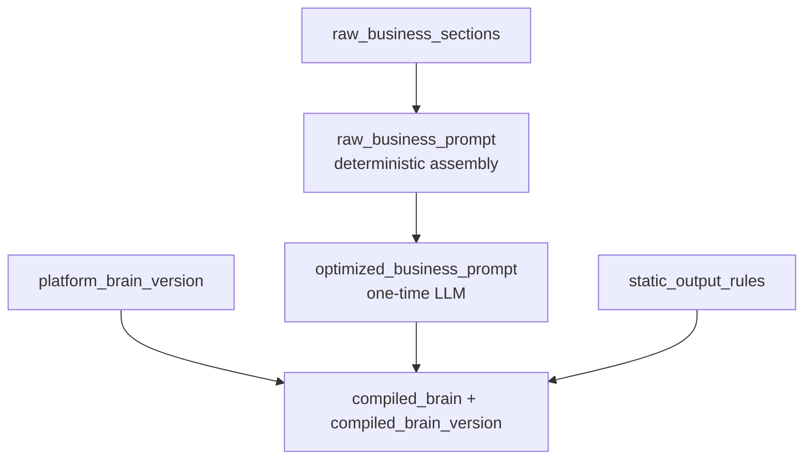

# Phase 2 — Brains & Agent Workspace

**Duration estimate:** 2–3 weeks  
**PRD mapping:** Phase 2 (versioned brains and agent workspace)  
**Depends on:** Phase 1 (PostgreSQL, agents table stub)  
**Blocks:** Phase 3 (call/start locks brain version)

---

## 1. Objective

Replace per-session ad-hoc prompt editing with **versioned Platform Brain + Business Brain** compilation. Each agent gets structured business sections, one-time optimization, and an immutable `compiled_brain_version` locked at call start. The existing `instruction_builder` becomes the sole assembler of live LLM input — but compilation moves to `compiled_brain_service`.

## 2. Current state

| Component | File | Behavior |
|-----------|------|----------|
| Brain composition | `brain_prompt_composer.py`, `prompts/brain_prompt.py` | Single composed prompt per session |
| Instructions CRUD | `instruction_store.py`, `routes/instructions.py` | Per-session RAM, 24h TTL, 10k char caps |
| Live input | `instruction_builder.py` | Developer message + optional summary + history + transcript |
| Caching | `prompt_cache_key.py` | Hash(brain + budget) — **must preserve** |

**Gap:** No platform/business separation, no section taxonomy, no optimizer, no version lock, no agent entity binding.

## 3. Target state

```text
server/
├── brain/
│   ├── compiled_brain_service.py      # L2 — sole compiler
│   ├── business_prompt_optimizer.py   # One-time LLM optimization
│   ├── platform_brain_store.py        # Developer-only platform versions
│   └── business_brain_store.py        # Per-agent sections + versions
├── routes/
│   ├── agents.py                      # Agent CRUD
│   ├── platform_brain.py                # Platform brain admin
│   └── agents_business_brain.py       # Section CRUD, optimize, publish
└── db/models/
    ├── platform_brain_versions.py
    ├── business_brain_versions.py
    └── compiled_brain_snapshots.py
```

## 4. Brain layer model (L2)



| Artifact | Owner | Mutable when |
|----------|-------|--------------|
| Platform brain | Platform Admin only | Activate new version |
| Raw sections | Customer Admin | Edit draft |
| Optimized business | Optimizer LLM | On explicit optimize/publish |
| Compiled brain | `compiled_brain_service` | On platform activate or business publish |
| Live calls | Immutable | Locked at `call/start` |

## 5. Deliverables

### 5.1 Platform brain

- Versioned records in PostgreSQL
- APIs per [`prd/13-api-data-security-contracts.md`](../prd/13-api-data-security-contracts.md) §2
- Contains: identity, safety, language policy, memory/output contract, static rules reference
- **Customer roles never read body text** — redacted preview only

### 5.2 Business brain (8 default sections)

Per [`prd/17-product-decisions.md`](../prd/17-product-decisions.md) §3:

1. Identity & Purpose  
2. Business Facts  
3. Actions & Limits  
4. Qualification Flow  
5. Callback / Appointment Flow  
6. Scope & Redirects  
7. Guardrails  
8. FAQ  

Plus custom sections (add/delete). Raw text preserved exactly; assembly is deterministic (section order + delimiters).

### 5.3 Business prompt optimizer

**Owner:** `brain/business_prompt_optimizer.py`

- Runs **only** on `POST .../business-brain/optimize` or publish
- Input: assembled raw prompt + optimizer policy + previous approved version
- Output: `optimized_business_prompt`, preserved facts/rules, conflicts array
- Triggers `compiled_brain_service.recompile()` — does **not** touch live calls

### 5.4 Compiled brain service

**Owner:** `brain/compiled_brain_service.py` — **sole L2 writer**

```text
platform_brain_version + business_brain_version + static_rules_version
  → compiled_brain_text + compiled_brain_version + checksum
```

Migrate logic from `brain_prompt_composer.py`; deprecate composer after migration.

**Cache rule:** `compiled_brain_text` becomes the stable developer prefix in `instruction_builder`. `prompt_cache_key` hashes `compiled_brain_version + budget` — not session ID.

### 5.5 Agent workspace

| Entity | Fields |
|--------|--------|
| `agents` | `agent_id`, `tenant_id`, `name`, `status`, `active_compiled_brain_version`, `default_tier`, `languages[]` |
| Dev default | Auto-create `default` agent in development environment |

APIs: `GET/POST /api/agents`, `GET/PATCH /api/agents/{id}`

Agent workspace fields (for Phase 5 UI): draft/active status, setup completion %, language, tier/stack, brain versions, channel readiness — per master PRD §11.

**Memory Schema (agent config):** store per-agent `memory_schema` pointer (default: compact schema). Full custom schema editor post-MVP; MVP uses locked default from `prd/17` §5.

**Publish guard:** block publish if active calls exist on current version (configurable `ALLOW_PUBLISH_DURING_CALLS=false`).

### 5.6 Instruction builder migration

`instruction_builder.build_live_input()` becomes the **only** live input builder:

```text
input[0]  developer: compiled_brain_text          [L2 — CACHED]
input[1]  user: [Memory projection]               [Phase 4 — placeholder empty in Phase 2]
input[2..]  recent turns + current transcript     [unchanged for now]
```

**Forbidden:** `instruction_builder` compiling brains or applying memory ops.

### 5.7 Semantic validation

Per [`prd/12`](../prd/12-brain-business-memory-spec.md) §27 — `POST .../business-brain/validate` runs:

- Section length limits and required fields per type
- Cross-section conflict detection (blocking vs warning)
- Language/script sanity checks
- Optimizer blocking conflicts prevent publish

### 5.8 Backward compatibility bridge

During migration, `routes/instructions.py` writes through to business brain draft for the default agent. Existing `client/settings.js` continues working until Phase 5 Next.js port.

Feature flag: `USE_VERSIONED_BRAINS=false` (default) → legacy `instruction_store`; `true` → compiled brain path.

## 6. API surface (new)

| Endpoint | Role |
|----------|------|
| `GET/POST /api/agents` | Agent list/create |
| `GET/PATCH /api/agents/{id}` | Agent detail |
| `GET /api/agents/{id}/business-brain` | Current draft + published versions |
| `PUT /api/agents/{id}/business-brain/draft` | Save sections |
| `POST /api/agents/{id}/business-brain/optimize` | Run optimizer |
| `POST /api/agents/{id}/business-brain/validate` | Schema/length checks |
| `POST /api/agents/{id}/business-brain/publish` | Publish → recompile |
| `GET /api/agents/{id}/business-brain/versions` | Version history |
| `GET /api/agents/{id}/brain/compiled-preview` | Preview compiled text (redacted for customers) |
| `GET/PUT /api/platform-brain/draft` | Platform admin |
| `POST /api/platform-brain/activate` | Activate version |

## 7. Database additions

| Table | Key columns |
|-------|-------------|
| `platform_brain_versions` | `version_id`, `body`, `status`, `activated_at` |
| `business_brain_sections` | `section_id`, `agent_id`, `type`, `raw_text`, `order`, `enabled` |
| `business_brain_versions` | `version_id`, `agent_id`, `optimized_prompt`, `source_checksum` |
| `compiled_brain_snapshots` | `compiled_version`, `platform_v`, `business_v`, `text`, `checksum` |

## 8. Tests

| Test | Validates |
|------|-----------|
| `test_business_section_assembly.py` | Deterministic raw prompt from sections |
| `test_brain_optimizer.py` | Mocked LLM optimizer output schema |
| `test_compiled_brain_service.py` | Version checksum, recompile on publish |
| `test_instruction_builder_migration.py` | Compiled text in developer slot; cache key stable |
| `test_brain_caching.py` (extend) | Cache hit with versioned brain |
| `test_agent_crud.py` | Agent APIs, default agent in dev |
| `test_semantic_validation.py` | Blocking conflicts, section limits |

## 9. Exit criteria

- [ ] Platform brain activate produces new `compiled_brain_version`
- [ ] Business publish triggers optimize + compile pipeline
- [ ] Raw section text preserved byte-for-byte in assembly
- [ ] `instruction_builder` uses compiled brain; cache regression tests pass
- [ ] In-flight session with legacy store still works (flag off)
- [ ] Conflict detection returns blocking vs warning severities
- [ ] Semantic validation rejects blocking conflicts before publish
- [ ] Publish blocked during active calls (when configured)

## 10. Migration from current code

| Legacy | Action |
|--------|--------|
| `instruction_store.py` | Read-through to business brain draft; deprecate in Phase 5 |
| `brain_prompt_composer.py` | Logic → `compiled_brain_service`; delete after migration |
| `prompts/brain_prompt.py` | Static rules → platform brain seed content |
| `client/settings.js` behaviour panel | Maps to business brain sections (interim) |

## 11. Out of scope

- Memory projection in live input (Phase 4)
- `call/start` version lock (Phase 3 — but schema ready)
- Next.js Business Brain UI (Phase 5)
- RBAC enforcement beyond stub checks (Phase 5)

## 12. Skills, MCPs & testing

See [SKILLS-AND-MCP-GUIDE.md](./SKILLS-AND-MCP-GUIDE.md) §Phase 2.

| Item | Detail |
|------|--------|
| Skills | `pytest`; `prd/12` §27 semantic validation |
| MCPs | None required |
| Gates | `test_brain_caching.py` must not regress |

## 13. Architecture references

- [architecture/data-models/brain-compilation.md](../architecture/data-models/brain-compilation.md)
- [architecture/02-module-ownership.md](../architecture/02-module-ownership.md) §4.4–4.5
- [prd/12-brain-business-memory-spec.md](../prd/12-brain-business-memory-spec.md)
