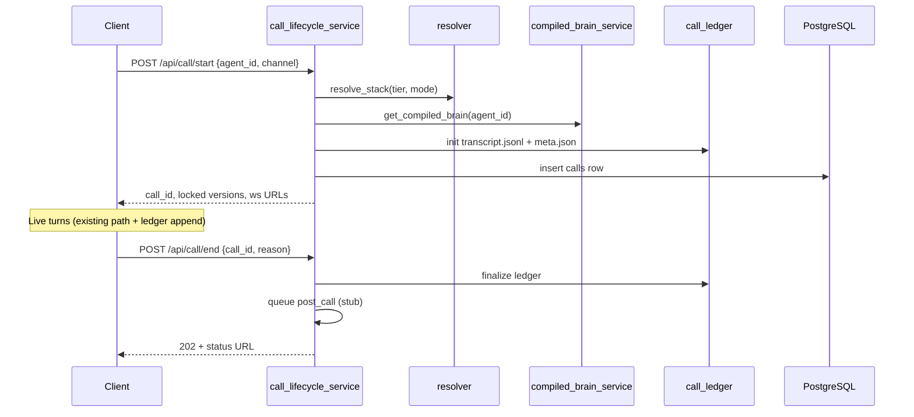

# Phase 3 — Call Lifecycle & Persistence

**Duration estimate:** 2–3 weeks  
**PRD mapping:** Phase 3 (durable call lifecycle)  
**Depends on:** Phase 1 (resolver, DB), Phase 2 (compiled brain version)  
**Blocks:** Phase 4 (memory scoped to call_id)

---

## 1. Objective

Introduce **`call_id` as the archival unit** with server-owned transcript ledger (A), audio capture, and PostgreSQL metadata. Browser `localStorage` becomes a cache only. The live voice path wires through `call_lifecycle_service` and begins using the provider registry for real.

## 2. Current state

| Concern | Today |
|---------|-------|
| Identity | `session_id` in localStorage — transport scope only |
| Transcript | `conversation_manager` — max 8 msgs, truncated, RAM |
| Audio | Client saves TTS base64 only; no user PCM on server |
| End of call | No `call/end`; interrupt ack only |
| Calls list | Client export buttons only |

## 3. Target state

```text
server/call/
├── call_lifecycle_service.py   # start/end/finalize — sole lifecycle owner
├── call_ledger.py              # A — transcript.jsonl append-only
├── audio_archive.py            # user.pcm, agent audio, mix.wav
├── call_store.py               # Index + metadata in PostgreSQL
└── (stubs for Phase 4)
    post_call_pipeline.py       # Queue only; no LLM yet

server/routes/calls.py          # HTTP CRUD delegates to lifecycle
data/calls/{call_id}/           # File store (local dev)
```

## 4. Call lifecycle



### 4.1 `POST /api/call/start`

**Owner:** `call_lifecycle_service.py`

```json
{
  "agent_id": "uuid",
  "session_id": "optional",
  "channel": "browser|pstn",
  "direction": "inbound|outbound",
  "campaign_id": "optional",
  "environment": "development|staging|production",
  "tier": "low|medium|premium",
  "stack_override": null,
  "caller_id": null
}
```

`direction` and `campaign_id` required for outbound campaign dials (Phase 5).

| Layer | Locked artifact |
|-------|-----------------|
| L1 | `combination_id`, STT/LLM/TTS stack |
| L2 | `compiled_brain_version` |
| L4 | `channel` (browser \| pstn) |

Creates:

- `data/calls/{call_id}/meta.json` — versions, timestamps, agent_id, tier
- `data/calls/{call_id}/transcript.jsonl` — empty ledger
- PostgreSQL `calls` row — index for list/filter

Returns: `call_id`, `resolved_stack` (safe), stream connection hints.

### 4.2 `POST /api/call/end`

- **Always `202 Accepted`** with finalization status URL (idempotent — CD-010)
- Triggers audio flush (`audio_archive.py`)
- Queues `post_call_pipeline` (no-op LLM in Phase 3)
- Auto-finalize on WS disconnect / browser unload (server-side hook)

### 4.3 Call ledger (A)

**Owner:** `call_ledger.py` — **sole writer of transcript lines**

```jsonl
{"seq":1,"role":"user","text":"...","ts":"ISO8601","stt_latency_ms":120}
{"seq":2,"role":"assistant","text":"...","ts":"ISO8601","brain_latency_ms":450}
```

Rules:

- Append-only; never truncated
- **Never sent to live LLM** (that's `conversation_manager` truncated window)
- Buffered async writes — must not block hot path

### 4.4 Audio archive

**Owner:** `audio_archive.py`

| File | Source |
|------|--------|
| `user.pcm` | STT WS binary frames (16 kHz mono) |
| `agent.mp3` or `agent.pcm` | TTS stream as played |
| `mix.wav` | Post-call stereo (L=user, R=agent) |

Ring buffer in RAM during call; flush on end. Object storage path in production (Phase 5).

### 4.5 Call store (PostgreSQL)

**Owner:** `call/call_store.py` — index queries, pagination, tenant scope (delegates file I/O to ledger/archive).

| Column | Purpose |
|--------|---------|
| `call_id` | UUID PK |
| `tenant_id`, `agent_id` | Scoping |
| `channel`, `environment`, `tier` | Metadata |
| `direction`, `campaign_id` | `inbound`/`outbound`; campaign link |
| `compiled_brain_version`, `combination_id` | Audit |
| `started_at`, `ended_at`, `duration_sec` | Timing |
| `finalization_status` | `pending` \| `complete` \| `failed` |
| `storage_path` | `data/calls/{call_id}/` or bucket URI |

### 4.6 Wire live path to call

| Change | Detail |
|--------|--------|
| `client/app.js` | `call/start` on live session begin; `call/end` on stop/unload |
| `routes/ws.py` | Require `call_id` query param; append audio to archive |
| `routes/brain.py` | Accept `call_id`; delegate turns to orchestrator stub that appends ledger |
| `USE_PROVIDER_REGISTRY` | Default **on** — live path uses resolver stack |

**Phase 3 orchestrator stub:** `live_turn_orchestrator.py` created with ledger append only; full memory in Phase 4.

```text
STT final
  → live_turn_orchestrator.handle_user_turn()
    → call_ledger.append_user_turn()
    → instruction_builder.build_live_input()  [no memory C yet]
    → llm_adapter.stream()  [existing brain route logic]
    → call_ledger.append_assistant_turn()
```

## 5. API surface

| Endpoint | Behavior |
|----------|----------|
| `POST /api/call/start` | Create call, lock versions |
| `POST /api/call/end` | Finalize, 202 idempotent |
| `GET /api/call/{call_id}` | Metadata + finalization status |
| `GET /api/calls` | Paginated list, tenant-scoped |
| `GET /api/call/{call_id}/transcript` | Full ledger (auth gated) |
| `GET /api/call/{call_id}/audio/{mix\|user\|agent}` | Audio stream or signed URL |
| `GET /api/call/{call_id}/trace` | Per-turn span stub (full in Phase 4) |
| `GET /api/call/{call_id}/finalization` | Component finalization status |

## 6. Client changes (interim SPA)

| File | Change |
|------|--------|
| `client/app.js` | call/start on mic start; call/end on stop; pass `call_id` to WS/brain |
| `client/conversation_store.js` | Mirror server list; localStorage = offline cache only |
| New `client/calls_view.js` | Basic calls list + detail (or console tab) |

Next.js port in Phase 5 — behavior reference only.

## 7. Configuration

```text
CALL_AUTO_END_ON_START=true     # 409 or auto-end previous call
CALL_RETENTION_DAYS=90
DATA_DIR=./data
ENABLE_CALL_ARCHIVE=true
```

## 8. Tests

| Test | Coverage |
|------|----------|
| `test_call_lifecycle.py` | start/end idempotency, 202 responses |
| `test_call_ledger.py` | Append ordering, no truncation |
| `test_audio_archive.py` | PCM capture, mix generation |
| `test_call_store.py` | DB index, pagination, tenant scope |
| `test_call_version_lock.py` | Brain/stack immutable mid-call |
| `test_trace_api.py` | Trace endpoint returns turn ordering |

## 9. Exit criteria

- [ ] Browser live call produces `call_id`, server transcript, and audio files
- [ ] `GET /api/calls` returns server-authoritative list
- [ ] Process kill mid-call → recoverable finalization on restart (or failed status)
- [ ] `call/end` twice returns same 202 status URL
- [ ] Provider registry active on live WS path
- [ ] Latency regression <10% vs Phase 1 baselines
- [ ] Ledger append does not block first TTS byte

## 10. Out of scope

- Memory B/C (Phase 4)
- Post-call LLM outcome (Phase 4)
- Plivo PSTN (Phase 5)
- Signed URL auth (stub same-origin; full auth Phase 5)

## 10. Skills, MCPs & testing

See [SKILLS-AND-MCP-GUIDE.md](./SKILLS-AND-MCP-GUIDE.md) §Phase 3.

| Item | Detail |
|------|--------|
| Skills | `pytest`; optional `LIVE_TEST=1` |
| MCPs | None required |
| Gates | `test_live_barge_policy.py`; latency <10% regression |

## 11. Architecture references

- [architecture/data-flows/call-lifecycle.md](../architecture/data-flows/call-lifecycle.md)
- [architecture/data-models/memory-ledger-outcome.md](../architecture/data-models/memory-ledger-outcome.md) §A
- [MEMORY_CALL_ARCHIVE_PLAN.md](../MEMORY_CALL_ARCHIVE_PLAN.md)
- [prd/04-memory-and-call-lifecycle.md](../prd/04-memory-and-call-lifecycle.md)
