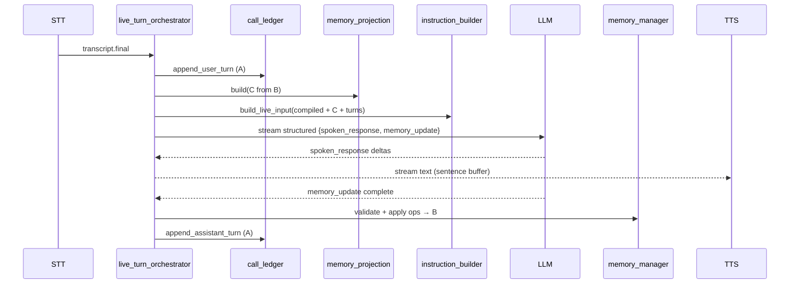

# Phase 4 — Memory & Post-Call Intelligence

**Duration estimate:** 3–4 weeks  
**PRD mapping:** Phase 4 (memory and post-call intelligence)  
**Depends on:** Phase 3 (`call_id`, ledger A, orchestrator stub)  
**Blocks:** Phase 5 production launch (MVP requires memory + disposition)

---

## 1. Objective

Implement the **A/B/C memory split** with same-LLM structured live turns (`spoken_response` + `memory_update`), compact projection for the hot path, and async post-call disposition. The agent remembers caller context across a 20-turn call without blowing the prompt cache or regressing time-to-first-audio.

## 2. Product decisions (locked)

From [`prd/17-product-decisions.md`](../prd/17-product-decisions.md) §5 (CD-016):

- **Same LLM** returns both spoken response and memory update — no separate cheap extraction call in MVP
- **No cross-call memory** — one call = one memory scope
- **Compact default schema:** `facts`, `preferences`, `important_context`, `summary`
- Stream `spoken_response` to TTS on hot path; apply `memory_update` when available without delaying first audio

## 3. Current state

| Component | Reality |
|-----------|---------|
| `session_memory.py` | 400-char RAM string; default off |
| `memory_summarizer.py` | String join — not LLM |
| `conversation_manager` | 2 turns to brain; 8 msg store |
| Post-call | Does not exist |

## 4. Target modules

```text
server/call/
├── memory_manager.py          # B — state, validation, event log, apply ops
├── memory_projection.py       # C — deterministic render for live LLM
├── memory_extraction.py       # Fallback only if structured path fails SLO
├── live_turn_orchestrator.py  # Full hot-path sequencing (extend Phase 3 stub)
└── post_call_pipeline.py      # Outcome LLM after hang-up

server/agent/
├── instruction_builder.py     # Add projection C + rolling summary slot
└── conversation_manager.py    # Recent turns only — NOT ledger A
```

## 5. Three data objects

| ID | Object | Owner | Live LLM? | Persisted |
|----|--------|-------|-----------|-----------|
| **A** | Call ledger | `call_ledger.py` | Never | `transcript.jsonl` |
| **B** | Full internal memory | `memory_manager.py` | Never (full JSON) | `memory_events.jsonl` + snapshot |
| **C** | Live memory projection | `memory_projection.py` | Yes | Optional debug per turn |

### 5.1 Default memory shape (B)

```json
{
  "facts": {},
  "preferences": {},
  "important_context": "",
  "summary": ""
}
```

Extended slot schema available per [`prd/12`](../prd/12-brain-business-memory-spec.md) §18 for agents needing provenance — not default.

### 5.2 Memory operations

Validated ops from `memory_update.operations`:

| Op | Example |
|----|---------|
| `set_fact` | `{"key":"city","value":"Hyderabad"}` |
| `set_preference` | `{"key":"language","value":"te-en mix"}` |
| `append_context` | Short bullet to `important_context` |
| `update_summary` | Replace rolling `summary` (token-capped) |

`memory_manager` validates, appends to event log, applies to B. **Only module that mutates B.**

**No public memory mutation API** — LLM proposals only. Administrative corrections use audited `manual_correction` events with actor + reason (`prd/13` §6).

### 5.2.1 Memory extraction fallback

**Owner:** `memory_extraction.py` — **fallback only** when structured same-LLM path fails SLO (parse error, timeout). Delegates apply to `memory_manager`. Primary path is CD-016 single LLM response — not a second extraction call in MVP.

### 5.3 Projection (C)

**Owner:** `memory_projection.py` — reads B, produces ~80–150 token text block.

Rolling summary singularity rule ([`architecture/02-module-ownership.md`](../architecture/02-module-ownership.md) §8):

- If `rolling_summary` sent as separate `input[2]`, projection **omits** narrative prose (slots only)
- If summary empty, projection may include one-line narrative tail
- **Never** send full B or A to live LLM

## 6. Live turn flow (complete)



**Critical path:** TTS starts on `spoken_response` deltas — **does not await** memory merge.

### 6.1 Structured output schema (live)

```json
{
  "spoken_response": "string — streamed to TTS",
  "memory_update": {
    "operations": [
      {"op": "set_fact", "key": "name", "value": "Ravi"}
    ]
  }
}
```

Implementation in `openai_llm.py` adapter: `text.format` json_schema with streaming text extraction for `spoken_response` field.

### 6.2 Instruction builder input order

```text
input[0]  developer: compiled_brain                    [CACHED]
input[1]  user: [Memory projection]\n{C}               [DYNAMIC]
input[2]  user: [Rolling summary]\n{text}              [OPTIONAL — singularity rule]
input[3..] user/assistant: recent turns (max 2)       [DYNAMIC]
input[N]  user: current transcript                     [DYNAMIC]
```

`prompt_cache_key` = hash(`compiled_brain_version` + budget) — unchanged.

### 6.3 Deprecate legacy memory

| Legacy | Replacement |
|--------|-------------|
| `session_memory.py` | `memory_manager.py` |
| `memory_summarizer.py` | `rolling_summary` field in B |
| `ENABLE_SESSION_SUMMARY` | `ENABLE_WORKING_MEMORY` |

## 7. Post-call pipeline

**Owner:** `post_call_pipeline.py` — runs async after `call/end`

Input: full ledger A + final B snapshot  
Output: `outcome.json`

```json
{
  "disposition": "qualified",
  "disposition_confidence": 0.87,
  "summary_te": "...",
  "summary_en": "...",
  "next_action": "callback_tomorrow_10am",
  "extracted_fields": {"budget": "50L", "location": "Gachibowli"},
  "objections": ["price"],
  "model": "gpt-5.6-luna",
  "generated_at": "ISO8601"
}
```

### 7.1 Disposition enum (locked)

`new_lead`, `interested`, `qualified`, `site_visit_planned`, `callback_required`, `not_interested`, `wrong_number`, `converted`, `no_outcome`

Uses cheaper model via `POST_CALL_LLM_MODEL` env — separate from live LLM.

**Production:** post-call runs on **Worker service** via Redis queue (Phase 5). Phase 4 may use `asyncio.create_task` in API for local dev only.

### 7.2 Finalization status

`GET /api/call/{call_id}/finalization` returns:

```json
{
  "status": "complete",
  "ledger": "complete",
  "audio": "complete",
  "outcome": "complete"
}
```

## 8. API additions

Canonical paths per [`prd/13`](../prd/13-api-data-security-contracts.md) §4–6:

| Endpoint | Purpose |
|----------|---------|
| `GET /api/call/{call_id}/memory` | B snapshot (role-redacted) |
| `GET /api/call/{call_id}/memory-events` | Event log audit |
| `GET /api/call/{call_id}/memory/projection?turn=N` | Debug projection at turn N |
| `GET /api/call/{call_id}/outcome` | Post-call result |
| `POST /api/call/{call_id}/outcome/retry` | Re-run failed analysis |
| `GET /api/metrics/calls/{call_id}` | Full per-turn trace + aggregates |

## 9. Client / UI (interim)

| Panel | Content |
|-------|---------|
| Call detail — Memory tab | Projection debug, facts, summary |
| Call detail — Outcome tab | Disposition badge, summaries, extracted fields |
| Live session | No UI change; memory invisible to user |

## 10. Tests

| Test file | Fixtures |
|-----------|----------|
| `test_memory_manager.py` | Op validation, event log, reject invalid ops |
| `test_memory_projection.py` | Token budget, singularity rule |
| `test_live_turn_orchestrator.py` | Hot path does not await merge |
| `test_structured_live_turn.py` | spoken_response streams before memory_update applied |
| `test_post_call_pipeline.py` | Golden transcripts → disposition |
| `test_memory_cache_regression.py` | Cache hit rate unchanged with projection |
| `test_phase3_context.py` (update) | Align with new memory model |

**Golden fixtures:** 5+ transcripts with expected disposition from [`prd/07`](../prd/07-testing-metrics-observability.md).

## 11. Exit criteria

- [ ] 20-turn call retains early facts via B without sending full transcript to LLM
- [ ] Cache hit rate ≥85% after turn 2 (baseline ~90%)
- [ ] TTFT/first-audio regression <10%
- [ ] Memory merge completes within 500ms of stream end (async)
- [ ] Post-call outcome written for 100% of completed calls
- [ ] Disposition enum validation rejects unknown values
- [ ] No module outside `memory_manager` mutates B
- [ ] `session_memory.py` removed or hard-deprecated

## 12. Risks

| Risk | Mitigation |
|------|------------|
| Structured output slows TTFT | Stream `spoken_response` field; sentence buffer unchanged |
| Memory ops hallucinated | Server-side validation; reject unknown keys |
| Projection too large | Hard token cap on C; truncate with priority order |
| Cache bust | Never put C inside developer/cached block |

## 13. Out of scope

- Cross-call memory / vector retrieval
- Benchmark scoring UI (Phase 5)
- DeepSeek as live LLM (Phase 5 optional)

## 13. Skills, MCPs & testing

See [SKILLS-AND-MCP-GUIDE.md](./SKILLS-AND-MCP-GUIDE.md) §Phase 4.

| Item | Detail |
|------|--------|
| Skills | Golden disposition fixtures; CD-016 same-LLM tests |
| MCPs | None required |
| Gates | Cache hit ≥85%; memory merge async; no TTFT regression |

## 14. Architecture references

- [architecture/data-flows/live-voice-turn.md](../architecture/data-flows/live-voice-turn.md)
- [architecture/data-flows/post-call-pipeline.md](../architecture/data-flows/post-call-pipeline.md)
- [architecture/data-models/memory-ledger-outcome.md](../architecture/data-models/memory-ledger-outcome.md)
- [prd/12-brain-business-memory-spec.md](../prd/12-brain-business-memory-spec.md)
