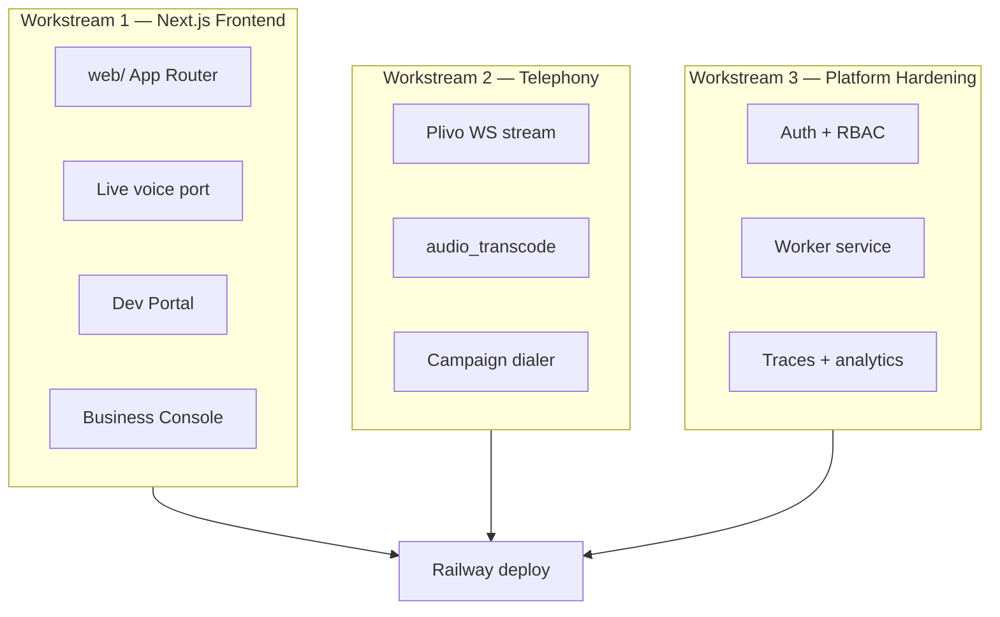

# Phase 5 — Production UI, Telephony & Launch

**Duration estimate:** 4–6 weeks  
**PRD mapping:** Phase 5–9 (MVP subset)  
**Depends on:** Phases 1–4 complete  
**Outcome:** Deployable multi-tenant platform on Railway

---

## 1. Objective

Ship the **production MVP**: Next.js consoles (Dev Portal + Business Console), Plivo inbound/outbound with campaigns, multi-tenant auth/RBAC, observability, and Railway deployment. Retire the vanilla `client/` SPA from production paths.

## 2. MVP scope (locked)

Per [`prd/17-product-decisions.md`](../prd/17-product-decisions.md):

| In MVP | Out of MVP |
|--------|------------|
| Dev Portal (env auth P0) | Customer login (P2) |
| Business Console (brain, numbers) | CRM integrations (webhook fields stub only) |
| Next.js web on Railway | Knowledge base / RAG |
| Plivo inbound + **outbound campaigns** | Benchmark auto-runs (`ENABLE_BENCHMARKS=false`; UI shell yes) |
| DeepSeek Flash as optional live LLM | Cartesia for Telugu production |
| Test Studio + per-call traces | Fleet analytics v2 |
| Overview + Analytics basics | Gemini LLM (`prd/17` §13 post-MVP) |
| Benchmarks nav shell | Tools & Actions (nav stub only) |
| WCAG 2.2 AA target | Quality review queue |

## 3. Workstreams



---

## 4. Workstream 1 — Next.js frontend (`web/`)

### 4.1 Stack

| Layer | Choice |
|-------|--------|
| Framework | Next.js 14+ App Router, TypeScript |
| Styling | Tailwind v4, design tokens from `.better-react-web-ui.md` |
| Hosting | Railway `web` service |
| Live voice | Client components — port from `client/app.js` |

See [architecture/integrations/nextjs-frontend-split.md](../architecture/integrations/nextjs-frontend-split.md).

### 4.2 Full v2 navigation (`prd/11` §3)

**Primary nav (all authenticated app routes):**

| # | Area | Routes |
|---|------|--------|
| 1 | Overview | `/app` — fleet health, calls today, latency, failures |
| 2 | Agents | `/app/agents`, `/app/agents/[id]/*` |
| 3 | Test Studio | `/app/agents/[id]/test` |
| 4 | Calls | `/app/calls`, `/app/calls/[id]` |
| 5 | Analytics | `/app/analytics` — disposition, latency, cost basics |
| 6 | Benchmarks | `/app/benchmarks` — **shell only** until `ENABLE_BENCHMARKS=true` |
| 7 | Providers | `/dev/providers` or `/app/providers` (role-gated) |
| 8 | Integrations | `/app/integrations` — phone numbers, Plivo status |
| 9 | Settings | `/app/settings` — tenant retention, notifications |

**Agent workspace sub-routes** (`/app/agents/[id]/...`):

| Tab | Route | MVP scope |
|-----|-------|-----------|
| Summary | `/summary` | Agent status, versions, deployment |
| Business Brain | `/brain` | 8-section editor |
| Platform Brain | `/platform-brain` | Dev Portal only |
| Voice & Models | `/voice` | Tier display (customer read-only) |
| Memory Schema | `/memory-schema` | Default compact schema (read-only MVP) |
| Tools & Actions | `/tools` | **Stub** — "Coming soon" |
| Channels | `/channels` | Browser + PSTN readiness |
| Versions & Deployment | `/versions` | Draft/active, publish history |

**Dev Portal** (`/dev/*`): login, stack/tiers, platform brain, provider status, promotion.

**Marketing** (public): `/`, `/pricing`, `/docs` — SSG, SEO.

**Do not extend** `client/*.html` or `client/app.js` for new features.

### 4.3 Live voice port checklist

Port with **behavior parity**:

| Source | Target | Must preserve |
|--------|--------|---------------|
| `client/app.js` | `web/components/live/LiveVoiceSession.tsx` | WS STT, SSE brain, WS TTS |
| `client/live-guards.js` | `web/lib/live-guards.ts` | ≥2-word barge-in, 1.2s cooldown |
| `client/pcm-worklet.js` | `web/public/pcm-worklet.js` | 16kHz Int16 frames |
| `client/audio_playback_manager.js` | `web/lib/audio-playback.ts` | FIFO, unlock overlay |
| `client/app.js` call hooks | Same `call/start`, `call/end` | Server authoritative |

### 4.4 API proxy

Next.js rewrites `/api/*` and `/ws/*` to Railway API service private URL in production. No provider secrets in client bundle.

### 4.5 Remove production static mount

`server/app.py` — remove `client/` static serve after web service verified.

---

## 5. Workstream 2 — Plivo & campaigns

### 5.1 Plivo bidirectional streaming

| Module | Role |
|--------|------|
| `routes/plivo_ws.py` | `/ws/plivo-stream` |
| `services/plivo_stream.py` | Plivo event handling |
| `services/audio_transcode.py` | μ-law 8k ↔ PCM 16k |

Flow:

```text
Plivo MEDIA (μ-law) → transcode → STT ingest (same as browser)
TTS output → transcode → Plivo playAudio
Barge-in → Plivo clearAudio (same policy as live-guards)
```

Shares `call_id`, ledger A, memory B/C, post-call pipeline with browser path.

### 5.2 Number provisioning

- Customer adds number in Business Console
- Auto-connection flow per [`prd/09-plivo-telephony-integration.md`](../prd/09-plivo-telephony-integration.md)
- `channel=pstn` on `call/start`

### 5.3 Outbound campaigns (Worker service)

**Owner:** `worker/` service — **not** Next.js or API hot path

| Feature | Detail |
|---------|--------|
| Campaign CRUD | Schedule, pause, resume |
| Dialer | Redis queue, concurrency limits |
| Retries | Max attempts, engagement timeout |
| DNC list | Per-tenant do-not-call |
| Consent | Production gate before PSTN launch |

Tables: `campaigns`, `campaign_contacts`, `campaign_runs`, `dial_attempts` — see [architecture/integrations/plivo-and-campaigns.md](../architecture/integrations/plivo-and-campaigns.md).

Campaign APIs per `prd/18` §5: import contacts, start/pause/cancel, analytics, DNC list.

---

## 6. Workstream 3 — Platform hardening

### 6.1 Auth (MVP)

| Portal | Auth |
|--------|------|
| Dev Portal | `DEV_PORTAL_USERNAME`, `DEV_PORTAL_PASSWORD` from env; httpOnly session cookies; **CSRF on mutating routes**; rate-limited login |
| Business Console | Stub tenant header / shared dev cred (customer auth P2) |

Production: session cookies, tenant scoping on every query. See [architecture/04-security-rbac-and-promotion.md](../architecture/04-security-rbac-and-promotion.md).

### 6.2 RBAC

Enforce server-side per [`prd/15`](../prd/15-architecture-ownership-and-singularity.md) §9 and [`prd/17`](../prd/17-product-decisions.md) §10:

- **Administrator / Developer** — full Dev Portal; can promote to production (one approver)
- **Custom roles** — extensible `roles` + `role_permissions` tables
- Platform Admin → platform brain, global promotions
- Customer Admin → business brain publish (when customer auth ships)
- Voice Engineer → test studio, traces
- Customer Viewer → read calls (redacted)

### 6.3 Railway deployment

```text
RAILWAY PROJECT
├── web      → Next.js (web/)
├── api      → FastAPI (server/)
├── worker   → Campaigns, post-call retries (worker/)
├── PostgreSQL
├── Redis
└── Bucket   → Audio, exports
```

See [architecture/infrastructure/railway-deployment.md](../architecture/infrastructure/railway-deployment.md).

### 6.3.1 Configuration promotion (Dev Portal)

- `GET/PUT /api/dev/stack/tiers/{tier}` — tier assignment UI
- `POST /api/dev/stack/test` — test combination
- `POST /api/dev/promote` — promote to staging/production
- `POST /api/promotions/{id}/rollback` — rollback
- All promotions write `audit_log` entries

### 6.4 Additional providers (MVP subset)

| Provider | Scope |
|----------|-------|
| DeepSeek Flash | LLM adapter; dev stack testing |
| Cartesia | English STT/TTS; benchmark experiments only until Telugu verified |

**Post-MVP:** Gemini LLM adapter (`prd/17` §13). Wrap in registry; production promotion requires benchmark evidence.

### 6.5 Observability

| Feature | Implementation |
|---------|----------------|
| Per-call trace timeline | `GET /api/call/{id}/trace` + `GET /api/metrics/calls/{id}` |
| Test Studio | Browser live test with trace drawer, memory projection inspector |
| Overview dashboard | Fleet health, calls today, P50/P95 latency |
| Analytics basics | Disposition breakdown, volume, cost estimates |
| Error surfacing | Provider fallback logged in trace |
| Benchmarks UI | Nav + stub pages; `ENABLE_BENCHMARKS=false` shows "Not configured" |

See [architecture/03-observability-and-slos.md](../architecture/03-observability-and-slos.md).

### 6.6 Accessibility (WCAG 2.2 AA target)

- Keyboard navigation, visible focus, semantic landmarks
- Accessible audio controls and transcript
- Controlled `aria-live` for streaming transcript (not every token)
- Telugu-capable typography; reduced motion support
- Accessible chart/table summaries in Analytics

### 6.7 Security & retention

- Encryption at rest (Railway Postgres + bucket)
- `CALL_RETENTION_DAYS=90` default
- Audit log for brain publish, tier promotion
- Signed audio URLs
- Recording consent banner hook

---

## 7. Deliverables checklist

### 7.1 Frontend

- [ ] `web/` scaffold with Tailwind + design tokens
- [ ] Dev Portal: stack tiers, platform brain, provider status
- [ ] Business Console: 8-section brain editor, agent list
- [ ] Calls list + detail (transcript, memory, outcome, audio, trace)
- [ ] Test Studio with live voice parity
- [ ] Marketing pages with SEO (sitemap, robots, metadata)
- [ ] Overview dashboard with fleet health metrics
- [ ] Analytics page (basic disposition + latency)
- [ ] Benchmarks shell page (disabled state)
- [ ] Integrations page (phone numbers)
- [ ] Settings page (tenant retention)
- [ ] Agent workspace tabs (Channels, Versions, Memory Schema read-only)

### 7.2 Backend

- [ ] Plivo WS + transcode + webhooks (`answer`, `hangup`, `stream-status`)
- [ ] Plivo webhook signature validation + WSS call-bound token
- [ ] Campaign worker + Redis queue + `campaign_runs`
- [ ] DeepSeek LLM adapter
- [ ] Auth middleware + RBAC
- [ ] `GET /api/dev/stack/tiers` and promotion APIs
- [ ] Remove `client/` production static

### 7.3 Infrastructure

- [ ] Railway project with all services
- [ ] Environment groups: development, staging, production
- [ ] Private networking web ↔ api
- [ ] Bucket lifecycle for audio retention
- [ ] CI: GitHub Actions — pytest + Next.js build + Playwright smoke

---

## 8. Tests

| Area | Tests |
|------|-------|
| Next.js | Playwright — live session smoke, brain editor |
| Plivo | Mock WS events → same call artifacts as browser |
| Campaigns | Dialer unit tests, DNC enforcement |
| RBAC | Endpoint matrix per role |
| E2E | Railway staging — full call → outcome |
| Regression | Cache, barge-in, latency baselines |

---

## 9. Exit criteria (MVP launch)

- [ ] End-to-end browser call with memory + disposition on Railway staging
- [ ] Outbound campaign places test call via Plivo
- [ ] Dev Portal assigns tier; production uses env mode
- [ ] Two tenants isolated (data + auth)
- [ ] No secrets in web bundle or catalog
- [ ] Core Web Vitals acceptable on marketing pages
- [ ] `client/` not served in production
- [ ] Dev Portal promotion workflow (dev → staging → prod) with audit log
- [ ] Benchmarks nav renders disabled state; no auto-runs
- [ ] Security checklist in [`prd/13`](../prd/13-api-data-security-contracts.md) satisfied for MVP scope
- [ ] WCAG 2.2 AA spot-check on Test Studio and Calls detail

---

## 10. Post-MVP backlog (not Phase 5)

1. Customer auth (OAuth/email)
2. Benchmark auto-runs + promotion workflow (Phase 6 in PRD 08)
3. Knowledge base + RAG
4. CRM webhook execution
5. Vercel edge for marketing CDN
6. Cross-call memory

---

## 11. Skills, MCPs & testing

See [SKILLS-AND-MCP-GUIDE.md](./SKILLS-AND-MCP-GUIDE.md) §Phase 5.

| Item | Detail |
|------|--------|
| Skills | **`web-mvp-design`**, `vercel-react-best-practices`, **`use-railway`**, **`review-security`** |
| MCPs | **`plugin-railway-railway`** (auth via `mcp_auth`) for deploy/logs |
| Tests | `pytest` + Playwright smoke; RBAC matrix; staging E2E |
| Not used | Firebase MCP (Railway is normative) |

## 12. Architecture references

- [architecture/01-system-context.md](../architecture/01-system-context.md)
- [architecture/infrastructure/railway-deployment.md](../architecture/infrastructure/railway-deployment.md)
- [architecture/integrations/plivo-and-campaigns.md](../architecture/integrations/plivo-and-campaigns.md)
- [prd/11-ui-information-architecture.md](../prd/11-ui-information-architecture.md)
- [prd/19-frontend-backend-nextjs-railway.md](../prd/19-frontend-backend-nextjs-railway.md)
- [prd/18-campaign-outbound.md](../prd/18-campaign-outbound.md)
