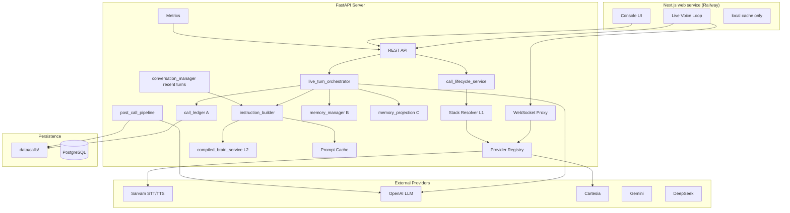
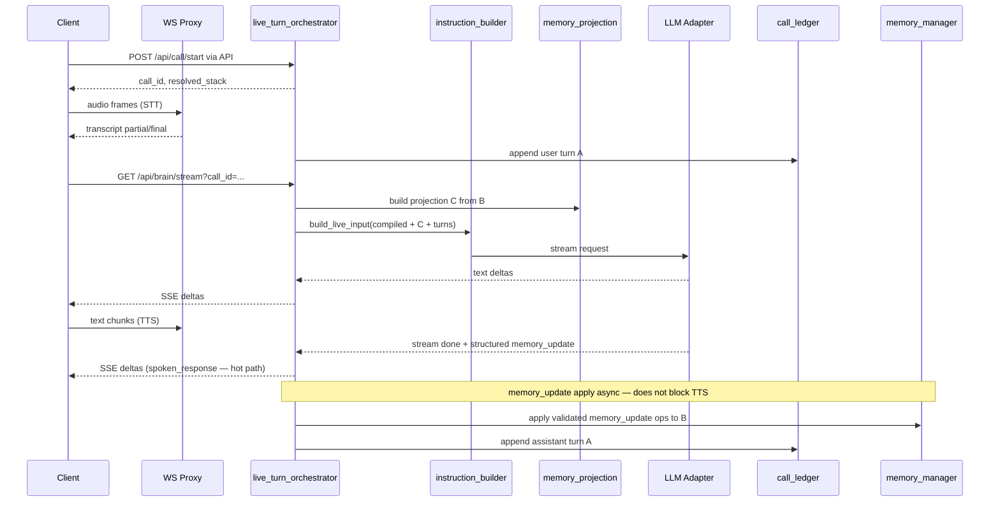
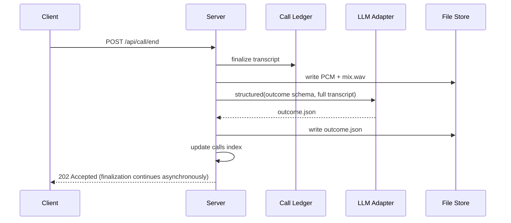

# 06 — Technical Architecture

System design, data flows, module map, and integration constraints.

**Ownership and singularity:** [15-architecture-ownership-and-singularity.md](./15-architecture-ownership-and-singularity.md) is normative for which module owns each layer. This document describes target flows without redefining ownership.

---

## 1. Target system context

The registry, working memory, call ledger, post-call pipeline, and database shown below are target components and do not exist in the current code.



---

## 2. Live turn data flow (target)



**CD-016 (normative):** Same LLM returns `spoken_response` + `memory_update` in one structured response. `memory_extraction.py` is **fallback only** if parse/SLO fails — not a second LLM call on the hot path.

---

## 3. Post-call data flow



---

## 4. Module map (existing → target)

### 4.1 Keep (modify minimally)

| Module | Role |
|--------|------|
| `server/app.py` | Register new routes; lifespan registry init |
| `server/services/openai_brain_service.py` | OpenAI LLM adapter backend |
| `server/services/sarvam_*.py`, `sarvam_ws.py` | Sarvam adapters |
| `server/agent/instruction_builder.py` | **Only** builder of live LLM `input[]` |
| `server/agent/brain_prompt_composer.py` | **Migrate into** `compiled_brain_service` |
| `server/agent/conversation_manager.py` | Truncated recent turns (not ledger A) |
| `server/utils/prompt_cache_key.py` | Version-based cache key |
| `server/utils/metrics.py` | Extend per-call |
| `server/prompts/voice_defaults.py` | Presets (separate from tiers) |
| `client/app.js`, `live-guards.js` | call/start/end hooks |

### 4.2 New modules

| Module | Role |
|--------|------|
| `server/providers/registry.py` | Provider catalog |
| `server/providers/resolver.py` | L1 tier + mode resolution (sole authority at call/start) |
| `server/providers/base.py` | ABCs |
| `server/providers/cartesia_*.py` | New adapters |
| `server/providers/deepseek_llm.py` | New adapter (MVP) |
| `server/providers/gemini_llm.py` | Post-MVP unless benchmark requires (`17` §13) |
| `server/brain/compiled_brain_service.py` | L2 compiled brain text + version |
| `server/brain/business_prompt_optimizer.py` | One-time business optimization |
| `server/call/memory_manager.py` | B state, validation, event log, apply ops |
| `server/call/memory_projection.py` | C projection render |
| `server/call/memory_extraction.py` | **Fallback only** if structured same-LLM path fails SLO (delegates apply to manager) |
| `server/call/live_turn_orchestrator.py` | Hot-path turn sequencing |
| `server/call/call_lifecycle_service.py` | call/start, end, finalize |
| `server/call/call_ledger.py` | A transcript.jsonl writer |
| `server/call/audio_archive.py` | PCM capture + mix |
| `server/call/post_call_pipeline.py` | Outcome generation |
| `server/call/call_store.py` | Index + metadata |
| `server/routes/calls.py` | call CRUD API (delegates to lifecycle) |
| `server/routes/benchmarks.py` | Benchmark runs API |
| `server/routes/plivo_ws.py` | Plivo bidirectional stream |
| `server/services/plivo_stream.py` | Plivo event handling |
| `server/services/audio_transcode.py` | μ-law ↔ PCM bridge |
| `client/calls_view.js` | Calls UI |
| `client/benchmark_view.js` | Test matrix UI |

### 4.3 Deprecate (after migration)

| Module | Replacement |
|--------|-------------|
| `server/agent/session_memory.py` | `call/memory_manager.py` |
| `server/agent/memory_summarizer.py` (string join) | `rolling_summary` in memory package |
| Client-only export as primary | Server `GET /api/calls` |

---

## 5. Configuration loading

**Order at startup (`env.py` + `registry.py`):**

1. Load pydantic `Settings` (existing)
2. Load provider registry with `ENABLE_*` flags
3. Validate tier env vars reference enabled providers
4. Warn on missing keys for enabled providers
5. Expose `get_catalog()` for routes

**Per request:**

1. Read `VOICE_AGENT_CONFIG_MODE`
2. `resolve_stack(mode, tier, client_selection, overrides)`
3. Lock at `call/start`

---

## 6. WebSocket architecture

### 6.1 STT WS (`/ws/stt-realtime`)

Current: hard-coded Sarvam upstream in `ws.py`.

Target:

```python
stack = get_call_stack(call_id)  # or session default
adapter = registry.get_stt(stack.stt.provider)
upstream = await adapter.connect_realtime(stack.stt.config)
# bidirectional proxy unchanged
```

Client protocol unchanged (binary audio + JSON events).

### 6.2 TTS WS (`/ws/tts`)

Same factory pattern for TTS adapter.

### 6.3 PSTN WebSocket (`/ws/plivo-stream`)

Bidirectional Plivo Audio Streaming — see [09-plivo-telephony-integration.md](./09-plivo-telephony-integration.md).

```
Plivo MEDIA (μ-law 8k) → audio_transcode → STT ingest (same as browser path)
TTS output → audio_transcode → Plivo playAudio events
```

Shares `call_id`, ledger writers, and pipeline with browser path. Barge-in sends Plivo `clearAudio`.

### 6.4 Authentication

v1: same-origin + existing rate limits. Future: API key per customer.

---

## 7. Brain request structure (OpenAI Responses)

Aligned with current `instruction_builder.py` + OpenAI caching guidance:

```python
input = [
    {
        "role": "developer",
        "content": compiled_brain_text,
        # cache breakpoint metadata when enable_prompt_caching
    },
    {
        "role": "user",
        "content": f"[Memory projection]\n{live_memory_projection_text}",
    },
    {
        "role": "user",
        "content": f"[Rolling summary]\n{rolling_summary_text}",  # only if non-empty and not duplicated in projection — see doc 15 §8
    },
    # recent turns from conversation_manager (user/assistant messages)
    {"role": "user", "content": current_transcript},
]
```

**Rules:**

- Stable prefix ≥1024 tokens for gpt-5.6* caching
- Dynamic tail: projection C + optional rolling summary + recent turns + utterance
- Never send full internal memory B or ledger A
- `store: false` on live
- `text.format` json_schema only on structured (memory merge, post-call)

---

## 8. Structured outputs usage

| Use case | Streaming | Schema |
|----------|-----------|--------|
| Live spoken response | Yes (text deltas) | None |
| Memory merge | No | `memory_update.operations` |
| Business optimizer | No | `optimized_business_prompt` |
| Post-call outcome | No | Full outcome schema |
| Brain test | Optional | None |

OpenAI: use Structured Outputs (`json_schema`) not prompt-described JSON.

---

## 9. Persistence strategy (v1)

| Data | Store | Retention |
|------|-------|-----------|
| Call files | `data/calls/{call_id}/` or object bucket | Env `CALL_RETENTION_DAYS` |
| Call index + entities | **PostgreSQL** (`calls`, agents, brains, …) | Metadata 90d default; brains permanent |
| Benchmark runs | PostgreSQL `benchmark_runs` | 90 days default |
| In-flight state | RAM | TTL |

**Database:** PostgreSQL for **all environments** including local dev (`prd/13` §9, `prd/17` §11, CD-021). Call audio/transcripts in file store or Railway bucket; not in DB blobs.

**Production:** Worker service + Redis for post-call and campaigns — not in-process-only (`prd/13` §9).

---

## 10. Concurrency and performance

| Concern | Approach |
|---------|----------|
| Memory merge async | `asyncio.create_task` after stream done |
| Post-call | Background task; don't block `call/end` response |
| Ledger writes | Buffered append; flush per turn |
| Audio | Ring buffer in RAM; flush on end |
| File I/O | Off hot path except ledger append (async queue) |

**SLO:** Live turn processing must not await post-call or memory merge.

---

## 11. Security

| Item | Rule |
|------|------|
| API keys | Server env only |
| `/api/settings/catalog` | No secrets |
| `meta.json` | No secrets |
| Call audio | Auth gate before v1 multi-tenant (same-origin v1) |
| Recording consent | UI banner hook `RECORDING_CONSENT_REQUIRED` |

---

## 12. Error handling

Extend existing `AppError` pattern:

```python
class AppError:
    code: ErrorCode  # provider_disabled, call_not_found, ...
    provider: str | None
    retryable: bool
```

Global handler in `app.py` (existing) returns consistent JSON.

Call lifecycle errors:

- `call/start` during active call → 409 or auto-end previous (config `CALL_AUTO_END_ON_START`)
- `call/end` twice → **202 Accepted** idempotent with same status URL (not `200`)

---

## 13. Deployment

| Var | Purpose |
|-----|---------|
| `DATA_DIR` | Root for calls + DB |
| `VOICE_AGENT_CONFIG_MODE` | env / frontend |
| `VOICE_AGENT_TIER` | Active tier |
| All tier + ENABLE_* vars | §03 |
| `ENABLE_WORKING_MEMORY` | Memory on/off |
| `POST_CALL_LLM_MODEL` | Cheaper model for outcome |
| `CRM_WEBHOOK_URL` | Optional |

Docker: mount `DATA_DIR` volume locally.

---

## 16. Railway production architecture (locked — `17` §11)

**Frontend:** Next.js on Railway **web** service. **Backend:** API + Worker + data on same Railway project ([19-frontend-backend-nextjs-railway.md](./19-frontend-backend-nextjs-railway.md)).

```text
RAILWAY PROJECT
├── API service (FastAPI — long-running)
├── Worker service (post-call, campaigns, summaries, retries)
├── PostgreSQL (agents, brains, memory metadata, calls, users, campaigns)
├── Redis (job queue — dialer, post-call, async jobs)
└── Storage bucket (audio WAV/MP3, large transcript exports)

Private networking between services. Secrets via Railway env.

| Environment | Database | Storage |
|-------------|----------|---------|
| **Development** | Local PostgreSQL (`DATABASE_URL` local) | Local `data/` or dev bucket |
| **Staging / Production** | Railway Postgres | Railway bucket |

**Retention:** 90 days default for call metadata in Postgres; object storage lifecycle aligned.

Install and configure PostgreSQL for local development in this repository.

---

## 14. Testing architecture

| Layer | Tool |
|-------|------|
| Unit | pytest — registry, resolver, memory merge |
| API mocked | httpx — call lifecycle, disabled provider |
| Cache regression | `test_brain_caching.py` extended |
| Live latency | `LIVE_TEST=1` optional |
| Client barge-in | `test_live_barge_policy.py` validating `client/live-guards.js` parity |
| Golden disposition | Fixture transcripts → outcome schema |

---

## 15. Context7 and implementation skills

See [16-mvp-implementation-skills.md](./16-mvp-implementation-skills.md) for skill selection per workstream.

Context7 was unavailable during PRD authoring. Before implementation:

- Re-verify OpenAI Responses SDK streaming + `json_schema` shapes
- Re-verify Cartesia/Gemini/DeepSeek streaming APIs
- Re-verify FastAPI background tasks + PostgreSQL async patterns
