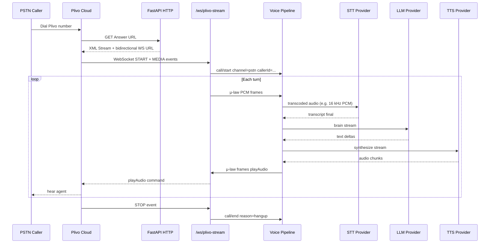

# 09 — Plivo Telephony Integration

Phone (PSTN) channel for testing and production voice calls via **Plivo Audio Streaming**, integrated with the existing **STT → LLM → TTS** pipeline and call lifecycle.

**Status:** Not implemented in codebase today — specified here for PRD completeness.  
**Official references:**

| Resource | URL |
|----------|-----|
| Audio Streaming overview | https://www.plivo.com/docs/voice-agents/audio-streaming/overview |
| Stream XML element | https://www.plivo.com/docs/voice-agents/audio-streaming/xml/stream |
| Plivo Stream SDK guide | https://www.plivo.com/docs/voice-agents/audio-streaming/integration-guides/plivo-stream-sdk |
| Plivo Stream SDK (Node) | https://github.com/plivo/plivo-stream-sdk-node |
| Plivo Stream SDK (Python) | https://github.com/plivo/plivo-stream-sdk-python |
| Account / credentials | https://console.plivo.com |

---

## 1. What Plivo is in this platform

Plivo is **not** an STT, LLM, or TTS provider. It is the **telephony transport layer**:

```
Caller (PSTN) ↔ Plivo network ↔ Bidirectional WebSocket ↔ Voice Agent Server ↔ STT / LLM / TTS
```

| Layer | Responsibility |
|-------|----------------|
| **Plivo** | Phone numbers, inbound/outbound calls, μ-law 8 kHz audio over WebSocket |
| **This platform** | Audio transcoding, STT/LLM/TTS pipeline, memory, ledger, disposition |
| **Browser path** | Existing mic/speaker path — no Plivo |

Both paths share the same **call lifecycle** (`call/start`, ledger, outcome) but differ in **audio ingress/egress** and **channel metadata**.

---

**Product priority (locked `17` §7):** **Outbound** campaigns and proactive dialing are prioritized over inbound-only features.

## 2. Goals

1. **Outbound campaigns** — automated dialing, retries, DNC, consent, calling windows ([18-campaign-outbound.md](./18-campaign-outbound.md)).
2. **Customer number onboarding** — business owner adds phone number in website; platform auto-connects to Plivo.
3. **Test real phone calls** against the same tier/combination matrix as browser testing.
4. **Measure true PSTN latency** (μ-law 8 kHz, network jitter).
5. **Inbound** support for published numbers.
6. **Barge-in** — reuse existing `live-guards.js` / server policy; Plivo `clearAudio` only.
3. Store Plivo START caller ID as telephony-observed call metadata with provenance; project it into working memory only according to confirmation/privacy policy.
4. **Archive PSTN audio** in the same `data/calls/{call_id}/` layout as browser calls.
5. **Configure with API keys only in `.env`** — no secrets in frontend.

---

## 3. Architecture



### 3.1 Recommended integration pattern (v1)

**Option A (recommended):** Native FastAPI route — mirrors existing `ws.py` proxy pattern.

```
server/routes/plivo_ws.py       # WebSocket handler for Plivo events
server/services/plivo_stream.py # START/MEDIA/STOP, playAudio, clearAudio
server/services/audio_transcode.py # μ-law 8k ↔ PCM 16k for Sarvam STT
```

**Option B (alternative):** Plivo Stream SDK (Python) wrapping the same pipeline callbacks.

Use Option A to stay consistent with `sarvam_ws.py` proxy style unless SDK reduces event-handling bugs.

### 3.2 Audio format strategy

| Leg | Plivo default | Sarvam STT typical | Bridge |
|-----|---------------|-------------------|--------|
| Ingress | `audio/x-mulaw;rate=8000` | 16 kHz PCM preferred | Decode μ-law → resample to STT input format |
| Egress | `audio/x-mulaw;rate=8000` | Sarvam TTS may output other rates | Resample/downsample → encode μ-law |

Plivo also supports `audio/x-l16;rate=16000` on the Stream element — use when STT quality improves enough to justify bandwidth:

```xml
<Stream bidirectional="true" keepCallAlive="true"
        contentType="audio/x-l16;rate=16000">
  wss://your-domain.com/ws/plivo-stream
</Stream>
```

**v1 default:** μ-law 8 kHz because it is telephony-native. Any latency/quality advantage over linear PCM is a benchmark hypothesis, not an assumed provider guarantee.

### 3.3 Barge-in on PSTN

When user speaks during agent playback:

1. Client path uses `live-guards.js`.
2. PSTN path: send Plivo **`clearAudio`** event on STT partial/final detection (same policy thresholds as barge-in preset).

Reference: [Plivo Stream SDK clearAudio](https://github.com/plivo/plivo-stream-sdk-node) — clears queued outbound audio.

---

## 4. HTTP endpoints

### 4.1 Answer URL (required by Plivo)

```
GET or POST /api/plivo/answer
```

Returns XML (example):

```xml
<?xml version="1.0" encoding="UTF-8"?>
<Response>
  <Speak language="te-IN">నమస్కారం. మీరు మాట్లాడవచ్చు.</Speak>
  <Stream bidirectional="true"
          keepCallAlive="true"
          contentType="audio/x-mulaw;rate=8000"
          statusCallbackUrl="https://your-domain.com/api/plivo/stream-status">
    wss://your-domain.com/ws/plivo-stream
  </Stream>
</Response>
```

Configure in Plivo Console: **Voice → Applications → Answer URL** = `https://your-domain.com/api/plivo/answer`.

### 4.2 WebSocket stream

```
WS /ws/plivo-stream
```

Handles Plivo events:

| Event | Action |
|-------|--------|
| `start` | Extract `callId`, `from`, `to`, `streamId`; `POST /api/call/start` internal with `channel=pstn`, `caller_id` |
| `media` | Decode audio → forward to STT ingest + append `audio/user.pcm` |
| `dtmf` | Optional: `*` → clearAudio (barge-in test) |
| `stop` | `POST /api/call/end` internal, `reason=hangup` |

### 4.3 Stream status callback (optional)

```
POST /api/plivo/stream-status
```

Logs stream lifecycle for observability (started, stopped, errors).

### 4.4 Hangup URL (optional)

```
POST /api/plivo/hangup
```

Fallback if WebSocket `stop` missed — trigger `call/end`.

### 4.5 Health check for Plivo config

```
GET /api/plivo/status
```

Returns (no secrets):

```json
{
  "enabled": true,
  "configured": true,
  "number": "+91XXXXXXXXXX",
  "answer_url_path": "/api/plivo/answer",
  "websocket_path": "/ws/plivo-stream",
  "content_type": "audio/x-mulaw;rate=8000"
}
```

---

## 5. Environment variables

Add to `.env` (never commit real values):

```bash
# ==========================================
# PLIVO TELEPHONY (optional — browser-only if unset)
# ==========================================

ENABLE_PLIVO=false

# From https://console.plivo.com/dashboard/ — Auth section
PLIVO_AUTH_ID=your_plivo_auth_id
PLIVO_AUTH_TOKEN=your_plivo_auth_token

# Voice-enabled number in E.164 (e.g. +14155551234 or +91XXXXXXXXXX)
PLIVO_NUMBER=+1XXXXXXXXXX

# Public base URL of your server (no trailing slash)
# Dev: ngrok URL e.g. https://abc123.ngrok-free.app
PLIVO_PUBLIC_BASE_URL=https://your-domain.com

# Optional overrides (defaults shown)
PLIVO_ANSWER_PATH=/api/plivo/answer
PLIVO_WS_PATH=/ws/plivo-stream
PLIVO_STREAM_CONTENT_TYPE=audio/x-mulaw;rate=8000
PLIVO_GREETING_SPEAK=true
PLIVO_GREETING_TEXT=నమస్కారం. మీరు మాట్లాడవచ్చు.

# Cost display (ties to metrics — example $5.30/mo US number)
PLIVO_NUMBER_MONTHLY_COST_USD=5.30
EXPECTED_MINUTES_PER_MONTH=500

# India numbers require KYC — see Plivo docs
# PLIVO_COUNTRY=IN
```

### 5.1 Plugin enable behavior

When `ENABLE_PLIVO=false`:

- Answer URL returns 503 or plain hangup XML
- `/ws/plivo-stream` rejects connections
- UI shows "Phone channel disabled"
- Browser path unaffected

When `ENABLE_PLIVO=true` but credentials missing:

- Startup warning + `/api/health` degraded flag `plivo_misconfigured`
- Do not crash server — browser path still works

### 5.2 Security

| Rule | Implementation |
|------|----------------|
| Never expose `PLIVO_AUTH_TOKEN` to browser | Server-only env |
| Validate Plivo HTTP callbacks | Required in production using Plivo V3 HMAC-SHA256 validation over the documented exact URL/parameters and nonce with the Auth Token; use the official SDK/helper where available and re-verify header names before implementation |
| Media WebSocket admission | WSS plus a short-lived, single-use application token bound to expected call/stream metadata; HTTP callback signatures must not be assumed to authenticate the WebSocket |
| Rate limit | Apply existing voice rate limits to Plivo routes |
| Recording consent | `PLIVO_GREETING_SPEAK` can include disclosure text |

---

## 6. Call lifecycle integration

### 6.1 `call/start` for PSTN

Internal invocation when Plivo `start` event arrives:

```json
{
  "channel": "pstn",
  "caller_id": "+919876543210",
  "callee_id": "+14155551234",
  "plivo_call_uuid": "uuid-from-plivo",
  "plivo_stream_id": "stream-id",
  "tier": null,
  "session_id": null
}
```

Server resolves `tier` from `VOICE_AGENT_TIER` (env mode) or `PLIVO_DEFAULT_TIER` env.

Create telephony-observed metadata:

```json
{
  "field": "caller_id",
  "value": "+919876543210",
  "source": "plivo_start",
  "authority": "telephony_observed",
  "confirmed_by_user": false
}
```

The memory projector may expose this as an unconfirmed contact hint only when tenant privacy policy permits. It is not automatically treated as verified customer identity.

### 6.2 `meta.json` extensions

```json
{
  "channel": "pstn",
  "caller_id": "+919876543210",
  "callee_id": "+14155551234",
  "plivo_call_uuid": "...",
  "plivo_stream_id": "...",
  "audio_format": "audio/x-mulaw;rate=8000"
}
```

### 6.3 Ledger

Same `transcript.jsonl` and `audio/` layout as browser calls (see [04-memory-and-call-lifecycle.md](./04-memory-and-call-lifecycle.md)).

PSTN `user.pcm` stored **after transcoding** to archive format (16 kHz s16le mono) for consistency with STT pipeline.

---

## 7. Developer setup guide (step-by-step)

### Step 1 — Plivo account

1. Sign up at https://console.plivo.com
2. Copy **Auth ID** and **Auth Token** from dashboard
3. Purchase a **voice-enabled phone number**
4. For India numbers: complete KYC per Plivo requirements

### Step 2 — Local `.env`

```bash
ENABLE_PLIVO=true
PLIVO_AUTH_ID=MAXXXXXXXXXXXXXXXX
PLIVO_AUTH_TOKEN=your_auth_token_here
PLIVO_NUMBER=+1XXXXXXXXXX
PLIVO_PUBLIC_BASE_URL=https://YOUR_NGROK_URL
```

### Step 3 — Expose server publicly (development)

Plivo must reach your Answer URL and WebSocket over HTTPS/WSS:

```bash
# Example with ngrok
ngrok http 8000
# Set PLIVO_PUBLIC_BASE_URL=https://xxxx.ngrok-free.app
```

### Step 4 — Configure Plivo application

In Plivo Console → **Voice → Applications**:

| Field | Value |
|-------|-------|
| Answer URL | `{PLIVO_PUBLIC_BASE_URL}/api/plivo/answer` |
| Answer Method | GET or POST |
| Hangup URL | `{PLIVO_PUBLIC_BASE_URL}/api/plivo/hangup` (optional) |

Assign the application to your Plivo number.

### Step 5 — Start server

```bash
# Ensure SARVAM + OPENAI keys also set for pipeline
uvicorn server.app:app --host 0.0.0.0 --port 8000
```

Verify: `GET /api/plivo/status` → `configured: true`

### Step 6 — Test inbound call

1. Dial your Plivo number from a mobile phone
2. Hear greeting (if `PLIVO_GREETING_SPEAK=true`)
3. Speak in Telugu — agent should respond
4. Hang up — check `data/calls/{call_id}/` for transcript + outcome
5. Open **Calls** tab in console — disposition should appear

### Step 7 — Outbound test (optional v1.1)

Use Plivo REST API to originate call to your mobile, pointing Answer URL to same app:

```bash
curl -X POST https://api.plivo.com/v1/Account/{AUTH_ID}/Call/ \
  -u {AUTH_ID}:{AUTH_TOKEN} \
  -d from={PLIVO_NUMBER} \
  -d to=+91XXXXXXXXXX \
  -d answer_url={PLIVO_PUBLIC_BASE_URL}/api/plivo/answer
```

Document in operator guide; not required for v1 inbound testing.

---

## 8. Testing matrix with Plivo

| Test | Channel | Tier | Purpose |
|------|---------|------|---------|
| Browser baseline | `browser` | MEDIUM | Compare E2E without PSTN |
| PSTN same stack | `pstn` | MEDIUM | Real phone latency + μ-law |
| PSTN LOW tier | `pstn` | LOW | Cost-optimized phone path |
| PSTN PREMIUM | `pstn` | PREMIUM | Quality ladder on real calls |

Benchmark runs record `channel` so comparison UI can filter browser vs PSTN.

**fix.md Test A–E** apply to both channels once adapters exist — Plivo does not change combination logic, only transport.

---

## 9. Cost accounting

| Cost component | Source |
|----------------|--------|
| STT + LLM + TTS | Same per-minute probes as browser |
| Plivo voice minutes | Plivo billing dashboard |
| Phone number | `PLIVO_NUMBER_MONTHLY_COST_USD` amortized |

Display in metrics UI:

```
Fully loaded INR/min = talking_cost_inr + (PLIVO_NUMBER_MONTHLY_COST_USD × FX / EXPECTED_MINUTES_PER_MONTH)
```

Example at $5.30/mo, 500 min/mo, ₹95.64/$: **~₹1.01/min** number overhead + **~₹1.70/min** talking ≈ **₹2.71/min fully loaded**.

---

## 10. UI surfacing

### Config tab (frontend mode)

```
Phone (Plivo)
  Status: ● Enabled / ○ Disabled
  Number: +1XXXXXXXXXX (masked)
  Channel: PSTN ready
  [Test connection] → GET /api/plivo/status
```

### Calls list

- Badge: `PSTN` vs `Browser`
- Filter by channel
- Show `caller_id` (masked in customer-facing roles)

### env mode

- Optional single line: "Phone: configured" with tier cost including number amortization
- No Plivo credential UI

---

## 11. Failure modes

| Failure | Behavior |
|---------|----------|
| STT fails on μ-law | Log error; optional Speak fallback "మళ్లీ మాట్లాడండి" |
| WebSocket disconnect mid-call | Auto `call/end` after idle TTL |
| TTS slower than playback buffer | Increase buffer or shorten responses; monitor `tts_first_audio_ms` |
| Plivo clearAudio missed | User hears overlap — tune barge-in preset for PSTN |

---

## 12. Acceptance criteria

- [ ] `ENABLE_PLIVO=true` + valid credentials → inbound call completes full conversation
- [ ] `call_id` created on Plivo START with `channel=pstn` and `caller_id`
- [ ] `transcript.jsonl` + `outcome.json` generated after hangup
- [ ] `GET /api/plivo/status` never returns auth token
- [ ] Production media WebSocket rejects absent, expired, reused, or call-mismatched application tokens
- [ ] `ENABLE_PLIVO=false` → browser path unchanged
- [ ] Benchmark run stores `channel: pstn`
- [ ] Barge-in clears Plivo outbound audio within preset threshold
- [ ] `.env.example` documents all `PLIVO_*` variables

---

## 13. Implementation phase

See [08-implementation-roadmap.md](./08-implementation-roadmap.md) **Phase 8 — Plivo PSTN**.

Depends on the provider/configuration foundation and durable call lifecycle. It can ship after the browser call archive works.

---

## 14. Relation to Pipecat

[Plivo recommends Pipecat](https://www.plivo.com/audio-streaming/) for full agent orchestration. This PRD **does not require Pipecat** because the repo already has a working cascade pipeline. If PSTN latency fails the approved SLO after tuning, evaluate Pipecat Plivo transport as an alternative; the default remains extending the existing FastAPI WebSocket architecture.
