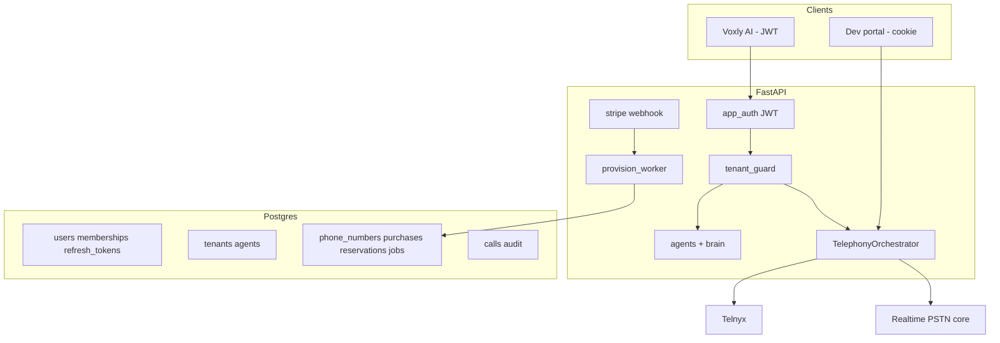

# PRD-02 — System architecture

## High-level

## Trust boundaries

| Zone | Secrets | Client gets |
|------|---------|-------------|
| Platform | Telnyx, Stripe, OpenAI, `JWT_SECRET` | Nothing |
| Subscriber | JWT access (short), refresh token | Agent IDs, own numbers |
| Never exposed | `stack_override`, connection IDs, webhooks | — |

## TelephonyOrchestrator (binding)

**Do not** call `dev_telephony_store` or unguarded dev outbound from subscriber routes.

Orchestrator responsibilities:

1. Resolve `tenant_id`, `user_id` from JWT.
2. Validate `from_e164` ∈ tenant numbers; `agent_id` ∈ tenant; brain published.
3. Check `tenants.limits` (max concurrent PSTN, max agents, etc.).
4. Build internal context: `stack_policy=saas_subscriber` → `{ pipeline: realtime_voice, language }`.
5. Delegate to existing Telnyx dial + `telnyx_ws` (same runtime as dev).

Dev portal calls the **same orchestrator** with `stack_policy=dev` (allows overrides for platform testing only).

## Call paths

### Outbound (subscriber)

1. `POST /api/telephony/calls/outbound` — Bearer JWT.
2. Orchestrator validations (above).
3. Telnyx outbound → stream token includes `tenant_id`, `agent_id`.

### Inbound

1. Telnyx webhook → lookup `phone_numbers.e164`.
2. If `tenant.status != active` or number `suspended` → hangup.
3. If `agent_id` null → use `tenants.default_agent_id` if set, else short message + hangup (**never** platform default agent).
4. Ledger init with `tenant_id`.

## Assignment dictionary

Postgres source of truth:

- `phone_numbers(tenant_id, e164, agent_id, status, stripe_subscription_id)`
- Admin view: PRD-09 SQL

Optional cache `e164 → routing` later; v1 = indexed DB lookup.

## Cross-tenant isolation (release gate)

See PRD-12 Phase A/B.

## Deployment

| Component | Notes |
|-----------|--------|
| API | FastAPI; worker can be same process or sidecar polling `provision_jobs` |
| Postgres | Required |
| Voxly | Static; `Authorization: Bearer` |
| Webhooks | `/api/stripe/webhook`, `/api/telnyx/webhook` |
