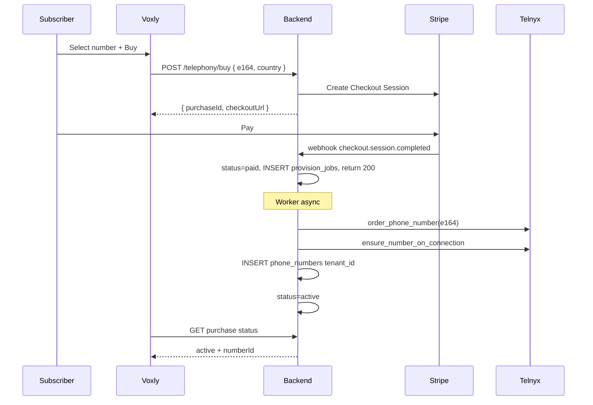

# PRD-04 — Phone numbers: Stripe payment → Telnyx provision → tenant assignment

## User story

> As a subscriber, I search for an available number on Voxly, pay with Stripe, and receive that number assigned to my account. I then assign it to one of my agents for inbound/outbound PSTN.

## Industry pattern (reference)

Align with common telephony SaaS flows (register number after payment, wire voice URL on assign):

- [Aethex phone numbers API](https://developers.aethexai.com/docs/api-reference/phone-numbers) — register Twilio/SIP number, optional `agent_id`, inbound wiring on PATCH.
- [Mihu provision call channel](https://developers.mihu.ai/api-reference/agents/provision-call-channel-for-an-agent) — buy number, then explicit provision step before calls.

Our variant: **Stripe gates Telnyx purchase**; platform owns one Telnyx account.

## Catalog & pricing

### Stripe products (recommended)

| Product | Stripe type | Notes |
|---------|-------------|-------|
| Phone number — India mobile | Price: recurring monthly + optional one-time setup | Mirror Telnyx monthly + margin |
| Phone number — US local | Same | Country-specific Prices |
| Platform usage | Metered or wallet top-up (phase 2) | Voxly `POST /api/billing/topup` |

Store `stripe_price_id` per country/number_type in `number_catalog` table or config.

### What user sees on Voxly

1. **Search** — `GET /api/telephony/numbers/search?country=IN` → list of **available** candidates (from Telnyx search API, not yet purchased).
2. **Select** — user picks `e164`.
3. **Reserve** — `POST /api/telephony/buy` creates `number_reservations` row (TTL **15 min**, unique on `e164` while active) + `number_purchases` in `checkout_created`. Reject if E.164 already owned or reserved by another tenant.
4. **Checkout** — same request or follow-up returns Stripe Checkout Session URL.
5. **Wait** — UI polls `GET /api/telephony/purchases/{id}` until `status=active` or `failed`.
6. **Assign** — `POST /api/telephony/numbers/{id}/assign` `{ agentId }`.

## Backend state machine

### `number_purchases` (new table)

| status | Meaning |
|--------|---------|
| `checkout_created` | Stripe session created, Telnyx not called |
| `payment_pending` | User in Checkout |
| `paid` | Stripe webhook received, provision queued |
| `provisioning` | Telnyx order in flight |
| `active` | Row in `phone_numbers`, tenant owns DID |
| `failed` | Telnyx or internal error; trigger refund/credit |
| `refunded` | Stripe refund completed |

### Idempotency

- `stripe_checkout_session_id` UNIQUE
- `stripe_payment_intent_id` UNIQUE
- `stripe_webhook_events.event_id` UNIQUE — duplicate events no-op
- `provision_jobs.purchase_id` UNIQUE — one worker execution per purchase
- Reservation expires → checkout cannot complete on stale session (re-search)

### `number_reservations`

| Column | Notes |
|--------|--------|
| e164 | UNIQUE where `expires_at > now()` |
| tenant_id | Holder |
| purchase_id | FK |
| expires_at | Typically now + 15m |

Cron/worker: delete expired reservations; cancel abandoned Stripe sessions if possible.

## Sequence diagram

## Stripe integration details

### Checkout Session (v1)

- Mode: `subscription` if monthly recurring for number; or `payment` for first month + setup as line items.
- `metadata`: `purchase_id`, `tenant_id`, `e164`, `user_id`
- `customer`: tenant's `stripe_customer_id`
- Success/cancel URLs: Voxly routes `/console/numbers?success=1`

### Webhooks (`POST /api/stripe/webhook`)

Verify signature with `STRIPE_WEBHOOK_SECRET`.

Handle (minimum):

| Event | Action |
|-------|--------|
| `checkout.session.completed` | Mark paid, start provision |
| `invoice.paid` | Renew number `status=active` |
| `invoice.payment_failed` | Suspend number routing |
| `customer.subscription.deleted` | Release number (policy: grace period) |

Use **Stripe idempotency** on API calls; store processed event IDs in `stripe_webhook_events`.

### Failure compensation

If Telnyx order fails after payment:

1. Set purchase `failed` with error payload.
2. Auto-refund via Stripe API OR credit wallet (config).
3. Notify dev admin queue + subscriber email (phase 2).

## Telnyx provision (reuse existing code)

- Search: `TelnyxClient.search_available_numbers` (today `dev_telephony` `/telnyx/numbers/search`).
- Order: `provision_ordered_number` (`server/services/telnyx_provisioning.py`).
- Wire connection: same Call Control app as dev; **isolation is DB-only** for v1.

## Assignment map (`phone_numbers` extended)

| Column | Purpose |
|--------|---------|
| `tenant_id` | Owner |
| `e164` | DID |
| `agent_id` | Nullable — inbound/outbound default agent |
| `purchase_id` | FK to `number_purchases` |
| `telnyx_number_id` | Provider id |
| `status` | `active`, `suspended`, `released` |
| `inbound_enabled` / `outbound_enabled` | Routing flags |
| `stripe_subscription_id` | If recurring |

**Dictionary views for admin:**

- `GET /api/dev/admin/assignments` → flat list `{ tenant, e164, agent, purchase, stripe }`
- `GET /api/telephony/numbers` → tenant-scoped list (Voxly)

## Assign / unassign agent

`POST /api/telephony/numbers/{id}/assign` — body `{ agentId }`

- Verify agent.tenant_id == number.tenant_id
- Update `phone_numbers.agent_id`
- Optional: push Telnyx metadata tag for ops

`PUT /api/telephony/numbers/{id}/routing` (Voxly) — map to inbound_enabled, outbound_enabled, agent_id.

## Admin pool (optional parallel path)

Dev can pre-buy numbers and set `tenant_id` without Stripe (enterprise sales). Subscriber "buy" still uses Stripe for self-serve.

## Compliance

- Display regulatory text on checkout (India TRAI / US A2P disclaimers as applicable).
- Store `billing_address` from Stripe Customer for number orders requiring it.
